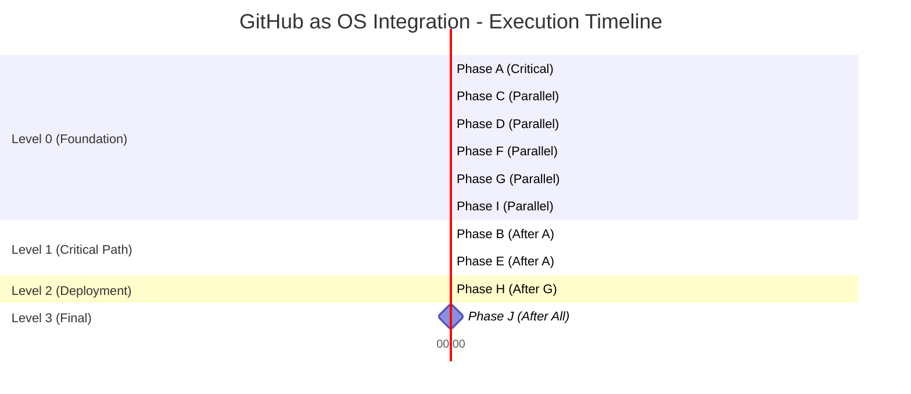
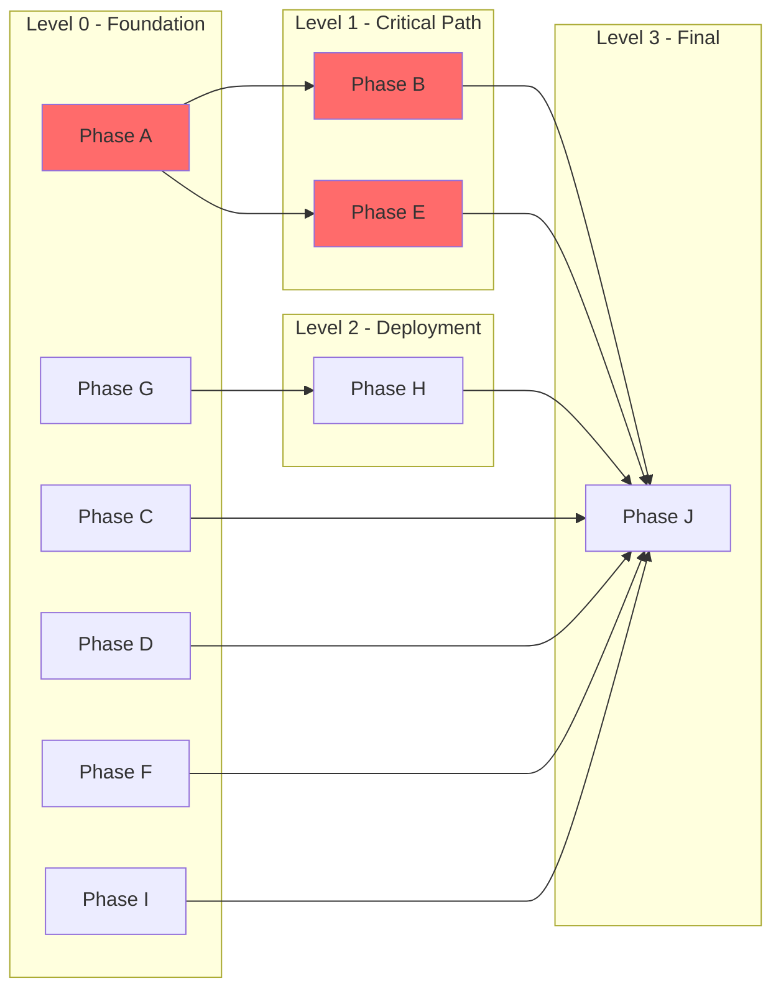
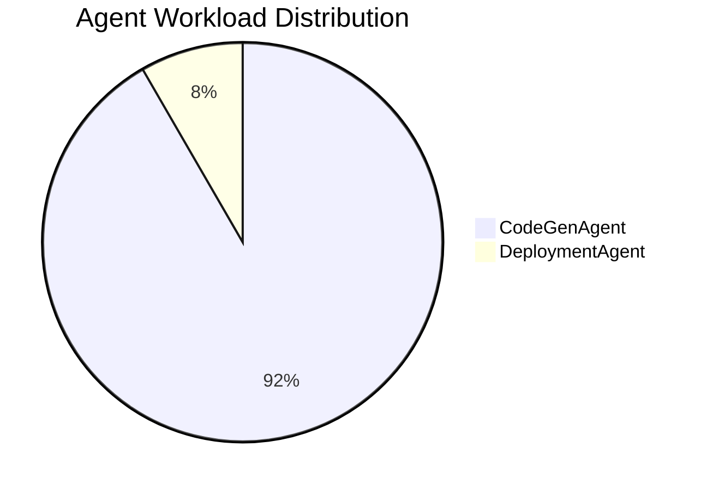
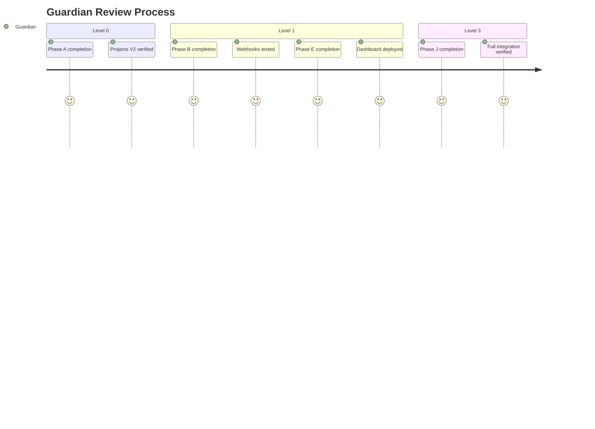

# GitHub as OS Full Integration - DAG Visualization

## Issue #5: 10 Phases (A-J) - Directed Acyclic Graph

### DAG Structure

```mermaid
graph TD
    %% Level 0: Foundation - No dependencies
    A[Phase A: Data Persistence<br/>Projects V2<br/>240 min | Critical]
    C[Phase C: Message Queue<br/>Discussions<br/>120 min | High]
    D[Phase D: Package Manager<br/>Packages<br/>240 min | High]
    F[Phase F: Security Layer<br/>Dependabot, CodeQL<br/>120 min | High]
    G[Phase G: API Wrapper<br/>SDK<br/>240 min | Medium]
    I[Phase I: Releases<br/>Distribution<br/>120 min | Low]

    %% Level 1: Critical Path - Depends on Phase A
    B[Phase B: Event Bus<br/>Webhooks<br/>300 min | Critical]
    E[Phase E: GUI Dashboard<br/>GitHub Pages<br/>360 min | Critical]

    %% Level 2: Deployment - Depends on SDK
    H[Phase H: Environments<br/>Deployment<br/>180 min | Medium]

    %% Level 3: Final Integration - All dependencies
    J[Phase J: Advanced Features<br/>Final Integration<br/>180 min | Low]

    %% Dependencies
    A --> B
    A --> E
    A --> J
    B --> J
    C --> J
    D --> J
    E --> J
    F --> J
    G --> H
    G --> J
    H --> J
    I --> J

    %% Styling
    classDef critical fill:#ff6b6b,stroke:#c92a2a,stroke-width:3px,color:#fff
    classDef high fill:#ffa94d,stroke:#e67700,stroke-width:2px,color:#000
    classDef medium fill:#74c0fc,stroke:#1c7ed6,stroke-width:2px,color:#000
    classDef low fill:#b2f2bb,stroke:#2f9e44,stroke-width:1px,color:#000

    class A,B,E critical
    class C,D,F high
    class G,H medium
    class I,J low
```

### Parallel Execution Groups



### Critical Path Analysis

**Longest Path**: Phase A → Phase B → Phase E

```
Phase A (240 min)
    ↓
Phase B (300 min) ← Critical bottleneck
    ↓
[Phase E (360 min) in parallel]
    ↓
Phase J (180 min)
─────────────────
Total: 900 minutes (15 hours)
```

**Parallel Optimization**:
- Level 0: 6 phases × 5 parallel = 360 min (vs 1140 min sequential)
- Level 1: 2 phases × 2 parallel = 360 min (vs 660 min sequential)
- **Total Time**: 18 hours parallel (vs 36 hours sequential)
- **Efficiency Gain**: 50%

### Dependency Matrix

|       | A | B | C | D | E | F | G | H | I | J |
|-------|---|---|---|---|---|---|---|---|---|---|
| **A** | - | ✓ | - | - | ✓ | - | - | - | - | ✓ |
| **B** | - | - | - | - | - | - | - | - | - | ✓ |
| **C** | - | - | - | - | - | - | - | - | - | ✓ |
| **D** | - | - | - | - | - | - | - | - | - | ✓ |
| **E** | - | - | - | - | - | - | - | - | - | ✓ |
| **F** | - | - | - | - | - | - | - | - | - | ✓ |
| **G** | - | - | - | - | - | - | - | ✓ | - | ✓ |
| **H** | - | - | - | - | - | - | - | - | - | ✓ |
| **I** | - | - | - | - | - | - | - | - | - | ✓ |
| **J** | - | - | - | - | - | - | - | - | - | - |

**Legend**: ✓ = Direct dependency (row depends on column)

### Execution Levels



### Agent Assignment



**CodeGenAgent**: 9 phases (33 hours)
- Phase A, B, C, D, E, F, G, I, J

**DeploymentAgent**: 1 phase (3 hours)
- Phase H

### Guardian Approval Points



**4 Guardian Checkpoints**:
1. **M1**: After Phase A - Data Persistence Foundation
2. **M2**: After Phase B - Event-Driven Architecture
3. **M3**: After Phase E - Public Dashboard Launch
4. **M4**: After Phase J - Full OS Integration

### Risk Heatmap

| Phase | Complexity | Impact | Risk Level | Mitigation |
|-------|-----------|--------|-----------|-----------|
| **Phase A** | High | Critical | 🔴 High | Experienced CodeGenAgent |
| **Phase B** | Very High | Critical | 🔴 High | Security focus, mock testing |
| **Phase E** | High | Critical | 🔴 High | Guardian review before deploy |
| **Phase C** | Low | Medium | 🟡 Medium | Standard workflow |
| **Phase D** | Medium | Medium | 🟡 Medium | NPM/Docker experience |
| **Phase F** | Low | High | 🟡 Medium | Security best practices |
| **Phase G** | Medium | Medium | 🟡 Medium | API documentation |
| **Phase H** | Medium | Medium | 🟡 Medium | Deployment testing |
| **Phase I** | Low | Low | 🟢 Low | Automated release |
| **Phase J** | Medium | Low | 🟢 Low | Integration testing |

### Success Criteria

✅ **Technical**:
- All 10 phases completed
- No circular dependencies
- All workflows operational
- Integration tests passing

✅ **Quality**:
- 4 Guardian approvals obtained
- Code reviews completed
- Documentation accurate
- Security scans passing

✅ **Timeline**:
- 50% time savings via parallelization
- Critical path: 15 hours
- Total project: 18 hours (parallel) / 36 hours (sequential)

### Next Actions

**Immediate Start (Parallel)**:
1. 🔴 **Phase A** (Priority 1) - Data Persistence - 240 min
2. 🟡 **Phase C** (Priority 2) - Message Queue - 120 min
3. 🟡 **Phase D** (Priority 2) - Package Manager - 240 min
4. 🟡 **Phase F** (Priority 2) - Security Layer - 120 min
5. 🟡 **Phase G** (Priority 3) - API Wrapper - 240 min

**After Phase A Guardian Approval**:
6. 🔴 **Phase B** - Event Bus - 300 min
7. 🔴 **Phase E** - GUI Dashboard - 360 min

**Sequential Finish**:
8. 🟢 **Phase H** - Environments (after Phase G) - 180 min
9. 🟢 **Phase I** - Releases (independent) - 120 min
10. 🟢 **Phase J** - Final Integration (after all) - 180 min

---

**Generated by**: CoordinatorAgent
**Date**: 2025-10-08
**Status**: Ready for execution
**Circular Dependencies**: None detected
**Estimated Completion**: 18 hours (parallel execution)
