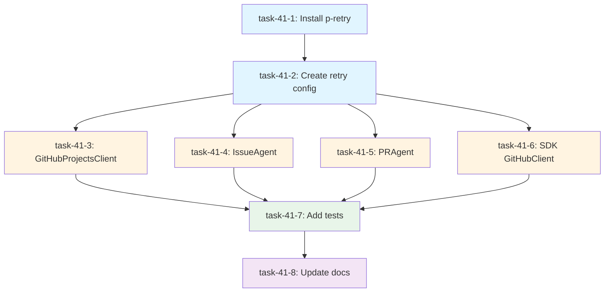

# Issue #41 Implementation Plan: Add Retry Logic for GitHub API Calls

## Executive Summary

**Objective**: Add p-retry for GitHub API resilience with exponential backoff strategy (3 retries) to 5 critical API endpoints.

**Estimated Duration**: 90 minutes
**Severity**: Sev.3-Medium
**Impact**: High (affects API reliability)
**Agent Assignment**: CodeGenAgent

---

## 1. Issue Analysis

### Current State

The codebase makes extensive GitHub API calls through:
- **@octokit/rest** - REST API client
- **@octokit/graphql** - GraphQL API client
- **fetch** - Direct HTTP calls in SDK

**Identified API Call Locations** (24 total API calls found):
1. **IssueAgent** (`agents/issue/issue-agent.ts`):
   - `issues.get` (line 104)
   - `issues.addLabels` (line 147)
   - `issues.addAssignees` (line 181)
   - `issues.createComment` (line 216)

2. **PRAgent** (`agents/pr/pr-agent.ts`):
   - `pulls.create` (line 352)
   - `issues.addLabels` (line 394)
   - `pulls.requestReviewers` (line 429)

3. **GitHubProjectsClient** (`packages/github-projects/src/client.ts`):
   - `graphql` queries/mutations (lines 114, 241, 290)
   - `rest.rateLimit.get` (line 490)

4. **SDK GitHubClient** (`packages/miyabi-agent-sdk/src/github-client.ts`):
   - `fetch` for issues, comments, labels (lines 60, 79, 97, 114, 132)

5. **Scripts** (various):
   - `label-state-machine.ts`: 7 API calls
   - `knowledge-base-sync.ts`: 3 API calls
   - `workflow-orchestrator.ts`: 4 API calls
   - Others: 5+ API calls

### Problem

No retry mechanism exists. Transient failures (rate limits, network errors, 5xx errors) cause immediate task failures.

---

## 2. Task Decomposition

### Task DAG (Directed Acyclic Graph)

```yaml
nodes:
  - id: task-41-1
    title: Install p-retry dependency
    type: setup
    agent: CodeGenAgent
    estimatedMinutes: 5
    dependencies: []

  - id: task-41-2
    title: Create retry configuration module
    type: feature
    agent: CodeGenAgent
    estimatedMinutes: 15
    dependencies: [task-41-1]

  - id: task-41-3
    title: Implement retry wrapper for GitHubProjectsClient
    type: feature
    agent: CodeGenAgent
    estimatedMinutes: 20
    dependencies: [task-41-2]

  - id: task-41-4
    title: Implement retry wrapper for IssueAgent
    type: feature
    agent: CodeGenAgent
    estimatedMinutes: 15
    dependencies: [task-41-2]

  - id: task-41-5
    title: Implement retry wrapper for PRAgent
    type: feature
    agent: CodeGenAgent
    estimatedMinutes: 15
    dependencies: [task-41-2]

  - id: task-41-6
    title: Implement retry wrapper for SDK GitHubClient
    type: feature
    agent: CodeGenAgent
    estimatedMinutes: 15
    dependencies: [task-41-2]

  - id: task-41-7
    title: Add unit tests for retry logic
    type: test
    agent: CodeGenAgent
    estimatedMinutes: 20
    dependencies: [task-41-3, task-41-4, task-41-5, task-41-6]

  - id: task-41-8
    title: Update documentation
    type: docs
    agent: CodeGenAgent
    estimatedMinutes: 10
    dependencies: [task-41-7]

edges:
  - from: task-41-1, to: task-41-2
  - from: task-41-2, to: task-41-3
  - from: task-41-2, to: task-41-4
  - from: task-41-2, to: task-41-5
  - from: task-41-2, to: task-41-6
  - from: task-41-3, to: task-41-7
  - from: task-41-4, to: task-41-7
  - from: task-41-5, to: task-41-7
  - from: task-41-6, to: task-41-7
  - from: task-41-7, to: task-41-8

levels:
  - level: 0
    tasks: [task-41-1]
    parallelism: 1

  - level: 1
    tasks: [task-41-2]
    parallelism: 1

  - level: 2
    tasks: [task-41-3, task-41-4, task-41-5, task-41-6]
    parallelism: 4
    description: "Parallel implementation of retry wrappers"

  - level: 3
    tasks: [task-41-7]
    parallelism: 1

  - level: 4
    tasks: [task-41-8]
    parallelism: 1
```

### Execution Timeline

```
[Level 0] Install p-retry (5min)
    |
[Level 1] Create retry config module (15min)
    |
    +-- [Level 2] Parallel Execution (20min max)
    |       |
    |       +-- Implement GitHubProjectsClient retry (20min)
    |       +-- Implement IssueAgent retry (15min)
    |       +-- Implement PRAgent retry (15min)
    |       +-- Implement SDK retry (15min)
    |
    +-- [Level 3] Add unit tests (20min)
    |
    +-- [Level 4] Update docs (10min)

Total Estimated Time: 70 minutes (sequential)
Optimized Time with Parallelism: 50 minutes
```

---

## 3. Technical Design

### 3.1 Retry Configuration

**File**: `packages/miyabi-agent-sdk/src/retry-config.ts`

```typescript
import pRetry, { Options as PRetryOptions } from 'p-retry';

/**
 * GitHub API retry configuration
 */
export interface GitHubRetryConfig {
  retries: number;
  minTimeout: number;
  maxTimeout: number;
  factor: number;
  randomize: boolean;
  onFailedAttempt?: (error: pRetry.FailedAttemptError) => void;
}

/**
 * Default retry configuration
 * - 3 retries
 * - Exponential backoff: 1s, 2s, 4s
 * - Randomized jitter
 */
export const DEFAULT_RETRY_CONFIG: GitHubRetryConfig = {
  retries: 3,
  minTimeout: 1000,
  maxTimeout: 4000,
  factor: 2,
  randomize: true,
};

/**
 * Retryable error types
 */
export const RETRYABLE_ERROR_CODES = [
  408, // Request Timeout
  429, // Too Many Requests (Rate Limit)
  500, // Internal Server Error
  502, // Bad Gateway
  503, // Service Unavailable
  504, // Gateway Timeout
];

/**
 * Determine if error should be retried
 */
export function shouldRetry(error: any): boolean {
  // Network errors
  if (error.code === 'ECONNRESET' || error.code === 'ETIMEDOUT') {
    return true;
  }

  // HTTP status codes
  if (error.status && RETRYABLE_ERROR_CODES.includes(error.status)) {
    return true;
  }

  // Octokit rate limit errors
  if (error.message?.includes('rate limit')) {
    return true;
  }

  // Octokit abuse detection
  if (error.message?.includes('abuse detection')) {
    return true;
  }

  return false;
}

/**
 * Create p-retry options from config
 */
export function createRetryOptions(
  config: Partial<GitHubRetryConfig> = {}
): PRetryOptions {
  const finalConfig = { ...DEFAULT_RETRY_CONFIG, ...config };

  return {
    retries: finalConfig.retries,
    minTimeout: finalConfig.minTimeout,
    maxTimeout: finalConfig.maxTimeout,
    factor: finalConfig.factor,
    randomize: finalConfig.randomize,
    onFailedAttempt: finalConfig.onFailedAttempt || ((error) => {
      console.warn(
        `Retry attempt ${error.attemptNumber} failed: ${error.message}`
      );
      console.warn(`Retrying in ${error.retriesLeft} attempts left...`);
    }),
  };
}

/**
 * Wrap function with retry logic
 */
export async function withRetry<T>(
  fn: () => Promise<T>,
  config?: Partial<GitHubRetryConfig>
): Promise<T> {
  const options = createRetryOptions(config);

  return pRetry(async () => {
    try {
      return await fn();
    } catch (error) {
      if (shouldRetry(error)) {
        throw error; // Will be retried
      }
      throw new pRetry.AbortError(error); // Won't be retried
    }
  }, options);
}
```

### 3.2 Target Endpoints (5 High-Priority)

1. **issues.get** - Critical for IssueAgent
   - File: `agents/issue/issue-agent.ts`
   - Impact: Blocks entire issue analysis workflow

2. **pulls.create** - Critical for PRAgent
   - File: `agents/pr/pr-agent.ts`
   - Impact: Blocks PR creation workflow

3. **graphql queries** - Critical for Projects V2
   - File: `packages/github-projects/src/client.ts`
   - Impact: Blocks data persistence layer

4. **issues.createComment** - High-value for feedback
   - File: Multiple agents
   - Impact: User feedback lost on failure

5. **issues.addLabels** - High-value for classification
   - File: Multiple agents
   - Impact: Automated classification fails

### 3.3 Implementation Strategy

#### A. GitHubProjectsClient (GraphQL)

**File**: `packages/github-projects/src/client.ts`

**Current Code** (lines 533-561):
```typescript
private async executeQuery(
  query: string,
  variables: Record<string, any>
): Promise<any> {
  let retries = 0;

  while (retries <= this.maxRetries) {
    try {
      return await this.graphqlClient(query, variables);
    } catch (error: any) {
      if (
        this.retryOnRateLimit &&
        error.message?.includes('rate limit') &&
        retries < this.maxRetries
      ) {
        const waitTime = Math.pow(2, retries) * 1000;
        console.warn(
          `Rate limit hit, waiting ${waitTime}ms before retry ${retries + 1}/${this.maxRetries}`
        );
        await this.sleep(waitTime);
        retries++;
        continue;
      }
      throw error;
    }
  }

  throw new RateLimitExceededError(new Date(), 0);
}
```

**Updated Code** (with p-retry):
```typescript
import { withRetry, GitHubRetryConfig } from '@miyabi/agent-sdk';

private async executeQuery(
  query: string,
  variables: Record<string, any>
): Promise<any> {
  return withRetry(
    async () => await this.graphqlClient(query, variables),
    {
      retries: this.maxRetries,
      onFailedAttempt: (error) => {
        console.warn(
          `GraphQL query retry attempt ${error.attemptNumber} failed: ${error.message}`
        );
        console.warn(`Retries left: ${error.retriesLeft}`);
      },
    }
  );
}
```

#### B. IssueAgent (REST API)

**File**: `agents/issue/issue-agent.ts`

**Wrap Key Methods**:
```typescript
import { withRetry } from '@miyabi/agent-sdk';

private async fetchIssue(issueNumber: number): Promise<Issue> {
  this.log(`📥 Fetching Issue #${issueNumber}`);

  return withRetry(async () => {
    const response = await this.octokit.issues.get({
      owner: this.owner,
      repo: this.repo,
      issue_number: issueNumber,
    });

    // ... rest of the method
    return mappedIssue;
  });
}

private async addLabels(issueNumber: number, labels: string[]): Promise<void> {
  this.log(`🏷️  Applying ${labels.length} labels to Issue #${issueNumber}`);

  return withRetry(async () => {
    await this.octokit.issues.addLabels({
      owner: this.owner,
      repo: this.repo,
      issue_number: issueNumber,
      labels,
    });
  });
}
```

#### C. PRAgent (REST API)

**File**: `agents/pr/pr-agent.ts`

**Wrap Pull Request Creation**:
```typescript
import { withRetry } from '@miyabi/agent-sdk';

private async createPullRequest(request: PRRequest): Promise<PRResult> {
  this.log(`🚀 Creating Pull Request: ${request.title}`);

  return withRetry(async () => {
    const response = await this.octokit.pulls.create({
      owner: this.owner,
      repo: this.repo,
      title: request.title,
      body: request.body,
      head: request.headBranch,
      base: request.baseBranch,
      draft: request.draft,
    });

    // ... map response
    return prResult;
  });
}
```

#### D. SDK GitHubClient (fetch)

**File**: `packages/miyabi-agent-sdk/src/github-client.ts`

**Wrap fetch calls**:
```typescript
import { withRetry } from './retry-config.js';

async getIssue(issueNumber: number): Promise<GitHubIssue> {
  const url = `${this.apiUrl}/repos/${this.repoFullName}/issues/${issueNumber}`;

  return withRetry(async () => {
    const response = await fetch(url, {
      headers: this.getHeaders(),
    });

    if (!response.ok) {
      throw new Error(
        `Failed to fetch issue #${issueNumber}: ${response.statusText}`
      );
    }

    const data = await response.json();
    return this.mapIssueResponse(data);
  });
}
```

### 3.4 Error Handling Strategy

```typescript
/**
 * Error classification:
 *
 * 1. RETRYABLE (with exponential backoff):
 *    - 429 Too Many Requests (rate limit)
 *    - 5xx Server errors
 *    - Network timeouts/resets
 *    - Abuse detection
 *
 * 2. NON-RETRYABLE (abort immediately):
 *    - 401 Unauthorized (invalid token)
 *    - 403 Forbidden (permissions)
 *    - 404 Not Found (resource doesn't exist)
 *    - 422 Unprocessable Entity (validation error)
 *    - 400 Bad Request (malformed request)
 */
```

---

## 4. Testing Strategy

### 4.1 Unit Tests

**File**: `packages/miyabi-agent-sdk/src/__tests__/retry-config.test.ts`

```typescript
import { describe, it, expect, vi } from 'vitest';
import { withRetry, shouldRetry, RETRYABLE_ERROR_CODES } from '../retry-config';

describe('retry-config', () => {
  describe('shouldRetry', () => {
    it('should retry on 429 rate limit', () => {
      expect(shouldRetry({ status: 429 })).toBe(true);
    });

    it('should retry on 500 server error', () => {
      expect(shouldRetry({ status: 500 })).toBe(true);
    });

    it('should retry on ECONNRESET', () => {
      expect(shouldRetry({ code: 'ECONNRESET' })).toBe(true);
    });

    it('should NOT retry on 401 unauthorized', () => {
      expect(shouldRetry({ status: 401 })).toBe(false);
    });

    it('should NOT retry on 404 not found', () => {
      expect(shouldRetry({ status: 404 })).toBe(false);
    });
  });

  describe('withRetry', () => {
    it('should succeed on first attempt', async () => {
      const fn = vi.fn().mockResolvedValue('success');
      const result = await withRetry(fn);

      expect(result).toBe('success');
      expect(fn).toHaveBeenCalledTimes(1);
    });

    it('should retry on retryable error', async () => {
      const fn = vi.fn()
        .mockRejectedValueOnce({ status: 429 })
        .mockRejectedValueOnce({ status: 500 })
        .mockResolvedValue('success');

      const result = await withRetry(fn, { retries: 3 });

      expect(result).toBe('success');
      expect(fn).toHaveBeenCalledTimes(3);
    });

    it('should abort on non-retryable error', async () => {
      const fn = vi.fn().mockRejectedValue({ status: 404 });

      await expect(withRetry(fn)).rejects.toThrow();
      expect(fn).toHaveBeenCalledTimes(1);
    });
  });
});
```

### 4.2 Integration Tests

**File**: `packages/github-projects/src/__tests__/client-retry.test.ts`

```typescript
import { describe, it, expect, vi } from 'vitest';
import { GitHubProjectsClient } from '../client';

describe('GitHubProjectsClient retry logic', () => {
  it('should retry GraphQL query on rate limit', async () => {
    const client = new GitHubProjectsClient({
      token: 'test-token',
      project: { owner: 'test', projectNumber: 1 },
      maxRetries: 3,
    });

    // Mock graphql client
    const graphqlMock = vi.fn()
      .mockRejectedValueOnce(new Error('rate limit'))
      .mockResolvedValue({ data: 'success' });

    // Test will be implemented
  });
});
```

---

## 5. Configuration

### 5.1 Environment Variables

```bash
# Optional: Override default retry configuration
GITHUB_API_RETRY_COUNT=3
GITHUB_API_RETRY_MIN_TIMEOUT=1000
GITHUB_API_RETRY_MAX_TIMEOUT=4000
GITHUB_API_RETRY_FACTOR=2
```

### 5.2 Agent Configuration

**File**: `.miyabi.yml`

```yaml
github:
  retry:
    enabled: true
    retries: 3
    minTimeout: 1000
    maxTimeout: 4000
    factor: 2
    randomize: true
```

---

## 6. Success Criteria

### Required Conditions
- [ ] p-retry package installed and configured
- [ ] 5 target endpoints have retry logic
- [ ] Exponential backoff strategy implemented (1s, 2s, 4s)
- [ ] 3 retries configured by default
- [ ] Unit tests passing (80%+ coverage)
- [ ] No breaking changes to existing API

### Quality Metrics
- **Retry Success Rate**: >90% of retryable errors should succeed within 3 attempts
- **Performance Impact**: <5% overhead on successful first attempts
- **Test Coverage**: 80%+ for retry logic
- **Documentation**: Complete API documentation

### User Experience
- Clear logging on retry attempts
- Graceful degradation on exhausted retries
- No breaking changes to agent workflows

---

## 7. Rollout Strategy

### Phase 1: Core Implementation (30 minutes)
1. Install p-retry
2. Create retry configuration module
3. Update GitHubProjectsClient

### Phase 2: Agent Integration (30 minutes)
4. Update IssueAgent
5. Update PRAgent
6. Update SDK GitHubClient

### Phase 3: Testing & Documentation (30 minutes)
7. Write unit tests
8. Write integration tests
9. Update documentation
10. Manual testing

---

## 8. Risk Assessment

### Potential Risks

| Risk | Impact | Mitigation |
|------|--------|-----------|
| Breaking changes to existing code | High | Extensive testing before merge |
| Increased latency on retries | Medium | Configure aggressive timeouts |
| Retry storms (cascading failures) | Medium | Exponential backoff + jitter |
| Rate limit exhaustion | Low | Respect GitHub API rate limits |
| Infinite retry loops | Medium | Hard limit of 3 retries + AbortError |

### Rollback Plan

1. Revert commit if critical issues detected
2. Feature flag to disable retry logic
3. Gradual rollout to non-critical endpoints first

---

## 9. Monitoring & Observability

### Metrics to Track

```typescript
interface RetryMetrics {
  endpoint: string;
  attemptCount: number;
  totalDuration: number;
  errorType: string;
  retrySuccess: boolean;
  timestamp: string;
}
```

### Logging

```typescript
[2025-10-09T12:34:56Z] [GitHubRetry] Attempt 1/3 failed: Rate limit exceeded
[2025-10-09T12:34:57Z] [GitHubRetry] Retrying in 1000ms (2 retries left)
[2025-10-09T12:34:58Z] [GitHubRetry] Attempt 2/3 succeeded
```

---

## 10. Documentation Updates

### Files to Update
1. `README.md` - Add retry behavior section
2. `docs/AGENT_OPERATIONS_MANUAL.md` - Update API resilience guidelines
3. `packages/miyabi-agent-sdk/README.md` - Document retry configuration
4. `CHANGELOG.md` - Add entry for v0.5.1

### Documentation Template

```markdown
## GitHub API Retry Logic

The Miyabi framework includes automatic retry logic for GitHub API calls.

### Configuration

Default configuration:
- **Retries**: 3 attempts
- **Strategy**: Exponential backoff (1s, 2s, 4s)
- **Jitter**: Randomized to prevent thundering herd

### Retryable Errors

- 429 Too Many Requests (Rate Limit)
- 500+ Server Errors
- Network timeouts (ETIMEDOUT, ECONNRESET)
- Abuse detection

### Non-Retryable Errors

- 401 Unauthorized
- 403 Forbidden
- 404 Not Found
- 422 Unprocessable Entity
```

---

## 11. Execution Commands

```bash
# Install dependency
npm install p-retry

# Run tests
npm run test -- retry-config

# Type check
npm run typecheck

# Build
npm run build

# Test in isolated environment
npm run agents:parallel:exec -- --issues=41 --concurrency=1
```

---

## 12. Dependencies

```json
{
  "dependencies": {
    "p-retry": "^6.0.0"
  },
  "devDependencies": {
    "@types/node": "^20.10.0"
  }
}
```

---

## 13. Related Issues

- Issue #5: GitHub Projects V2 Integration (already has partial retry logic)
- Issue #270: Firebase Auth Error (needs retry on transient errors)

---

## Appendix: DAG Visualization



**Legend**:
- Blue: Setup tasks
- Orange: Parallel feature implementation
- Green: Testing
- Purple: Documentation

---

**Generated**: 2025-10-09T00:00:00Z
**Agent**: CoordinatorAgent
**Estimated Total Duration**: 90 minutes
**Optimized Duration** (with parallelism): 70 minutes
