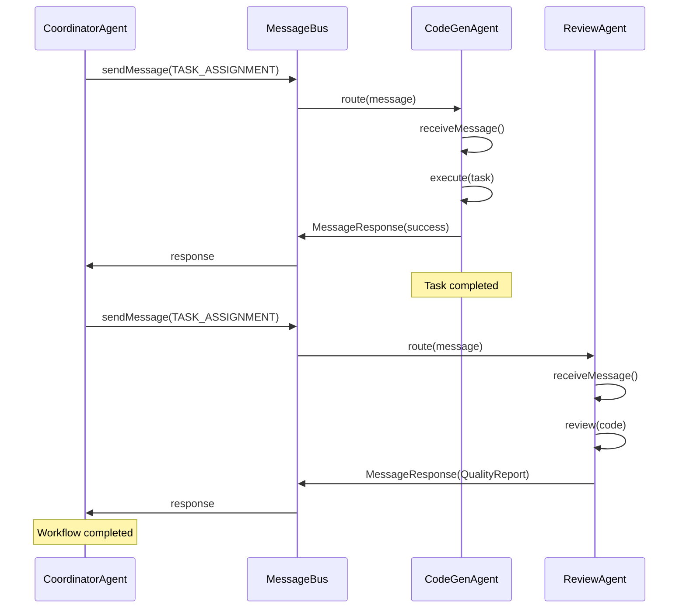
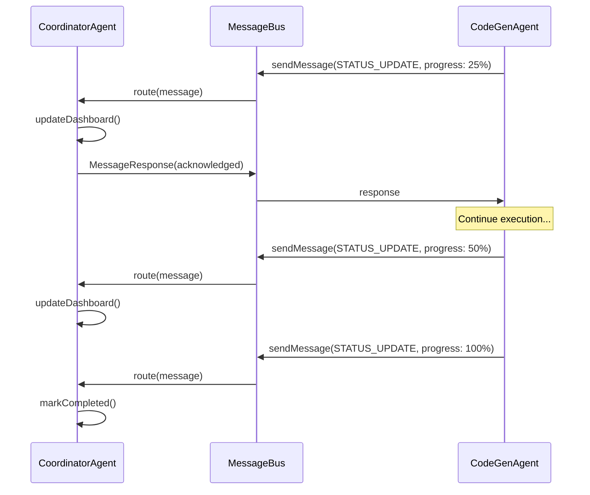
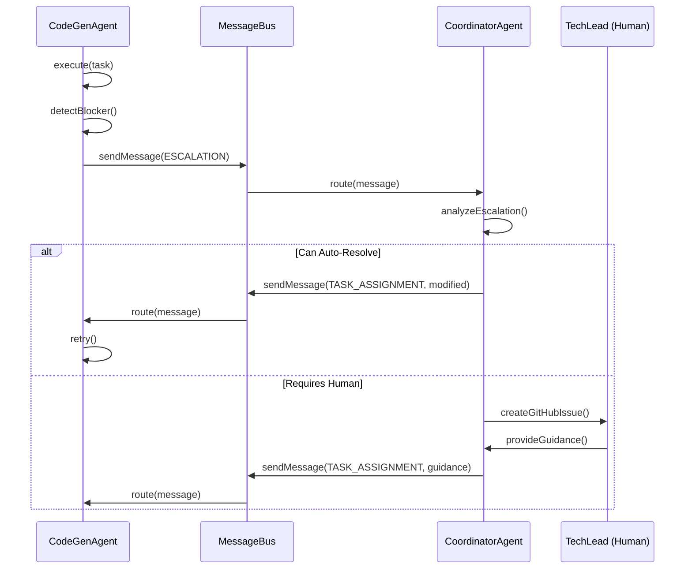

# Agent Communication Protocol

**Issue**: #139
**Status**: Implemented
**Version**: 1.0.0
**Last Updated**: 2025-10-20

---

## 📋 Overview

This document defines the standardized messaging protocol for inter-agent communication in the Miyabi autonomous operations platform.

**Key Features**:
- Type-safe message format
- Priority-based message queue
- Request-response tracking
- Centralized message routing (MessageBus)
- Logging and tracing

---

## 🏗️ Architecture

### Components

```
┌─────────────────┐
│ CoordinatorAgent │
└────────┬────────┘
         │ sendMessage()
         ▼
┌──────────────────────┐
│     MessageBus       │ ◄──── Centralized routing
│  (Event-driven)      │
└──────────┬───────────┘
           │ route()
           ▼
┌─────────────────┐
│  CodeGenAgent   │
└────────┬────────┘
         │ receiveMessage()
         ▼
    (Process task)
```

### Message Flow

1. **Sender**: Agent A calls `sendMessage(to, type, payload)`
2. **MessageBus**: Routes message to registered handler
3. **Recipient**: Agent B's `receiveMessage()` is invoked
4. **Response**: Agent B returns `MessageResponse`
5. **Callback**: Original sender receives response (if waiting)

---

## 📝 Message Format

### AgentMessage

```typescript
interface AgentMessage<T = unknown> {
  id: string;                  // UUID v4
  from: AgentType;             // Sender agent
  to: AgentType;               // Recipient agent
  type: MessageType;           // Message type
  priority: MessagePriority;   // 0-3 (lower = higher priority)
  payload: T;                  // Type-safe payload
  timestamp: string;           // ISO 8601
  correlationId?: string;      // For request-response tracking
  replyTo?: string;            // Parent message ID
  ttl?: number;                // Time-to-live (ms)
}
```

### MessageResponse

```typescript
interface MessageResponse<T = unknown> {
  messageId: string;     // Original message ID
  success: boolean;      // Success flag
  payload?: T;           // Response data (optional)
  error?: string;        // Error message (if failed)
  timestamp: string;     // ISO 8601
  durationMs?: number;   // Processing time
}
```

---

## 🔤 Message Types

### Supported Types

| Type | Description | Sender | Recipient |
|------|-------------|--------|-----------|
| `TASK_ASSIGNMENT` | Assign task to agent | Coordinator | Specialist |
| `STATUS_UPDATE` | Task progress update | Specialist | Coordinator |
| `ESCALATION` | Escalate blocked task | Specialist | Coordinator |
| `RESULT_REPORT` | Task completion result | Specialist | Coordinator |
| `ERROR_REPORT` | Error occurred | Any | Coordinator |
| `HEARTBEAT` | Health check | Any | Coordinator |
| `CAPABILITY_QUERY` | Request capabilities | Coordinator | Any |
| `CAPABILITY_RESPONSE` | Report capabilities | Any | Coordinator |

### Priority Levels

```typescript
enum MessagePriority {
  CRITICAL = 0,  // Immediate processing
  HIGH = 1,      // Process soon
  MEDIUM = 2,    // Standard priority
  LOW = 3,       // Process when available
}
```

---

## 🔧 Usage

### 1. Register Message Handler (in BaseAgent subclass)

```typescript
export class CodeGenAgent extends BaseAgent {
  constructor(config: AgentConfig) {
    super('CodeGenAgent', config);

    // Register to receive messages
    this.registerMessageHandler();
  }

  // Override to handle incoming messages
  protected async receiveMessage(
    message: AgentMessage
  ): Promise<MessageResponse> {
    switch (message.type) {
      case MessageType.TASK_ASSIGNMENT:
        return await this.handleTaskAssignment(message);

      case MessageType.STATUS_UPDATE:
        return await this.handleStatusUpdate(message);

      default:
        return {
          messageId: message.id,
          success: false,
          error: `Unknown message type: ${message.type}`,
          timestamp: new Date().toISOString(),
        };
    }
  }

  private async handleTaskAssignment(
    message: AgentMessage<TaskAssignmentPayload>
  ): Promise<MessageResponse> {
    const { task } = message.payload;

    // Execute task...
    const result = await this.execute(task);

    return {
      messageId: message.id,
      success: true,
      payload: { result },
      timestamp: new Date().toISOString(),
    };
  }
}
```

### 2. Send Message

```typescript
// In CoordinatorAgent
async assignTask(task: Task, agentType: AgentType): Promise<void> {
  const response = await this.sendMessage(
    agentType,
    MessageType.TASK_ASSIGNMENT,
    { task },
    MessagePriority.HIGH
  );

  if (!response.success) {
    logger.error(`Task assignment failed: ${response.error}`);
  }
}
```

### 3. Send and Wait for Response

```typescript
import { globalMessageBus } from './utils/message-bus';

const message = globalMessageBus.createMessage(
  'CoordinatorAgent',
  'CodeGenAgent',
  MessageType.TASK_ASSIGNMENT,
  { task }
);

const response = await globalMessageBus.sendAndWait(message, 30000); // 30s timeout

if (response.success) {
  console.log('Task accepted:', response.payload);
}
```

---

## 📊 Sequence Diagram

### Task Assignment Flow



### Status Update Flow



### Escalation Flow



---

## 🔍 Debugging

### View Message Log

```typescript
import { globalMessageBus } from './utils/message-bus';

// Get recent messages
const messages = globalMessageBus.getMessageLog(50);
console.log('Recent messages:', messages);

// Get statistics
const stats = globalMessageBus.getStats();
console.log('MessageBus stats:', stats);
```

### Listen to Events

```typescript
globalMessageBus.on('message:sent', (message) => {
  console.log('Message sent:', message);
});

globalMessageBus.on('message:response', (response) => {
  console.log('Response received:', response);
});

globalMessageBus.on('message:error', ({ message, error }) => {
  console.error('Message error:', error);
});
```

---

## 🧪 Testing

### Unit Test Example

```typescript
import { MessageBus } from './utils/message-bus';
import { MessageType, MessagePriority } from './types/communication';

describe('MessageBus', () => {
  let bus: MessageBus;

  beforeEach(() => {
    bus = new MessageBus({ enableLogging: false });
  });

  test('should register and send message', async () => {
    let received: any = null;

    bus.register('CodeGenAgent', async (message) => {
      received = message;
      return {
        messageId: message.id,
        success: true,
        timestamp: new Date().toISOString(),
      };
    });

    const message = bus.createMessage(
      'CoordinatorAgent',
      'CodeGenAgent',
      MessageType.TASK_ASSIGNMENT,
      { task: 'test' },
      MessagePriority.HIGH
    );

    await bus.send(message);

    expect(received).not.toBeNull();
    expect(received.type).toBe(MessageType.TASK_ASSIGNMENT);
  });
});
```

---

## 📚 API Reference

### MessageBus Methods

| Method | Description |
|--------|-------------|
| `register(agentType, handler)` | Register message handler |
| `unregister(agentType)` | Unregister handler |
| `send(message)` | Send message (fire-and-forget) |
| `sendAndWait(message, timeout)` | Send and wait for response |
| `createMessage(from, to, type, payload, priority)` | Create message with defaults |
| `getQueueSize(agentType)` | Get queue size for agent |
| `getMessageLog(limit)` | Get recent messages |
| `getStats()` | Get statistics |

### BaseAgent Methods

| Method | Description |
|--------|-------------|
| `sendMessage(to, type, payload, priority)` | Send message to another agent |
| `receiveMessage(message)` | Handle incoming message (override) |
| `registerMessageHandler()` | Register for messages |
| `unregisterMessageHandler()` | Unregister from messages |

---

## 🚀 Future Enhancements

- [ ] Remote messaging via WebSocket/gRPC
- [ ] Message persistence (database)
- [ ] Message replay for debugging
- [ ] Rate limiting and backpressure
- [ ] Message encryption for sensitive data
- [ ] Dead letter queue for failed messages
- [ ] Dashboard integration (Issue #142)

---

## 📖 Related Documents

- [Agent SDK Label Integration](./AGENT_SDK_LABEL_INTEGRATION.md)
- [Entity-Relation Model](../../docs/ENTITY_RELATION_MODEL.md)
- [Agent Operations Manual](../../docs/AGENT_OPERATIONS_MANUAL.md)

---

🤖 Generated with [Claude Code](https://claude.com/claude-code)

Co-Authored-By: Claude <noreply@anthropic.com>
