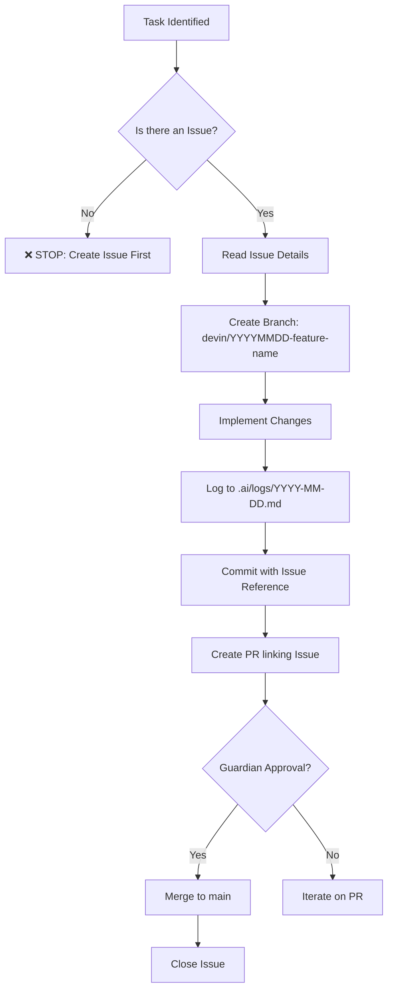

# 🔄 Workflow Rules — The Autonomous Operations Protocol

**Version**: 1.0.0
**Last Updated**: 2025-10-08
**Status**: MANDATORY — All contributors MUST follow these rules

---

## 🎯 Prime Directive

> **"Everything starts with an Issue. No exceptions."**

このプロジェクトでは、**全ての作業・変更・タスクは必ずGitHub Issueから開始**されなければなりません。

---

## 📜 The Three Commandments

### 1️⃣ Issue-Driven Development (IDD)

```
❌ WRONG:
   "Let's implement feature X"
   → Start coding immediately

✅ CORRECT:
   1. Create GitHub Issue with label
   2. Document intent, plan, acceptance criteria
   3. Get approval (if needed)
   4. Start implementation
   5. Reference Issue in commits/PR
```

**WHY?**
- ✅ Complete traceability (AGENTS.md Law 3)
- ✅ Knowledge persistence for AI learning
- ✅ Community visibility
- ✅ Historical context preservation
- ✅ Automatic log generation

### 2️⃣ Log-Driven Development (LDD)

All work must be logged in `.ai/logs/YYYY-MM-DD.md` with:
- **Intent**: What are we trying to achieve?
- **Plan**: Step-by-step approach
- **Implementation**: What was changed
- **Verification**: How we confirmed it works

**WHY?**
- Agent learning & knowledge base
- Debugging & troubleshooting
- Future reference for similar tasks

### 3️⃣ Zero Surprise Principle

No silent changes. Every action must:
1. Be documented in an Issue
2. Be visible to the Guardian
3. Be auditable via GitHub history

---

## 🚨 Mandatory Workflow

### For ALL Tasks (Human or Agent)



---

## 📝 Issue Creation Guidelines

### Issue Title Format

```
[TYPE] Brief description (max 80 chars)

Examples:
✅ [FEATURE] Add rich CLI output styling
✅ [BUG] Economic circuit breaker not triggering at 150%
✅ [DOCS] Update CONTRIBUTING.md with agent development guide
✅ [REFACTOR] Extract logger into agents/ui/ module
✅ [TEST] Add unit tests for RichLogger class
```

### Issue Body Template

```markdown
## 🎯 Goal
<!-- What are we trying to achieve? -->

## 📋 Context
<!-- Why is this needed? What's the background? -->

## ✅ Acceptance Criteria
- [ ] Criterion 1
- [ ] Criterion 2
- [ ] Criterion 3

## 🔗 Related Issues
<!-- Link to related issues if any -->

## 📊 Estimated Effort
<!-- S/M/L/XL or hours -->

## 🏷️ Labels
<!-- Suggested labels: feature, bug, docs, enhancement, etc. -->
```

---

## 🤖 For AI Agents (CoordinatorAgent, Specialists)

### Agent Responsibilities

1. **Before Starting Work**:
   ```typescript
   // Check if Issue exists
   const issue = await github.issues.get({ issue_number: taskId });
   if (!issue) {
     throw new Error('❌ PROTOCOL VIOLATION: No Issue found. Cannot proceed.');
   }
   ```

2. **During Work**:
   - Update Issue with progress comments
   - Log all actions to `.ai/logs/`
   - Reference Issue number in all commits

3. **After Completion**:
   - Create PR linking Issue (`Closes #123`)
   - Request Guardian review
   - Wait for approval before merge

### Agent Escalation

If an Agent encounters a situation without an Issue:

```typescript
await escalate({
  to: 'guardian',
  reason: 'No Issue exists for this task',
  action: 'Create Issue first, then retry',
  data: { taskDescription, context }
});
```

---

## 👤 For Human Contributors

### Before You Code

```bash
# 1. Create Issue on GitHub
gh issue create \
  --title "[FEATURE] Your feature description" \
  --body "$(cat issue-template.md)" \
  --label "enhancement"

# 2. Note the Issue number (e.g., #42)

# 3. Create branch
git checkout -b devin/$(date +%Y%m%d)-your-feature

# 4. Now you can start coding!
```

### During Development

```bash
# Commit with Issue reference
git commit -m "feat: implement X

Addresses #42

- Detail 1
- Detail 2

🤖 Generated with Claude Code
Co-Authored-By: Claude <noreply@anthropic.com>"
```

### After Development

```bash
# Create PR linking Issue
gh pr create \
  --title "feat: Your feature" \
  --body "Closes #42" \
  --draft
```

---

## 🚫 What NOT To Do

### ❌ Anti-Pattern #1: Silent Changes

```bash
# DON'T DO THIS:
git commit -m "fix typo"
git push
# No Issue, no PR, no visibility → VIOLATION
```

### ❌ Anti-Pattern #2: Post-Hoc Issues

```bash
# DON'T DO THIS:
# 1. Write code
# 2. Commit & push
# 3. Create Issue afterwards
# Issue should come FIRST, not after
```

### ❌ Anti-Pattern #3: Combining Multiple Features

```bash
# DON'T DO THIS:
# Create one Issue for "Improve CLI output"
# But implement:
# - Rich colors
# - Progress bars
# - Table formatters
# - Emoji support
# - Banner ASCII art

# DO THIS INSTEAD:
# Issue #1: [FEATURE] Add rich color support
# Issue #2: [FEATURE] Add progress bars
# Issue #3: [FEATURE] Add table formatters
# etc.
```

---

## 🎓 Rationale: Why This Rule Exists

### 1. Traceability (AGENTS.md Law 3)

Every change must be traceable:
```
Issue #123 → Branch → Commits → PR → Merge → Closed
```

### 2. Knowledge Persistence Layer

AI Agents learn from past Issues:
```
Vector DB: "How did we implement rich CLI output?"
→ Search Issue #123 → Find solution → Apply pattern
```

### 3. Community Collaboration

Open Source requires transparency:
- Contributors can see what's being worked on
- Avoid duplicate efforts
- Enable parallel work without conflicts

### 4. Guardian Governance

The Guardian (@ShunsukeHayashi) must have visibility:
- All work starts with Issue creation
- Guardian can approve/reject before work starts
- No surprise changes in PRs

---

## 🔧 Enforcement

### Automated Checks (Future)

```yaml
# .github/workflows/enforce-workflow-rules.yml
name: Enforce Workflow Rules

on:
  pull_request:
    types: [opened, synchronize]

jobs:
  check-issue-link:
    runs-on: ubuntu-latest
    steps:
      - name: Check PR links to Issue
        run: |
          if ! gh pr view ${{ github.event.pull_request.number }} \
               --json body --jq '.body' | grep -E '#[0-9]+|Closes #[0-9]+'; then
            echo "❌ VIOLATION: PR must link to an Issue"
            exit 1
          fi
```

### Manual Review

Guardian will reject PRs that:
- Don't link to an Issue
- Implement features not described in Issue
- Make silent changes without documentation

---

## ✅ Quick Reference

### Starting Work Checklist

- [ ] Issue exists on GitHub?
- [ ] Issue has clear acceptance criteria?
- [ ] Issue is assigned (if applicable)?
- [ ] Branch created from main?
- [ ] Branch name follows convention: `devin/YYYYMMDD-feature`?

### During Work Checklist

- [ ] Logging to `.ai/logs/YYYY-MM-DD.md`?
- [ ] Commits reference Issue number?
- [ ] Progress updates posted to Issue?

### Completing Work Checklist

- [ ] PR created?
- [ ] PR links to Issue (`Closes #123`)?
- [ ] All acceptance criteria met?
- [ ] Tests passing?
- [ ] Guardian notified for review?

---

## 🌟 Examples

### Example 1: Feature Implementation

```
1. Create Issue:
   Title: [FEATURE] Add rich CLI output styling
   Body: Implement RichLogger with chalk, ora, boxen
   Labels: enhancement, good-first-issue

2. Get Issue #: 42

3. Create Branch:
   devin/20251008-rich-cli-output

4. Implement:
   - agents/ui/logger.ts
   - agents/ui/theme.ts
   - Update base-agent.ts

5. Log Work:
   .ai/logs/2025-10-08.md

6. Commit:
   feat: add rich CLI output styling (#42)

7. Create PR:
   Title: feat: Add rich CLI output styling
   Body: Closes #42

8. Wait for Guardian review

9. Merge → Issue auto-closed
```

### Example 2: Bug Fix

```
1. User reports bug in Issue #56

2. Agent detects Issue via webhook

3. CoordinatorAgent:
   - Analyzes Issue #56
   - Creates branch: devin/20251008-fix-circuit-breaker

4. CodeGenAgent:
   - Fixes bug
   - Logs to .ai/logs/

5. ReviewAgent:
   - Runs tests
   - Verifies fix

6. PRAgent:
   - Creates PR: "fix: economic circuit breaker threshold (#56)"

7. Guardian approves → Merge → Close #56
```

---

## 📚 Further Reading

- [AGENTS.md](.github/AGENTS.md) - Constitutional rules
- [CONTRIBUTING.md](../CONTRIBUTING.md) - Contribution guidelines
- [GETTING_STARTED.md](../GETTING_STARTED.md) - Setup guide

---

## 🚨 Reminder

> **"If it's not in an Issue, it doesn't exist."**
>
> **"If it's not logged, it didn't happen."**
>
> **"If there's no trace, there's no trust."**

— AGENTS.md v5.0, Law of Traceability

---

**🤖 Generated with [Claude Code](https://claude.com/claude-code)**

**Co-Authored-By: Claude <noreply@anthropic.com>**

**Last Updated**: 2025-10-08
