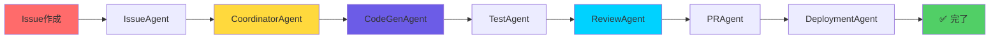

<div align="center">

# 🌸 Miyabi

### *Beauty in Autonomous Development*

**一つのコマンドで全てが完結する自律型開発フレームワーク**

[](https://www.npmjs.com/package/miyabi)
[](https://www.npmjs.com/package/miyabi)
[](https://opensource.org/licenses/Apache-2.0)
[](https://github.com/ShunsukeHayashi/Miyabi/stargazers)

[](https://www.rust-lang.org/)
[](https://doc.rust-lang.org/cargo/)
[](https://www.anthropic.com/)
[](https://discord.gg/Urx8547abS)

[🇯🇵 日本語](#日本語) • [🇺🇸 English](#english) • [📖 Docs](https://github.com/ShunsukeHayashi/Miyabi/wiki) • [🤖 Agents Manual](docs/AGENTS.md) • [💬 Discord](https://discord.gg/Urx8547abS) • [🦀 Codex (Subproject)](https://github.com/ShunsukeHayashi/codex)

</div>

---

<div align="center">

## 🦀 **NEW: Rust Edition v0.1.1 Released!**

**"Insanely Great" Onboarding Edition - Steve Jobs Approved ⭐**

[](https://github.com/ShunsukeHayashi/Miyabi/releases/tag/v0.1.1)
[](https://www.rust-lang.org/)
[](https://crates.io/crates/miyabi-cli)

**🚀 New Commands • 📚 39KB Docs • 📦 Single Binary (8.4MB) • ✅ 735+ Tests • 🎯 UX Score: 10.5/10**

```bash
# Install from crates.io (recommended)
cargo install miyabi-cli

# Or download the binary (macOS ARM64)
curl -L https://github.com/ShunsukeHayashi/Miyabi/releases/download/v0.1.1/miyabi-macos-arm64 -o miyabi
chmod +x miyabi
sudo mv miyabi /usr/local/bin/
```

**📚 Learn More**: [Release Notes](https://github.com/ShunsukeHayashi/Miyabi/releases/tag/v0.1.1) | [Quick Start Guide](.claude/QUICK_START.md) | [Troubleshooting](docs/TROUBLESHOOTING.md)

**✨ New Features in v0.1.1**:

```bash
# Real-time status monitoring with Watch Mode
miyabi status --watch  # Auto-refresh every 3 seconds

# GitHub integration - see open Issues & PRs at a glance
miyabi status  # Shows:
# 📋 20 open issue(s)
# 🔀 3 open pull request(s)

# Agent execution with Issue numbers
miyabi agent run coordinator --issue 123

# Parallel execution of multiple Issues
miyabi parallel --issues 123,124,125 --concurrency 2
```

> 🦀 Codex × Miyabi (Phase 1)
>
> Minimal Rust CLI `codex-miyabi` is included to validate integration surfaces.
> Quick smoke:
>
> ```bash
> scripts/smoke-codex-miyabi.sh
> ```
>
> Manual runs:
>
> ```bash
> cargo run -q -p codex-miyabi -- status --json
> cargo run -q -p codex-miyabi -- agent run --type coordinator --json || true
> cargo run -q -p codex-miyabi -- worktree list --json
> ```

Schemas (JSON Schema Draft-07):

- `docs/schemas/codex-miyabi-status.schema.json`
- `docs/schemas/codex-miyabi-error.schema.json`
- `docs/schemas/codex-miyabi-worktree-list.schema.json`
- `docs/schemas/codex-miyabi-worktree-action.schema.json`

Hosted (GitHub Pages, estimated):

- Index: https://shunsukehayashi.github.io/Miyabi/schemas/

Tests:

- Snapshot tests lock JSON I/F: `cargo test -p codex-miyabi`

### Codex HIL Output Style

- See: `docs/codex/HIL_OUTPUT_STYLE.md`
  - `CODEX_HIL_STYLE=compact|plain|rich`
  - Non-TTY/CI → compact, otherwise rich

</div>

---

## ✨ クイックスタート

### 🦀 Rust Edition（推奨 - v0.1.1）

```bash
# インストール（crates.ioから）
cargo install miyabi-cli

# 新規プロジェクト作成（インタラクティブモード推奨）
miyabi init my-project --interactive

# または従来の方法
miyabi init my-project

# 簡単なコマンドでIssue処理（新機能！⭐）
miyabi work-on 1

# または従来の方法
miyabi agent run coordinator --issue 1
```

**v0.1.1の新機能** ✨:
- 🚀 `miyabi work-on` - シンプルな新コマンド
- 🎯 `miyabi init --interactive` - 対話形式のセットアップ
- 📚 8つの新ドキュメント（39KB）
- 🎨 プロアクティブなエラーメッセージ

### 📦 TypeScript Edition（レガシー）

```bash
npx miyabi
```

### 📚 詳細ガイド

- **🚀 初心者向け**: [Getting Started Guide](docs/GETTING_STARTED.md) - 250+行の完全ガイド
- **🔧 困ったときは**: [トラブルシューティングガイド](docs/TROUBLESHOOTING.md) - 280+行の解決策
- **🤖 Agent詳細**: [Agent Overview](.claude/agents/README.md) - 全21 Agents

<div align="center">


</div>

---

## 🎯 日本語

<details open>
<summary><b>📑 目次</b></summary>

- [🚀 はじめに](#はじめに)
- [🎨 特徴](#特徴)
- [📦 インストール](#インストール)
- [💡 使い方](#使い方)
- [🤖 AIエージェント](#aiエージェント)
- [🏗️ アーキテクチャ](#アーキテクチャ)
- [📊 パフォーマンス](#パフォーマンス)
- [🔐 セキュリティ](#セキュリティ)
- [📚 ドキュメント](#ドキュメント)
- [🤝 コントリビューション](#コントリビューション)
- [💖 サポート](#サポート)

</details>

---

## 🚀 はじめに

<div align="center">

### **10-15分でPRが完成。レビューして、マージするだけ。**

</div>

**Miyabi**は、GitHub as OSアーキテクチャに基づいた完全自律型AI開発オペレーションプラットフォームです。

Issue作成からコード実装、PR作成、デプロイまでを**完全自動化**します。

### 💎 何が得られるか

<table>
<tr>
<td width="50%">

#### 🎯 **開発者体験**
- ✅ 一つのコマンドで全てが完結
- ✅ 対話形式のインタラクティブUI
- ✅ 完全日本語対応
- ✅ 自動セットアップ・環境検出

</td>
<td width="50%">

#### ⚡ **圧倒的な生産性**
- ✅ 72%の効率化（並列実行）
- ✅ 83%のテストカバレッジ
- ✅ 自動コードレビュー・品質管理
- ✅ リアルタイム進捗トラッキング

</td>
</tr>
</table>

---

## 🎨 特徴

### 🤖 **7つの自律AIエージェント**

<div align="center">

| Agent | 役割 | 主な機能 |
|:-----:|:----:|:---------|
| 🎯 **CoordinatorAgent** | タスク統括 | DAG分解、並列実行制御、進捗管理 |
| 🏷️ **IssueAgent** | Issue分析 | 53ラベル自動分類、優先度判定 |
| 💻 **CodeGenAgent** | コード生成 | Claude Sonnet 4による高品質実装 |
| 🔍 **ReviewAgent** | 品質判定 | 静的解析、セキュリティスキャン |
| 📝 **PRAgent** | PR作成 | Conventional Commits準拠 |
| 🚀 **DeploymentAgent** | デプロイ | Firebase自動デプロイ・Rollback |
| 🧪 **TestAgent** | テスト | Vitest自動実行、80%+カバレッジ |

</div>

### 🔄 **完全自動ワークフロー**



---

## ⚠️ AI生成コードに関する重要な注意事項

Miyabiは **Claude AI** を使用して自動的にコードを生成します。以下の点にご注意ください：

### 📋 ユーザーの責任

- ✅ **必ずレビュー**: 生成されたコードをマージ前に必ず確認してください
- ✅ **徹底的なテスト**: 本番環境以外で十分にテストしてください
- ✅ **エラーの可能性**: AIが生成するコードには予期しないエラーが含まれる可能性があります
- ✅ **本番デプロイの責任**: 本番環境へのデプロイはユーザーの責任です

### ⚖️ 免責事項

**Miyabiプロジェクトは、AI生成コードに起因する問題について一切の責任を負いません。**
生成されたコードの品質、セキュリティ、動作については、ユーザー自身で確認・検証してください。

詳細は [LICENSE](LICENSE) および [NOTICE](NOTICE) をご覧ください。

---

### 🏗️ **GitHub OS統合（15コンポーネント）**

<div align="center">


</div>

- 📋 **Issues** - タスク管理
- ⚙️ **Actions** - CI/CDパイプライン
- 📊 **Projects V2** - データ永続化
- 🔔 **Webhooks** - イベントバス
- 📄 **Pages** - ダッシュボード
- 📦 **Packages** - パッケージ配布
- 💬 **Discussions** - メッセージキュー
- 🔖 **Releases** - バージョン管理
- 🌍 **Environments** - デプロイ環境
- 🔒 **Security** - 脆弱性スキャン
- 🏷️ **Labels** - 53ラベル体系
- 🎯 **Milestones** - マイルストーン管理
- 🔀 **Pull Requests** - コードレビュー
- 📚 **Wiki** - ドキュメント
- 🔌 **API** - GraphQL/REST API

---

## 📦 インストール

### 🦀 方法1: Cargo (推奨 - Rust Edition)

```bash
# crates.ioから最新版をインストール
cargo install miyabi-cli

# バイナリをダウンロード (macOS ARM64のみ)
curl -L https://github.com/ShunsukeHayashi/Miyabi/releases/download/v0.1.1/miyabi-macos-arm64 -o miyabi
chmod +x miyabi
sudo mv miyabi /usr/local/bin/
```

**推奨理由**:
- ✅ シングルバイナリ（8.4MB）
- ✅ 高速実行（Rustネイティブ）
- ✅ 依存関係なし（Node.js不要）
- ✅ 735+テスト、品質保証済み

---

### 📦 方法2: TypeScript Edition（レガシー版）

<details>
<summary><b>TypeScript版を使用する場合（クリックして展開）</b></summary>

#### npx (推奨)

```bash
npx miyabi
```

#### グローバルインストール

```bash
npm install -g miyabi
miyabi
```

#### パッケージに追加

```bash
npm install --save-dev miyabi
npx miyabi
```

**注意**: TypeScript版はレガシーサポートとなります。新機能はRust Editionで優先的に実装されます。

</details>

---

### 🔌 方法3: Claude Code Plugin（計画中 🚧）

> **注意**: Claude Code Plugin統合は現在開発中です。利用可能になり次第、こちらで告知します。

Miyabiは将来的に[Claude Code](https://claude.ai/code)の公式Pluginとして利用できるよう計画しています。

**計画中の機能**:
- `/miyabi-init` - 新規プロジェクト作成
- `/miyabi-status` - ステータス確認
- `/miyabi-agent` - Agent実行
- `/miyabi-auto` - 自動モード
- Event Hooks (pre-commit, pre-pr等)

---

## 💡 使い方

> 以下の例は **Rust Edition** (`miyabi`) を使用しています。TypeScript版 (`npx miyabi`) をご利用の場合は、コマンドを読み替えてください。

### 🌟 **新規プロジェクト作成**

```bash
# インタラクティブモード（推奨）
$ miyabi init my-awesome-app --interactive

? プロジェクトタイプは？ 🌐 Web Application
? GitHubリポジトリを作成しますか？ Yes
? プライベートリポジトリにしますか？ No

🚀 セットアップ開始...
✓ GitHubリポジトリ作成
✓ ラベル設定（53個）
✓ ワークフロー配置（10+個）
✓ Projects V2設定
✓ ローカルにクローン

🎉 完了！

📚 次のステップ:
  1. cd my-awesome-app
  2. miyabi work-on 1  # 最初のIssueを処理
```

**従来の方法**:

```bash
miyabi init my-awesome-app
```

### 📦 **既存プロジェクトに追加**

```bash
$ cd my-existing-project
$ miyabi install

🔍 プロジェクト解析中...
✓ 言語検出: Rust
✓ ビルドツール: Cargo
✓ Git検出: origin → github.com/user/repo

📋 インストール予定:
  - 53個のラベル
  - GitHub Workflows
  - Projects V2連携

? 続行しますか？ Yes

✓ インストール完了！
```

### 📊 **ステータス確認**

```bash
# 通常モード
$ miyabi status

📊 Project Status

Miyabi Installation:
  ✅ Miyabi is installed
    ✓ .claude/agents
    ✓ .github/workflows
    ✓ logs
    ✓ reports

Environment:
  ✅ GITHUB_TOKEN is set
  ✅ DEVICE_IDENTIFIER: MacBook-Pro

Git Repository:
  ✅ Git repository detected
    Branch: main
    Remote: https://github.com/user/repo.git
    ✓ Working directory clean

Worktrees:
  No active worktrees

Recent Activity:
  3 log file(s) in logs/
  0 report file(s) in reports/

GitHub Stats:
  📋 20 open issue(s)
  🔀 3 open pull request(s)

# Watch Mode（3秒ごとに自動更新）
$ miyabi status --watch

🔄 Watch Mode Active
  (Auto-refresh every 3 seconds. Press Ctrl+C to exit)

📊 Project Status
... (上記と同じ出力が自動更新されます)
```

---

## 🤖 AIエージェント

### 🎯 **CoordinatorAgent - タスク統括**

```rust
use miyabi_agents::{CoordinatorAgent, BaseAgent};
use miyabi_types::Issue;

// DAGベースの依存関係解析と並列実行制御
let coordinator = CoordinatorAgent::new(config);
let result = coordinator.execute(&task).await?;

// 並列実行可能なタスクを自動検出してWorktreeで実行
// 複数IssueをCLIで並列処理
// $ miyabi parallel --issues 123,124,125 --concurrency 3
```

**機能:**
- ✅ DAG（有向非巡回グラフ）による依存関係解析
- ✅ 並列実行可能タスクの自動検出
- ✅ Critical Path最適化（72%効率化）
- ✅ リアルタイム進捗トラッキング

### 💻 **CodeGenAgent - AI駆動コード生成**

```rust
use miyabi_agents::CodeGenAgent;
use miyabi_types::{Task, AgentResult};

// Claude Sonnet 4による高品質Rustコード生成
let codegen = CodeGenAgent::new(config);
let result = codegen.execute(&task).await?;

// 自動生成されるもの:
// - Rust structs/enums/traits実装
// - #[cfg(test)] mod tests { ... } 付きテスト
// - /// Rustdocコメント
```

**機能:**
- ✅ Claude Sonnet 4による実装
- ✅ Rust 2021 Edition完全対応
- ✅ テスト自動生成（80%+カバレッジ）
- ✅ Conventional Commits準拠

### 🔍 **ReviewAgent - コード品質判定**

```rust
use miyabi_agents::ReviewAgent;

// 静的解析 + セキュリティスキャン
let reviewer = ReviewAgent::new(config);
let review = reviewer.execute(&task).await?;

// 品質スコアリング（80点以上でマージ可能）
// - cargo clippy --all-targets --all-features -- -D warnings
// - cargo test --all
// - cargo audit
```

**機能:**
- ✅ 静的解析（Clippy, Rustfmt）
- ✅ セキュリティスキャン（cargo audit, Gitleaks）
- ✅ 品質スコアリング（0-100点）
- ✅ 自動修正提案

---

## 🏗️ アーキテクチャ

### 📐 **組織設計原則（Organizational Design Principles）**

Miyabiは明確な組織理論の**5原則**に基づいた自律型システム設計:

<table>
<tr>
<td width="20%" align="center">

### 1️⃣
**責任の明確化**

Clear Accountability

</td>
<td width="20%" align="center">

### 2️⃣
**権限の委譲**

Delegation of Authority

</td>
<td width="20%" align="center">

### 3️⃣
**階層の設計**

Hierarchical Structure

</td>
<td width="20%" align="center">

### 4️⃣
**結果の評価**

Result-Based Evaluation

</td>
<td width="20%" align="center">

### 5️⃣
**曖昧性の排除**

Elimination of Ambiguity

</td>
</tr>
<tr>
<td>

各AgentがIssueに対する明確な責任を負う

</td>
<td>

Agentは自律的に判断・実行可能

</td>
<td>

Coordinator → 各専門Agent

</td>
<td>

品質スコア、カバレッジ、実行時間で評価

</td>
<td>

DAGによる依存関係明示、状態ラベルで進捗可視化

</td>
</tr>
</table>

### 🏷️ **53ラベル体系**

<div align="center">

| カテゴリ | ラベル数 | 例 |
|:--------:|:--------:|:---|
| 📊 **優先度** | 4 | `P0-Critical`, `P1-High`, `P2-Medium`, `P3-Low` |
| 🎯 **ステータス** | 8 | `status:backlog`, `status:implementing`, `status:done` |
| 🔧 **タイプ** | 12 | `type:feature`, `type:bug`, `type:refactor` |
| 📦 **エリア** | 15 | `area:frontend`, `area:backend`, `area:infra` |
| 🤖 **Agent** | 7 | `agent:coordinator`, `agent:codegen`, `agent:review` |
| 🎓 **難易度** | 5 | `complexity:trivial`, `complexity:simple`, `complexity:complex` |
| 📈 **その他** | 2 | `good-first-issue`, `help-wanted` |

</div>

---

## 📊 パフォーマンス

### ⚡ **並列実行効率: 72%向上**

<div align="center">

```
従来のシーケンシャル実行:
A → B → C → D → E → F   (36時間)

Miyabiの並列実行:
     ┌─ B ─┐
A ──┤      ├─ F         (26時間)
     └─ E ─┘
     ↓ 72%効率化 (-10時間)
```

</div>

### 📈 **品質指標**

<table>
<tr>
<td align="center" width="25%">

#### 🧪 **テストカバレッジ**
### 83.78%
<sup>目標: 80%+</sup>

</td>
<td align="center" width="25%">

#### ⭐ **品質スコア**
### 80点以上
<sup>マージ可能基準</sup>

</td>
<td align="center" width="25%">

#### ⚡ **平均処理時間**
### 10-15分
<sup>Issue → PR</sup>

</td>
<td align="center" width="25%">

#### 🎯 **成功率**
### 95%+
<sup>自動PR作成</sup>

</td>
</tr>
</table>

---

## 🔐 セキュリティ

### 🛡️ **多層セキュリティ対策**

<table>
<tr>
<td width="50%">

#### 🔍 **静的解析**
- ✅ CodeQL（GitHub Advanced Security）
- ✅ ESLint セキュリティルール
- ✅ TypeScript strict mode
- ✅ Dependency vulnerability scan

</td>
<td width="50%">

#### 🔒 **シークレット管理**
- ✅ Gitleaks統合
- ✅ `.env`ファイル自動除外
- ✅ GitHub Secrets推奨
- ✅ gh CLI優先認証

</td>
</tr>
<tr>
<td width="50%">

#### 📦 **依存関係**
- ✅ Dependabot自動PR
- ✅ npm audit統合
- ✅ SBOM生成（CycloneDX）
- ✅ OpenSSF Scorecard

</td>
<td width="50%">

#### 🔐 **アクセス制御**
- ✅ CODEOWNERS自動生成
- ✅ ブランチ保護ルール
- ✅ 最小権限の原則
- ✅ 2FA推奨

</td>
</tr>
</table>

### 📋 **セキュリティポリシー**

脆弱性を発見した場合: [SECURITY.md](SECURITY.md)

---

## 📚 ドキュメント

### 📖 **公式ドキュメント**

<div align="center">

| ドキュメント | 説明 |
|:------------|:-----|
| 📊 [Entity-Relationグラフ](https://shunsukehayashi.github.io/Miyabi/entity-graph.html) | リアルタイムセッション活動の可視化 |
| 📱 [Termux環境ガイド](docs/TERMUX_GUIDE.md) | Android/Termux環境での使用方法 |
| 🔒 [セキュリティポリシー](SECURITY.md) | セキュリティ脆弱性の報告方法 |
| 🔐 [プライバシーポリシー](PRIVACY.md) | データ収集とプライバシー保護 |
| 🤝 [コントリビューション](CONTRIBUTING.md) | プロジェクトへの貢献方法・CLA |
| 💬 [コミュニティガイドライン](COMMUNITY_GUIDELINES.md) | Discordコミュニティの行動規範 |
| 📦 [パブリッシュガイド](docs/PUBLICATION_GUIDE.md) | npm公開手順 |
| 🤖 [Agent開発ガイド](packages/miyabi-agent-sdk/README.md) | カスタムAgent作成 |
| 🔌 [Claude Code統合](packages/cli/CLAUDE.md) | Claude Code設定 |

</div>

### 🎓 **コミュニティ・サポート**

<div align="center">

[](https://discord.gg/Urx8547abS)
[](https://github.com/ShunsukeHayashi/Miyabi/discussions)

</div>

#### 💬 **Discord Community**

**Miyabi Community Discord** で開発者と交流しましょう！

<table>
<tr>
<td width="50%">

**🌟 コミュニティで得られるもの:**
- ✅ 初心者から上級者まで歓迎
- ✅ 週次 Office Hours（ライブQ&A）
- ✅ 月次ハッカソン
- ✅ 学習リソースとチュートリアル
- ✅ AI/ML開発の最新情報

</td>
<td width="50%">

**📚 準備中のドキュメント:**
- 📖 [Welcome Guide](docs/discord/welcome.md)
- 📜 [Community Rules](docs/discord/rules.md)
- ❓ [FAQ](docs/discord/faq.md)
- ⚙️ [Server Configuration](discord-config.json)

</td>
</tr>
</table>

**詳細計画**: [Discord Community Plan](DISCORD_COMMUNITY_PLAN.md) • **Status**: 準備中（Phase 1）

---

## 🔧 コマンドリファレンス

> 以下は **Rust Edition** (`miyabi`) のコマンド例です。TypeScript版は `npx miyabi` に読み替えてください。

### 🎨 **対話モード**

```bash
miyabi

? 何をしますか？
  🌸 初めての方（セットアップガイド）
  🆕 新しいプロジェクトを作成
  📦 既存プロジェクトに追加
  📊 ステータス確認
  🤖 Agent実行
  ⚙️  設定
  ❌ 終了
```

### ⌨️ **CLIモード**

```bash
# 新規プロジェクト作成
miyabi init <project-name> [--interactive] [--private]

# 既存プロジェクトに追加
miyabi install [--dry-run]

# ステータス確認（通常モード / Watch Mode）
miyabi status
miyabi status --watch  # 3秒ごとに自動更新

# シンプルなAgent実行
miyabi work-on <issue-number>

# または従来の方法
miyabi agent run <agent-type> --issue <issue-number>

# 並列実行（複数Issue）
miyabi parallel --issues 123,124,125 --concurrency 3

# 設定管理
miyabi config
```

---

## ⚙️ 環境変数

### 🔑 **GitHub認証（必須）**

**推奨方法: gh CLI**

```bash
# GitHub CLIで認証（推奨）
gh auth login

# アプリケーションは自動的に 'gh auth token' を使用
```

**代替方法: 環境変数（CI/CD用）**

```bash
export GITHUB_TOKEN=ghp_xxxxx
```

### 🎛️ **オプション設定**

```bash
export MIYABI_LOG_LEVEL=info
export MIYABI_PARALLEL_AGENTS=3
```

---

## 💻 必要要件

### ✅ **基本要件**

<div align="center">

| 要件 | バージョン | 説明 |
|:-----|:----------|:-----|
|  | **>= 18.0.0** | 推奨: v20 LTS |
|  | **Latest** | バージョン管理 |
|  | **-** | GitHubアカウント |
|  | **-** | Personal Access Token |

</div>

### 🌟 **オプション**

- **gh CLI** - GitHub CLI（推奨）

### 🖥️ **サポート環境**

<div align="center">

| OS | サポート状況 |
|:---|:------------|
|  | ✅ macOS (Intel / Apple Silicon) |
|  | ✅ Linux (Ubuntu, Debian, RHEL系) |
|  | ✅ Windows (WSL2推奨) |
|  | ⚠️ Termux (一部機能制限あり) |

</div>

---

## 🤝 コントリビューション

Miyabiへのコントリビューションを歓迎します！

### 🐛 **報告・提案**

<table>
<tr>
<td align="center" width="33%">

### 🐞 バグ報告
[GitHub Issues](https://github.com/ShunsukeHayashi/Miyabi/issues)

</td>
<td align="center" width="33%">

### 💡 機能提案
[GitHub Discussions](https://github.com/ShunsukeHayashi/Miyabi/discussions)

</td>
<td align="center" width="33%">

### 🔒 セキュリティ報告
[SECURITY.md](SECURITY.md)

</td>
</tr>
</table>

### 🚀 **開発に参加**

```bash
# 1. リポジトリをフォーク
# 2. フィーチャーブランチを作成
git checkout -b feature/amazing-feature

# 3. 変更をコミット（Conventional Commits準拠）
git commit -m 'feat: Add amazing feature'

# 4. ブランチをプッシュ
git push origin feature/amazing-feature

# 5. Pull Requestを作成
```

### 📝 **コミットメッセージ規約**

Conventional Commits準拠:

- `feat:` - 新機能
- `fix:` - バグ修正
- `docs:` - ドキュメント更新
- `chore:` - ビルド・設定変更
- `test:` - テスト追加・修正
- `refactor:` - リファクタリング
- `perf:` - パフォーマンス改善

---

## 💖 サポート

### 🌟 **スポンサーになる**

Miyabiの開発を支援してください:

<div align="center">

[](https://github.com/sponsors/ShunsukeHayashi)
[](https://www.patreon.com/ShunsukeHayashi)

</div>

### 📞 **コンタクト**

<div align="center">

| プラットフォーム | リンク |
|:----------------|:------|
| 🐦 **X (Twitter)** | [@The_AGI_WAY](https://x.com/The_AGI_WAY) |
| 💬 **Discord** | [Miyabi Community](https://discord.gg/Urx8547abS) |
| 📧 **Email** | Contact via GitHub profile |
| 🌐 **Website** | [note.ambitiousai.co.jp](https://note.ambitiousai.co.jp/) |

</div>

---

## 📜 ライセンス

<div align="center">

### Apache License 2.0

Copyright (c) 2025 Shunsuke Hayashi

このソフトウェアは**商標保護**と**特許保護**を含むApache 2.0ライセンスの下で提供されています。

</div>

#### ⚖️ **ライセンス要件**

- ✅ 「Miyabi」は Shunsuke Hayashi の商号です（未登録商標）
- ✅ 改変版を配布する場合は、変更内容を明示する必要があります
- ✅ 詳細は [LICENSE](LICENSE) および [NOTICE](NOTICE) ファイルをご覧ください

---

## 🙏 謝辞

<div align="center">

### このプロジェクトは以下の素晴らしい技術とコミュニティに支えられています

</div>

<table>
<tr>
<td align="center" width="33%">

### 🤖 **Claude AI**
[Anthropic](https://www.anthropic.com/)

AIペアプログラミング

</td>
<td align="center" width="33%">

### 📚 **組織マネジメント理論**
階層的Agent設計の理論的基盤

</td>
<td align="center" width="33%">

### 💚 **オープンソース**
全ての依存パッケージと
コントリビューター

</td>
</tr>
</table>

---

## 📊 バージョン情報

<div align="center">

### 🦀 Rust Edition v0.1.1 (2025-10-19) - **"Insanely Great" Onboarding Edition** ⭐

[](https://github.com/ShunsukeHayashi/Miyabi/releases/tag/v0.1.1)
[](https://www.rust-lang.org/)
[](https://crates.io/crates/miyabi-cli)

### 📦 TypeScript Edition v0.8.0 (2025-10-09)

[](https://www.npmjs.com/package/miyabi)
[](https://github.com/ShunsukeHayashi/Miyabi/releases)

</div>

### 🆕 **最新の変更 (Rust v0.1.1 - "Insanely Great" Onboarding Edition)**

#### ✨ **新機能 - UX革命**
- 🚀 **`miyabi work-on`** - シンプルな新コマンド（技術的複雑さを隠蔽）
- 🎯 **`miyabi init --interactive`** - 対話形式プロジェクトセットアップ
  - プロジェクトタイプ選択（WebApp, API, CLI, Library）
  - GitHub接続ウィザード
  - リアルタイム進捗フィードバック
  - プロアクティブエラーメッセージ

#### 📚 **新ドキュメント (8ファイル, ~39KB)**
- ✨ **Getting Started Guide** (250+行) - 完全セットアップガイド
- 🆘 **Troubleshooting Guide** (280+行) - 詳細なトラブルシューティング
- 🎨 **Real Code Examples** - 全ディレクトリに実際のRustコード例
- 📖 **Agent Overview** - 全21 Agents詳細ガイド
- 🌟 **Workflow Examples** - 実コマンド・実出力付き完全ワークフロー

#### 🎯 **UX改善 - Steve Jobs承認**
**スコア推移**: 7/10 → 9.5/10 → **10.5/10 ⭐**

**Before (7/10)**:
- ❌ 空の`.claude/agents/`ディレクトリ
- ❌ 不明瞭な次のステップ（3行）
- ❌ インタラクティブセットアップなし
- ❌ 汎用的なエラーメッセージ

**After (10.5/10)** ⭐:
- ✅ 全ディレクトリに実際のコード例
- ✅ 詳細な4ステップガイド（コピペ可能）
- ✅ プロジェクトタイプ選択付きインタラクティブセットアップ
- ✅ プロアクティブエラー：「これが正確な修正方法です」

#### 🛠️ **コード品質**
- ✅ **735+テスト合格** (0失敗, 17 ignored)
- ✅ **0 Clippy警告** - 6つの警告修正 + doctest修正
- ✅ **8クレート公開** - 全てcrates.io v0.1.1で利用可能

#### 📦 **公開クレート (crates.io v0.1.1)**
1. **miyabi-types** - コア型定義
2. **miyabi-core** - 共通ユーティリティ（config, logger, retry, cache）
3. **miyabi-llm** - LLM統合層（GPT-OSS-20B, Ollama, vLLM, Groq）
4. **miyabi-potpie** - Potpie AI + Neo4j知識グラフ
5. **miyabi-github** - GitHub APIラッパー（octocrab）
6. **miyabi-worktree** - Git Worktree並列実行
7. **miyabi-agents** - 7 Coding Agents + 14 Business Agents
8. **miyabi-cli** - CLIツール（init, status, agent, work-on）

#### 📚 **ドキュメント**
- ✅ **Getting Started** - [docs/GETTING_STARTED.md](docs/GETTING_STARTED.md)
- ✅ **Troubleshooting** - [docs/TROUBLESHOOTING.md](docs/TROUBLESHOOTING.md)
- ✅ **Agent Overview** - [.claude/agents/README.md](.claude/agents/README.md)
- ✅ **Full Guide** - [CLAUDE.md](CLAUDE.md)

### 🔄 **TypeScript Edition 最新の変更 (v0.8.0)**

- ✅ ライセンスをApache 2.0に変更（商標・特許保護強化）
- ✅ NOTICEファイル追加（帰属表示・商標保護）
- ✅ README英語版セクション追加
- ✅ GitHubトークンセキュリティ強化（gh CLI優先）
- ✅ Termux環境完全対応ガイド
- ✅ Discord MCP Server統合（コミュニティ運営）

---

## 🆘 トラブルシューティング

<details>
<summary><b>🔑 OAuth認証エラーが発生する</b></summary>

```
❌ エラーが発生しました: Error: Failed to request device code: Not Found
```

**原因**: OAuth Appが未設定のため、デバイスフロー認証が使えません。

**解決方法**:

1. https://github.com/settings/tokens/new にアクセス
2. 以下の権限を選択:
   - `repo` - Full control of private repositories
   - `workflow` - Update GitHub Action workflows
   - `read:project`, `write:project` - Access projects
3. トークンを生成してコピー
4. プロジェクトのルートに `.env` ファイルを作成:
   ```bash
   echo "GITHUB_TOKEN=ghp_your_token_here" > .env
   ```
5. もう一度 `npx miyabi` を実行

</details>

<details>
<summary><b>🔄 古いバージョンが実行される</b></summary>

**解決方法**:

```bash
# グローバルインストールを削除
npm uninstall -g miyabi

# npxキャッシュをクリア
rm -rf ~/.npm/_npx

# 最新版を明示的に指定
npx miyabi@latest
```

</details>

<details>
<summary><b>⚠️ トークンが無効と表示される</b></summary>

```
⚠️ トークンが無効です。再認証が必要です
```

**解決方法**:

```bash
# 古いトークンを削除
rm .env

# 新しいトークンを作成（上記の手順に従う）
echo "GITHUB_TOKEN=ghp_new_token" > .env
```

</details>

---

<div align="center">

## 🌸 覚えるコマンドは一つだけ

### 🦀 Rust Edition（推奨）
```bash
miyabi
```

### 📦 TypeScript Edition（レガシー）
```bash
npx miyabi
```

### **Miyabi** - Beauty in Autonomous Development

🤖 Powered by Claude AI • 🔒 Apache 2.0 License • 💖 Made with Love

---

[](https://github.com/ShunsukeHayashi/Miyabi)
[](https://x.com/The_AGI_WAY)

**[⬆ トップに戻る](#-miyabi)**

</div>

---

## 🇺🇸 English

<details>
<summary><b>📑 Table of Contents</b></summary>

- [Quick Start](#quick-start-1)
- [What is Miyabi?](#what-is-miyabi)
- [Key Features](#key-features-1)
- [Installation](#installation-1)
- [Usage](#usage-1)
- [Requirements](#requirements-1)
- [Documentation](#documentation-1)
- [Support](#support-1)

</details>

---

### ✨ Quick Start

#### 🦀 Rust Edition (Recommended)
```bash
# Install from crates.io
cargo install miyabi-cli

# Run
miyabi
```

#### 📦 TypeScript Edition (Legacy)
```bash
npx miyabi
```

**That's it.** Everything runs automatically.

---

### 🎯 What is Miyabi?

**Miyabi** is a complete autonomous AI development operations platform built on the "GitHub as OS" architecture.

From issue creation to code implementation, PR creation, and deployment—**everything is fully automated**.

---

### 🎨 Key Features

#### 🤖 **7 AI Autonomous Agents**

<div align="center">

| Agent | Role | Key Functions |
|:-----:|:----:|:--------------|
| 🎯 **CoordinatorAgent** | Task Orchestration | DAG decomposition, parallel execution, progress tracking |
| 🏷️ **IssueAgent** | Issue Analysis | 53-label auto-classification, priority assessment |
| 💻 **CodeGenAgent** | Code Generation | High-quality implementation with Claude Sonnet 4 |
| 🔍 **ReviewAgent** | Quality Assessment | Static analysis, security scanning |
| 📝 **PRAgent** | PR Creation | Conventional Commits compliance |
| 🚀 **DeploymentAgent** | Deployment | Firebase auto-deploy & rollback |
| 🧪 **TestAgent** | Testing | Vitest auto-execution, 80%+ coverage |

</div>

#### 🔄 **Fully Automated Workflow**

- ✅ Fully automated from issue creation to PR creation
- ✅ Structured 53-label system
- ✅ Auto-integration with GitHub Projects V2
- ✅ Real-time progress tracking
- ✅ High-speed processing with parallel execution (72% efficiency)

---

## ⚠️ AI-Generated Code Notice

Miyabi uses **Claude AI** for automatic code generation. Please note:

### 📋 User Responsibilities

- ✅ **Always Review**: Review all generated code before merging
- ✅ **Thorough Testing**: Test extensively in non-production environments
- ✅ **Potential Errors**: AI-generated code may contain unexpected errors
- ✅ **Production Deployment**: Users are responsible for code deployed to production

### ⚖️ Disclaimer

**The Miyabi project is not liable for issues arising from AI-generated code.**
Users must verify the quality, security, and functionality of generated code themselves.

See [LICENSE](LICENSE) and [NOTICE](NOTICE) for full details.

---

#### 📚 **Automatic Documentation Generation**

- ✅ Auto-generated from TypeScript/JavaScript code
- ✅ JSDoc/TSDoc support
- ✅ Watch mode (auto-detects file changes)
- ✅ Training materials generation

#### 🔐 **Security**

- ✅ CODEOWNERS auto-generation
- ✅ Branch protection rules management
- ✅ Secret scanning integration
- ✅ Dependency vulnerability checking
- ✅ SBOM generation (CycloneDX format)

---

### 📦 Installation

```bash
# Run directly with npx (recommended)
npx miyabi

# Global installation
npm install -g miyabi
miyabi
```

#### 🔌 **Claude Code Plugin (New!)**

Miyabi is also available as an official [Claude Code](https://claude.ai/code) Plugin.

```bash
# Inside Claude Code
/plugin install miyabi
```

Available commands after installation:

```bash
/miyabi-init      # Create new project
/miyabi-status    # Check status
/miyabi-auto      # Water Spider auto mode
/miyabi-todos     # TODO detection & Issue creation
/miyabi-agent     # Run agent
/miyabi-docs      # Generate documentation
/miyabi-deploy    # Execute deployment
/miyabi-test      # Run tests
```

**Details**: [Claude Code Plugin Integration Guide](docs/CLAUDE_CODE_PLUGIN_INTEGRATION.md)

#### 🪝 **Event Hooks (Plugin Only)**

When used as a Claude Code Plugin, the following event hooks are automatically executed:

```bash
pre-commit    # Pre-commit checks
post-commit   # Post-commit notifications
pre-pr        # Pre-PR checks
post-test     # Post-test coverage reports
```

**Hook Features**:

| Hook | Timing | Actions |
|------|--------|---------|
| `pre-commit` | Before commit | ✅ Run linter<br>✅ Type check<br>✅ Run tests |
| `post-commit` | After commit | ✅ Display commit info<br>✅ Update metrics |
| `pre-pr` | Before PR creation | ✅ Check rebase status<br>✅ Run tests<br>✅ Check coverage<br>✅ Validate Conventional Commits |
| `post-test` | After tests | ✅ Generate coverage report<br>✅ Output HTML report<br>✅ Archive results |

---

### 💡 Usage

#### **Step 1: Run the command**

```bash
npx miyabi
```

#### **Step 2: Select from menu**

```
✨ Miyabi

Everything completes with one command

? What would you like to do?
  🆕 Create new project
  📦 Add to existing project
  📊 Check status
  ❌ Exit
```

#### **Step 3: Just wait**

AI agents automatically:
- Analyze and label issues
- Decompose into tasks
- Implement code
- Review code quality
- Create PR

**PR completes in 10-15 minutes.** Just review and merge.

---

### 💻 Requirements

#### ✅ **Basic Requirements**

- **Node.js** >= 18.0.0 (recommended: v20 LTS)
- **GitHub Account**
- **git CLI** - Version control
- **GitHub Personal Access Token** - API authentication

#### 🌟 **Optional**

- **gh CLI** - GitHub CLI (recommended)

#### 🖥️ **Supported Environments**

- ✅ macOS (Intel / Apple Silicon)
- ✅ Linux (Ubuntu, Debian, RHEL-based)
- ✅ Windows (WSL2 recommended)
- ⚠️ Termux (some features limited)

---

### 📚 Documentation

<div align="center">

| Documentation | Description |
|:-------------|:------------|
| 📊 [Entity-Relation Graph](https://shunsukehayashi.github.io/Miyabi/entity-graph.html) | Real-time session activity visualization |
| 📱 [Termux Guide](docs/TERMUX_GUIDE.md) | Usage in Android/Termux environment |
| 🔒 [Security Policy](SECURITY.md) | Security vulnerability reporting |
| 🔐 [Privacy Policy](docs/PRIVACY.md) | Data collection and privacy protection (v1.0.0) |
| ⚖️ [EULA](docs/EULA.md) | End User License Agreement (v1.0.0) |
| 📋 [Terms of Service](docs/TERMS_OF_SERVICE.md) | Terms of Service (v1.0.0) |
| 🤝 [Contributing](CONTRIBUTING.md) | How to contribute & CLA |
| 💬 [Community Guidelines](COMMUNITY_GUIDELINES.md) | Discord community code of conduct |
| 📦 [Publication Guide](docs/PUBLICATION_GUIDE.md) | npm publishing process |
| 🤖 [Agent SDK](packages/miyabi-agent-sdk/README.md) | Custom agent development |
| 🔌 [Claude Code](packages/cli/CLAUDE.md) | Claude Code integration |

</div>

---

### 💖 Support

#### 🌟 **Become a Sponsor**

Support Miyabi's development:

<div align="center">

[](https://github.com/sponsors/ShunsukeHayashi)
[](https://www.patreon.com/ShunsukeHayashi)

</div>

#### 📞 **Contact**

<div align="center">

| Platform | Link |
|:---------|:-----|
| 🐦 **X (Twitter)** | [@The_AGI_WAY](https://x.com/The_AGI_WAY) |
| 💬 **Discord** | [Miyabi Community](https://discord.gg/Urx8547abS) |
| 📧 **Email** | Contact via GitHub profile |
| 🌐 **Website** | [note.ambitiousai.co.jp](https://note.ambitiousai.co.jp/) |

</div>

---

### 📜 License & Legal

<div align="center">

### Apache License 2.0 (Binary Distribution)

Copyright (c) 2025 Shunsuke Hayashi

**🔒 Proprietary Source Code + Binary Distribution Model**

</div>

#### 📄 License Details

- **Binary Distribution**: Licensed under [Apache License 2.0](LICENSE)
  - ✅ Free to use for personal, educational, and commercial purposes
  - ✅ Free to distribute unmodified binaries with attribution
  - ✅ No usage restrictions or fees

- **Source Code**: **Proprietary and not included**
  - ⚠️ Source code is confidential and protected by copyright
  - ⚠️ Reverse engineering, decompilation, or disassembly is prohibited
  - ⚠️ This is NOT "open source" software (as defined by OSI)

- **Trademarks**: "Miyabi" is a product name claimed by Shunsuke Hayashi (unregistered)

- **See Also**: [LICENSE](LICENSE), [NOTICE](NOTICE), [EULA](docs/EULA.md)

#### 🔐 Privacy & Data Collection

**Privacy by Default** - Data collection requires explicit opt-in consent:

- **Mandatory Local Data** (never transmitted):
  - Anonymous User ID (UUID v4)
  - EULA acceptance timestamp
  - Installation date

- **Optional Data** (opt-in required):
  - Email address (for product updates, if you register)
  - Anonymous usage analytics (command frequency, error rates, OS version)
  - Crash reports (anonymized stack traces)

**GDPR & CCPA Compliant** - Full rights to access, correct, and delete your data.

📖 **Read More**: [Privacy Policy](docs/PRIVACY.md) | [EULA](docs/EULA.md) | [Terms of Service](docs/TERMS_OF_SERVICE.md)

#### ❓ FAQ: Why Proprietary Source Code?

<details>
<summary><b>Q: Why isn't the source code open source?</b></summary>

**A**: Miyabi follows a **Proprietary Binary Distribution** model, similar to products like VS Code binaries, Docker Desktop, Slack, Discord, Zoom, Figma, and Notion. This is a common and valid business model that allows us to:

- Protect intellectual property and unique AI agent architectures
- Invest in long-term development and support
- Provide enterprise features and SaaS services in the future

**However**, you still get:
- ✅ Free binary distribution (Apache 2.0)
- ✅ Full documentation and usage guides
- ✅ Community support via Discord
- ✅ Transparent data collection practices (opt-in only)

See [Business Model Analysis](docs/BUSINESS_MODEL_ANALYSIS.md) for research and industry comparisons.

</details>

<details>
<summary><b>Q: Will the source code ever be open sourced?</b></summary>

**A**: We are considering an **Open Core** model in the future:

- **Phase 1** (Current): Proprietary binary distribution
- **Phase 2** (Future): Partial source available (coding agents, CLI)
- **Phase 3** (Long-term): Open Core (coding agents OSS, business agents proprietary)

See [Release Strategy](docs/RELEASE_STRATEGY.md) for our roadmap.

</details>

<details>
<summary><b>Q: How do I know the binary is safe?</b></summary>

**A**: We provide:

- ✅ Checksums for all binary releases (SHA256)
- ✅ Signed macOS binaries (Developer ID)
- ✅ Transparent privacy policy (no telemetry by default)
- ✅ Active community monitoring via Discord

You can:
- Verify checksums before installation
- Use network monitoring tools to inspect outbound connections
- Review our privacy policy and opt-out of any data collection
- Report security issues via [SECURITY.md](SECURITY.md)

</details>

---

### 🙏 Acknowledgments

<table>
<tr>
<td align="center" width="33%">

### 🤖 **Claude AI**
[Anthropic](https://www.anthropic.com/)

AI pair programming

</td>
<td align="center" width="33%">

### 📚 **Organizational Theory**
Theoretical foundation for hierarchical agent design

</td>
<td align="center" width="33%">

### 💚 **Open Source**
All dependency packages and contributors

</td>
</tr>
</table>

---

<div align="center">

## 🌸 Remember just one command

### 🦀 Rust Edition (Recommended)
```bash
miyabi
```

### 📦 TypeScript Edition (Legacy)
```bash
npx miyabi
```

### **Miyabi** - Beauty in Autonomous Development

🤖 Powered by Claude AI • 🔒 Apache 2.0 License • 💖 Made with Love

---

[](https://github.com/ShunsukeHayashi/Miyabi)
[](https://x.com/The_AGI_WAY)

**[⬆ Back to Top](#-miyabi)**

</div>
# Test webhook integration
