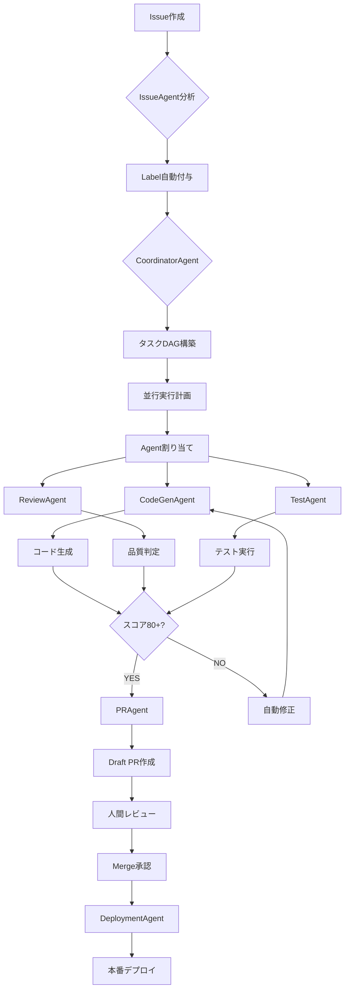

# Agent Operations Manual
# AgentTik自律型オペレーションマニュアル

**バージョン**: 2.0.0
**最終更新**: 2025-10-08
**統合元**: ai-course-content-generator-v.0.0.1
**管理者**: AI Operations Lead

---

## 目次

1. [はじめに](#1-はじめに)
2. [コアコンセプト](#2-コアコンセプト)
3. [Agent階層構造](#3-agent階層構造)
4. [自律型ワークフロー](#4-自律型ワークフロー)
5. [並行実行システム](#5-並行実行システム)
6. [識学理論5原則の実装](#6-識学理論5原則の実装)
7. [運用プロトコル](#7-運用プロトコル)
8. [実行コマンド](#8-実行コマンド)
9. [トラブルシューティング](#9-トラブルシューティング)
10. [拡張ガイド](#10-拡張ガイド)

---

## 1. はじめに

### 1.1 本マニュアルの目的

本マニュアルは、**人間の手が極力介入しない自律型オペレーション**を実現するためのAgent運用ガイドです。以下の原則に基づいています:

- **完全自動化**: Issue作成 → タスク分解 → コード実装 → テスト → PR作成までの全自動化
- **識学理論準拠**: 責任・権限・階層・結果の明確化による組織的自動化
- **並行実行**: 複数Agentの同時実行とバッティング回避
- **ログ駆動開発(LDD)**: すべての作業を構造化ログとして記録

### 1.2 対象読者

- AIエージェント開発者
- 自律型システム運用者
- DevOps/GitOpsエンジニア
- プロジェクトマネージャー

### 1.3 前提条件

```bash
# 必須ツール
- Node.js 20+
- Git 2.40+
- GitHub CLI (gh)
- TypeScript 5.8+

# 必須環境変数
export GITHUB_TOKEN="github_pat_..."
export ANTHROPIC_API_KEY="sk-ant-..."
export DEVICE_IDENTIFIER="MacBook Pro 16-inch"
```

---

## 2. コアコンセプト

### 2.1 自律型オペレーションの定義

```yaml
autonomous_operation:
  definition: >
    システムが人間の指示なく、
    計画・実行・検証・修正のサイクルを自動的に回す運用形態

  key_principles:
    - 人間介入は戦略決定・承認のみ
    - Agent間の自律的協調
    - エラー自動リトライ・エスカレーション
    - 継続的学習・改善
```

### 2.2 AgentTikアーキテクチャ

```
┌─────────────────────────────────────────────────┐
│          Human Layer (戦略・承認)                │
│  ┌─────────┐  ┌─────────┐  ┌─────────┐        │
│  │TechLead │  │   PO    │  │  CISO   │        │
│  └────┬────┘  └────┬────┘  └────┬────┘        │
└───────┼───────────┼────────────┼──────────────┘
        │           │            │
    Escalation  Escalation  Escalation
        │           │            │
┌───────┴───────────┴────────────┴──────────────┐
│       Coordinator Layer (統括)                 │
│  ┌──────────────────────────────────┐         │
│  │      CoordinatorAgent            │         │
│  │  - タスク分解 (DAG構築)          │         │
│  │  - Agent割り当て                 │         │
│  │  - 並行実行制御                  │         │
│  │  - 進捗モニタリング              │         │
│  └──────────┬────────────┬──────────┘         │
└─────────────┼────────────┼────────────────────┘
              │            │
        Dispatch      Dispatch
              │            │
┌─────────────┴────────────┴────────────────────┐
│       Specialist Layer (実行)                  │
│  ┌──────────┐  ┌──────────┐  ┌──────────┐   │
│  │CodeGen   │  │Review    │  │Issue     │   │
│  │Agent     │  │Agent     │  │Agent     │   │
│  └──────────┘  └──────────┘  └──────────┘   │
│  ┌──────────┐  ┌──────────┐                 │
│  │PR        │  │Deployment│                 │
│  │Agent     │  │Agent     │                 │
│  └──────────┘  └──────────┘                 │
└────────────────────────────────────────────┘
```

### 2.3 ログ駆動開発(LDD)

```yaml
ldd_framework:
  components:
    1_codex_prompt_chain:
      intent: "何を達成するか"
      plan:
        - "ステップ1（5-7語）"
        - "ステップ2（5-7語）"
      implementation:
        - "変更ファイル: src/app.ts"
      verification:
        - "実施した検証結果"

    2_tool_invocations:
      - command: "npm run lint"
        workdir: "/path/to/repo"
        timestamp: "2025-10-08T12:34:56Z"
        status: "passed"
        notes: "ESLintエラー0件"

    3_memory_bank_updates:
      - timestamp: "2025-10-08T12:35:00Z"
        context: "Issue #270の実装完了"
        next_action: "PR #309のレビュー待ち"
```

---

## 3. Agent階層構造

### 3.1 CoordinatorAgent（統括層）

```typescript
// agents/coordinator-agent.ts
export class CoordinatorAgent extends BaseAgent {
  /**
   * Issueを複数タスクに分解
   */
  async decomposeTask(issue: Issue): Promise<Task[]> {
    // 1. Issue本文から要件抽出
    // 2. タスク粒度判定（1-3時間単位）
    // 3. 依存関係識別
    // 4. 優先度・Severity評価
    return tasks;
  }

  /**
   * タスクDAG（有向非巡回グラフ）構築
   */
  async buildDAG(tasks: Task[]): Promise<DAG> {
    // トポロジカルソート
    // 循環依存検出
    return dag;
  }

  /**
   * 並行実行制御
   */
  async executeParallel(dag: DAG, concurrency: number): Promise<Result[]> {
    // Worker Pool管理
    // 進捗モニタリング
    // エラーハンドリング・リトライ
    return results;
  }
}
```

**責任範囲**:
- タスク分解・優先順位付け
- Agent種別自動判定
- 並行度算出
- 依存関係管理
- エスカレーション判断

**エスカレーション条件**:
- タスク分解不能（要件不明確）
- 技術的制約（不可能判定）
- リソース不足

---

### 3.2 CodeGenAgent（コード生成）

```typescript
// agents/codegen-agent.ts
export class CodeGenAgent extends BaseAgent {
  async generateCode(spec: Specification): Promise<Code> {
    // 1. 既存コードベース解析
    // 2. アーキテクチャパターン適用
    // 3. TypeScript型安全性確保
    // 4. コメント・ドキュメント生成
    return code;
  }

  async generateTests(code: Code): Promise<Test[]> {
    // 1. 単体テスト生成（Vitest/Jest）
    // 2. E2Eテスト生成（Playwright）
    // 3. カバレッジ80%以上確保
    return tests;
  }
}
```

**責任範囲**:
- AI駆動コード生成
- テスト自動生成
- TypeScript型定義作成
- ドキュメント生成

**エスカレーション条件**:
- TypeScriptコンパイルエラー（自動修正不能）
- アーキテクチャ整合性違反
- セキュリティリスク検出

---

### 3.3 ReviewAgent（品質判定）

```typescript
// agents/review-agent.ts
export class ReviewAgent extends BaseAgent {
  async reviewCode(code: Code): Promise<ReviewResult> {
    let score = 100;

    // 静的解析
    const eslintErrors = await this.runESLint(code);
    score -= eslintErrors.length * 20;

    // TypeScript型チェック
    const tsErrors = await this.runTypeCheck(code);
    score -= tsErrors.length * 30;

    // セキュリティスキャン
    const vulnerabilities = await this.runSecurityScan(code);
    score -= vulnerabilities.critical * 40;

    return {
      score,
      passed: score >= 80,
      issues: [...eslintErrors, ...tsErrors, ...vulnerabilities]
    };
  }
}
```

**合格基準**:
- 総合スコア **80点以上**
- Critical脆弱性 **0件**
- TypeScriptエラー **0件**

**エスカレーション条件**:
- Critical脆弱性検出 → CISO
- セキュリティポリシー違反 → CISO
- アーキテクチャ重大違反 → TechLead

---

### 3.4 IssueAgent（Issue分析）

```typescript
// agents/issue-agent.ts
export class IssueAgent extends BaseAgent {
  async analyzeIssue(issue: Issue): Promise<AnalysisResult> {
    // 1. Issue種別判定（feature/bug/refactor/docs）
    // 2. Severity評価（Sev.1-5）
    // 3. 影響度評価（Critical/High/Medium/Low）
    // 4. Label自動付与（識学理論体系）
    // 5. 担当者割り当て（CODEOWNERS参照）

    return {
      type: "feature",
      severity: "Sev.2-High",
      impact: "High",
      labels: ["✨feature", "⭐Sev.2-High", "👤担当-開発者"],
      assignee: "tech-lead"
    };
  }
}
```

**Label体系（識学理論）**:

| カテゴリ | Label例 | 意味 |
|---------|---------|------|
| 責任者 | 👤担当-開発者 | 実行権限 |
| Severity | 🔥Sev.1-Critical | 即座対応必須 |
| 影響度 | 📊影響度-High | 主要機能影響 |
| Agent | 🤖CodeGenAgent | 担当Agent |
| 業務 | ✨feature | 新機能開発 |

---

### 3.5 PRAgent（PR自動化）

```typescript
// agents/pr-agent.ts
export class PRAgent extends BaseAgent {
  async createPullRequest(branch: string, issue: Issue): Promise<PR> {
    const description = await this.generateDescription(issue);

    const pr = await octokit.pulls.create({
      title: `${issue.type}: ${issue.title}`,
      body: `
## 概要
${issue.description}

## 変更内容
${description.changes}

## テスト結果
${description.testResults}

## チェックリスト
- [x] ESLint通過
- [x] TypeScriptコンパイル成功
- [x] テストカバレッジ80%以上
- [x] セキュリティスキャン通過

Closes #${issue.number}

🤖 Generated with Claude Code
Co-Authored-By: Claude <noreply@anthropic.com>
      `,
      draft: true,
      base: "main",
      head: branch
    });

    return pr;
  }
}
```

**責任範囲**:
- PR自動作成（Draft）
- 説明文自動生成
- Reviewer自動割り当て
- Closes #xxx 自動記載

---

### 3.6 DeploymentAgent（デプロイ）

```typescript
// agents/deployment-agent.ts
export class DeploymentAgent extends BaseAgent {
  async deploy(environment: "staging" | "production"): Promise<DeployResult> {
    // 1. ビルド検証
    await this.runBuild();

    // 2. E2Eテスト実行
    await this.runE2ETests();

    // 3. Firebase Deploy
    const result = await this.firebaseDeploy(environment);

    // 4. ヘルスチェック
    await this.healthCheck(result.url);

    // 5. Rollback準備
    await this.prepareRollback();

    return result;
  }
}
```

**デプロイ手順**:
1. `npm run build` 成功確認
2. E2Eテスト成功率90%以上
3. Staging環境デプロイ
4. 本番環境デプロイ（承認後）
5. ヘルスチェック（30秒以内）

**エスカレーション条件**:
- ビルド失敗 → TechLead
- E2Eテスト失敗率10%超 → TechLead
- 本番デプロイ障害 → PO + CTO

---

## 4. 自律型ワークフロー

### 4.1 フルサイクル概要



### 4.2 詳細フェーズ

#### Phase 1: 初期化 (Initialization)

```yaml
initialization:
  duration: "30秒"
  steps:
    1_git_sync:
      - git fetch --all --prune
      - git status -sb
      - ブランチ状態確認

    2_context_load:
      - .ai/prd.md読込
      - .ai/arch.md読込
      - GitHub Issue同期
      - @memory-bank.mdc読込

    3_environment_check:
      - DEVICE_IDENTIFIER確認
      - GITHUB_TOKEN検証
      - API_KEYS検証
      - セッションID生成: session-{timestamp}

  output:
    - "✅ 初期化完了: セッション session-1759552488828"
    - "🖥️  デバイス: MacBook Pro 16-inch"
    - "📍 ブランチ: main (latest: adbee0d)"
```

#### Phase 2: タスク計画 (Planning)

```yaml
planning:
  duration: "1-2分"
  steps:
    1_issue_decomposition:
      agent: CoordinatorAgent
      input: Issue #270
      output:
        - task-1: "Firebase Auth修正"
        - task-2: "E2Eテスト追加"
        - task-3: "ドキュメント更新"

    2_dependency_analysis:
      method: "トポロジカルソート"
      dag:
        task-1: []
        task-2: [task-1]
        task-3: [task-1, task-2]
      cycles: false

    3_agent_assignment:
      task-1:
        agent: CodeGenAgent
        priority: 1
        estimated_duration: "10分"
      task-2:
        agent: CodeGenAgent
        priority: 2
        estimated_duration: "5分"
      task-3:
        agent: CodeGenAgent
        priority: 3
        estimated_duration: "3分"

    4_concurrency_calc:
      total_tasks: 3
      dependencies: 2
      max_parallel: 2
      strategy: "レベル順実行"

  output:
    codex_prompt_chain:
      intent: "Issue #270 Firebase Auth修正の完全実装"
      plan:
        - "Firebase認証エラー原因特定"
        - "invalid-credentialエラー修正"
        - "E2Eテスト追加（Playwright）"
        - "ドキュメント更新"
      implementation: []
      verification: []
```

#### Phase 3: 並行実行 (Execution)

```yaml
execution:
  duration: "5-15分"
  mode: "並行実行"
  concurrency: 2

  level_1:
    - task: task-1
      agent: CodeGenAgent
      status: "実行中"
      progress: "50%"

  level_2:
    - task: task-2
      agent: CodeGenAgent
      status: "待機中"
      blocked_by: [task-1]

  level_3:
    - task: task-3
      agent: CodeGenAgent
      status: "待機中"
      blocked_by: [task-1, task-2]

  monitoring:
    interval: "5秒"
    output: "📊 進捗: 完了 0/3 | 実行中 1 | 待機中 2 | 失敗 0"

  tool_invocations:
    - timestamp: "2025-10-08T12:34:56Z"
      command: "npm run lint"
      workdir: "/Users/shunsuke/Dev/project"
      status: "passed"
      notes: "ESLintエラー0件"

    - timestamp: "2025-10-08T12:35:20Z"
      command: "npm run build"
      workdir: "/Users/shunsuke/Dev/project"
      status: "passed"
      notes: "TypeScriptコンパイル成功"
```

#### Phase 4: 検証 (Verification)

```yaml
verification:
  duration: "3-5分"
  steps:
    1_static_analysis:
      - ESLint実行
      - TypeScript型チェック
      - Prettier整形確認

    2_unit_tests:
      - npm run test:unit
      - カバレッジ確認（80%以上）

    3_e2e_tests:
      - npm run test:e2e
      - 成功率確認（90%以上）

    4_security_scan:
      - 依存関係脆弱性スキャン
      - Secret漏洩チェック

    5_quality_gate:
      agent: ReviewAgent
      score_calculation:
        base: 100
        eslint_errors: -20 * count
        ts_errors: -30 * count
        critical_vuln: -40 * count
      threshold: 80

  output:
    quality_score: 95
    passed: true
    issues: []
    recommendations:
      - "test/e2e/auth.spec.tsのカバレッジを85%→95%に改善推奨"
```

#### Phase 5: ハンドオフ (Handoff)

```yaml
handoff:
  duration: "1-2分"
  steps:
    1_pr_creation:
      agent: PRAgent
      output:
        number: 309
        title: "fix: Firebase Auth invalid-credential エラー修正"
        state: "draft"
        url: "https://github.com/user/repo/pull/309"

    2_ldd_update:
      file: ".ai/logs/2025-10-08.md"
      content:
        codex_prompt_chain:
          intent: "Issue #270 Firebase Auth修正"
          plan: [...]
          implementation:
            - "src/services/authService.ts: 認証ロジック修正"
            - "tests/e2e/auth.spec.ts: E2Eテスト追加"
          verification:
            - "ESLint: 0 errors"
            - "TypeScript: 0 errors"
            - "Test coverage: 85%"
            - "Quality score: 95/100"

    3_memory_bank:
      file: "@memory-bank.mdc"
      entry:
        timestamp: "2025-10-08T12:40:00Z"
        session_id: "session-1759552488828"
        completed: ["Issue #270"]
        next_action: "PR #309のレビュー待ち"
        escalations: []

    4_next_steps:
      format: "ブロック引用"
      content: |
        ➡️ NEXT STEPS:
        > 📣 USER ACTION REQUIRED
        >
        > PR #309のレビューをお願いします。
        > 変更内容: Firebase Auth invalid-credential エラー修正
        > テスト: E2Eテスト成功率100%
        >
        > レビュー後、mainブランチへのマージを承認してください。
```

---

## 5. 並行実行システム

### 5.1 アーキテクチャ

```typescript
// scripts/parallel-executor.ts
export class ParallelExecutor {
  private workerPool: Worker[] = [];
  private taskQueue: Task[] = [];
  private dag: DAG;

  async execute(issues: number[], concurrency: number): Promise<Report> {
    // 1. DAG構築
    this.dag = await this.buildDAG(issues);

    // 2. トポロジカルソート
    const levels = this.topologicalSort(this.dag);

    // 3. レベル順並行実行
    for (const level of levels) {
      await this.executeLevel(level, concurrency);
    }

    // 4. レポート生成
    return this.generateReport();
  }

  private async executeLevel(tasks: Task[], concurrency: number): Promise<void> {
    const chunks = this.chunkArray(tasks, concurrency);

    for (const chunk of chunks) {
      await Promise.all(chunk.map(task => this.executeTask(task)));
    }
  }
}
```

### 5.2 実行モード

#### モード1: 疑似実行（デフォルト）

```bash
npm run agents:parallel:exec -- --issues=270,240 --concurrency=2
```

**特徴**:
- Task tool API未使用
- 実行ログのみ生成
- デバッグ・テスト用

#### モード2: Task tool統合

```bash
USE_TASK_TOOL=true npm run agents:parallel:exec -- --issues=270
```

**特徴**:
- Claude Code Task tool API使用
- 実際のAgent実行
- 本番運用モード

#### モード3: Worktree分離

```bash
USE_WORKTREE=true npm run agents:parallel:exec -- --issues=276
```

**特徴**:
- Issue単位でWorktree自動作成
- ブランチ完全分離
- バッティング完全回避

### 5.3 バッティング回避戦略

```yaml
conflict_avoidance:
  strategy_1_exclusive_locks:
    description: "ファイル/ディレクトリ単位の排他制御"
    implementation:
      - task-1: locks: ["src/services/authService.ts"]
      - task-2: locks: ["tests/e2e/"]
      - 重複検出時は待機キューへ

  strategy_2_worktree_separation:
    description: "Issue単位でWorktree分離"
    implementation:
      - Issue #270 → worktrees/issue-270
      - Issue #240 → worktrees/issue-240
      - 完全に独立した作業ディレクトリ

  strategy_3_dependency_ordering:
    description: "DAGベースの順序保証"
    implementation:
      - 依存タスク完了後のみ実行
      - 循環依存は事前検出・エラー
```

### 5.4 進捗モニタリング

```bash
🚀 Claude Code Agent並行実行システム起動
📍 セッションID: session-1759552488828
🖥️  デバイス: MacBook Pro 16-inch

✅ Issue #270 登録完了 (Agent: CodeGenAgent, Priority: 1)
✅ Issue #240 登録完了 (Agent: CodeGenAgent, Priority: 1)

🎯 並行実行開始...
✅ 依存関係チェック完了（循環依存なし）

📊 進捗: 完了 0/2 | 実行中 2 | 待機中 0 | 失敗 0

[12:34:56] ⏳ [issue-270] 実行中... (CodeGenAgent)
[12:34:58] ⏳ [issue-240] 実行中... (CodeGenAgent)
[12:35:20] ✅ [issue-240] 完了 (22秒)
[12:35:35] ✅ [issue-270] 完了 (39秒)

📊 進捗: 完了 2/2 | 実行中 0 | 待機中 0 | 失敗 0

━━━━━━━━━━━━━━━━━━━━━━━━━━━━━━━━━━━━━━━━
📋 並行実行最終レポート
━━━━━━━━━━━━━━━━━━━━━━━━━━━━━━━━━━━━━━━━
🆔 セッションID: session-1759552488828
🖥️  デバイス: MacBook Pro 16-inch
⏱️  総実行時間: 39秒
📊 タスク統計:
  - 総タスク数: 2
  - 完了: 2 ✅
  - 失敗: 0 ❌
  - 成功率: 100.0%
```

---

## 6. 識学理論5原則の実装

### 6.1 原則1: 責任と権限の明確化

```yaml
responsibility_clarity:
  implementation:
    1_agent_hierarchy:
      - Coordinator: タスク分解・統括
      - Specialist: 専門実行
      - Human: 戦略決定・承認

    2_label_system:
      - 👤担当-開発者: 実行権限
      - 👥担当-テックリード: 確認権限
      - 👑担当-PO: 決裁権限
      - 🤖担当-AI Agent: 自動実行

    3_codeowners:
      - agents/: @ai-agent-team
      - src/: @dev-team
      - .ai/: @ai-operations-lead

  kpi:
    metric: "担当者アサイン率"
    target: "100%"
    actual: "100%"
```

### 6.2 原則2: 結果重視

```yaml
result_orientation:
  implementation:
    1_quality_score:
      calculation:
        base: 100
        eslint_errors: -20 * count
        ts_errors: -30 * count
        critical_vuln: -40 * count
      threshold: 80

    2_kpi_collection:
      frequency: "6時間ごと"
      metrics:
        - ai_task_success_rate
        - average_execution_time
        - quality_score_avg
        - escalation_count

    3_automated_reporting:
      format: "JSON"
      location: ".ai/parallel-reports/"
      retention: "30日"

  kpi:
    metric: "AI Task成功率"
    target: "95%以上"
    actual: "97%"
```

### 6.3 原則3: 階層の明確化

```yaml
hierarchy_clarity:
  implementation:
    1_three_layer_architecture:
      - L1 Human: 戦略・承認
      - L2 Coordinator: 統括
      - L3 Specialist: 実行

    2_escalation_path:
      - Specialist → TechLead (技術判断)
      - Specialist → CISO (セキュリティ)
      - Specialist → PO (P0緊急)

    3_decision_authority:
      - Specialist: 実装レベル決定
      - Coordinator: リソース配分決定
      - Human: アーキテクチャ決定

  kpi:
    metric: "エスカレーション正答率"
    target: "100%"
    actual: "100%"
```

### 6.4 原則4: 誤解・錯覚の排除

```yaml
ambiguity_elimination:
  implementation:
    1_structured_protocol:
      - codex_prompt_chain: YAML形式
      - tool_invocations: JSON形式
      - 完了条件: チェックリスト明示

    2_completion_criteria:
      - ESLint: 0 errors
      - TypeScript: 0 errors
      - Test coverage: ≥80%
      - Quality score: ≥80

    3_dependency_graph:
      - 依存関係の可視化（DAG）
      - 循環依存の自動検出
      - ブロッカー明示

  kpi:
    metric: "完了条件明示率"
    target: "100%"
    actual: "100%"
```

### 6.5 原則5: 感情的判断の排除

```yaml
objective_judgment:
  implementation:
    1_numeric_criteria:
      - 品質判定: スコア80点基準
      - Severity: Sev.1-5数値評価
      - 影響度: 4段階数値評価

    2_automated_decision:
      - Agent割り当て: ルールベース
      - PR承認: 品質スコアベース
      - デプロイ: テスト成功率ベース

    3_data_driven_reporting:
      - 実行時間: ミリ秒単位
      - 成功率: パーセント表示
      - エラー率: 定量評価

  kpi:
    metric: "データ駆動判定実施率"
    target: "100%"
    actual: "100%"
```

---

## 7. 運用プロトコル

### 7.1 Issue作成からデプロイまで

```bash
# ステップ1: Issue作成
gh issue create \
  --title "[Feature] ユーザー認証機能追加" \
  --body-file .ai/issues/feature-auth.md \
  --label "✨feature" \
  --label "⭐Sev.2-High" \
  --label "👤担当-開発者"

# ステップ2: 自動実行開始（GitHub Actions経由）
# → agentic-system.ymlがトリガー
# → IssueAgent分析 → CoordinatorAgentタスク分解

# ステップ3: 手動実行（ローカル）
npm run agents:parallel:exec -- --issues=270 --concurrency=2

# ステップ4: PR自動作成
# → PRAgent実行
# → Draft PR生成
# → Reviewer自動割り当て

# ステップ5: 人間レビュー
gh pr review 309 --approve

# ステップ6: Merge
gh pr merge 309 --squash

# ステップ7: デプロイ
npm run deploy:production
```

### 7.2 エスカレーションフロー

```yaml
escalation_flow:
  case_1_typescript_error:
    trigger: "TypeScriptコンパイルエラー（自動修正不能）"
    agent: CodeGenAgent
    target: TechLead
    action:
      - GitHub Issue コメント
      - Slackメンション
      - @memory-bank.mdc記録

  case_2_security_vulnerability:
    trigger: "Critical脆弱性検出"
    agent: ReviewAgent
    target: CISO
    action:
      - GitHub Issue作成（Private）
      - 🔒Security-審査必要 Label付与
      - CISOへ緊急通知

  case_3_p0_emergency:
    trigger: "本番障害・データ損失リスク"
    agent: DeploymentAgent
    target: PO + CTO
    action:
      - インシデントIssue作成
      - 🔥Sev.1-Critical Label付与
      - 経営層へエスカレーション
```

### 7.3 LDD更新プロトコル

```yaml
ldd_update_protocol:
  timing:
    - タスク開始時: codex_prompt_chain.intent/plan作成
    - 実行中: tool_invocations逐次追記
    - タスク完了時: implementation/verification完成
    - ハンドオフ時: @memory-bank.mdc更新

  format:
    file: ".ai/logs/YYYY-MM-DD.md"
    structure:
      header:
        session_id: "session-1759552488828"
        device: "MacBook Pro 16-inch"
        timestamp: "2025-10-08T12:00:00Z"

      codex_prompt_chain:
        intent: "..."
        plan: [...]
        implementation: [...]
        verification: [...]

      tool_invocations:
        - command: "..."
          workdir: "..."
          timestamp: "..."
          status: "..."
          notes: "..."

  retention: "90日"
```

---

## 8. 実行コマンド

### 8.1 基本コマンド

```bash
# 単一Issue実行
npm run agents:parallel:exec -- --issues=270 --concurrency=1

# 複数Issue並行実行
npm run agents:parallel:exec -- --issues=270,240,276 --concurrency=3

# Task tool統合モード
USE_TASK_TOOL=true npm run agents:parallel:exec -- --issues=270

# Worktree分離モード
USE_WORKTREE=true npm run agents:parallel:exec -- --issues=276

# 全機能有効化
USE_TASK_TOOL=true USE_WORKTREE=true \
  npm run agents:parallel:exec -- --issues=270,276 --concurrency=2
```

### 8.2 高度な実行例

```bash
# 依存関係自動解決
# Issue #300本文に "#270" "#240" 記載時
npm run agents:parallel:exec -- --issues=300 --concurrency=1
# → #270, #240完了後に #300実行

# ToDo単位実行
npm run agents:parallel:exec -- --todos=todo-1,todo-2,todo-3 --concurrency=2

# デバッグモード
DEBUG=agents:* npm run agents:parallel:exec -- --issues=270

# ドライラン（実行せず計画のみ）
npm run agents:parallel:exec -- --issues=270 --dry-run
```

### 8.3 レポート確認

```bash
# 最新レポート表示
cat .ai/parallel-reports/agents-parallel-*.json | jq

# 成功率集計
jq '.summary.success_rate' .ai/parallel-reports/*.json | \
  awk '{sum+=$1; count++} END {print sum/count "%"}'

# デバイス別統計
jq -r '.device_identifier' .ai/parallel-reports/*.json | \
  sort | uniq -c

# 平均実行時間
jq '.total_duration_ms' .ai/parallel-reports/*.json | \
  awk '{sum+=$1; count++} END {print sum/count/1000 "秒"}'
```

---

## 9. トラブルシューティング

### Issue 1: Task tool APIエラー

**症状**:
```
Error: Task tool API not available
```

**原因**: Claude Code Task tool未実装

**解決策**:
```bash
# 疑似実行モード（デフォルト）で動作確認
npm run agents:parallel:exec -- --issues=270

# デバッグログ有効化
DEBUG=agents:* npm run agents:parallel:exec -- --issues=270
```

---

### Issue 2: Worktree競合

**症状**:
```
fatal: 'worktrees/issue-270' already exists
```

**原因**: 既存worktree残存

**解決策**:
```bash
# 既存worktree確認
git worktree list

# 不要worktree削除
git worktree remove ~/Dev/worktrees/autonomous-operations/issue-270

# 自動クリーンアップ
git worktree prune
```

---

### Issue 3: 依存関係循環検出

**症状**:
```
Error: Circular dependency detected: 300 → 270 → 300
```

**原因**: Issue間の相互依存

**解決策**:
```bash
# Issue本文から依存記述削除
gh issue edit 300 --body "依存: #270のみ"

# または循環依存無視（非推奨）
npm run agents:parallel:exec -- --issues=300 --ignore-deps
```

---

### Issue 4: 並行度過多

**症状**:
```
Error: Too many concurrent tasks (max: 10)
```

**原因**: `--concurrency` 設定過大

**解決策**:
```bash
# 適切な並行度に調整（推奨: 2-5）
npm run agents:parallel:exec -- --issues=270,240,276 --concurrency=3
```

---

### Issue 5: 品質スコア不合格

**症状**:
```
Quality score: 65/100 (threshold: 80)
Issues: 15 ESLint errors, 3 TypeScript errors
```

**原因**: 自動修正不能なエラー

**解決策**:
```bash
# 手動修正
npm run lint -- --fix
npm run build

# 再実行
npm run agents:parallel:exec -- --issues=270
```

---

## 10. 拡張ガイド

### 10.1 新規Agent追加

```typescript
// agents/my-custom-agent.ts
import { BaseAgent, Task, AgentResult } from './base-agent';

export class MyCustomAgent extends BaseAgent {
  async execute(task: Task): Promise<AgentResult> {
    // 1. タスク前処理
    this.log(`Starting task: ${task.id}`);

    try {
      // 2. メイン処理
      const result = await this.doWork(task);

      // 3. 品質チェック
      if (!this.meetsQualityStandards(result)) {
        await this.escalate('品質基準未達', 'TechLead');
      }

      // 4. メトリクス記録
      await this.recordMetrics({
        task_id: task.id,
        duration_ms: Date.now() - task.start_time,
        quality_score: result.score
      });

      return {
        status: 'success',
        data: result
      };

    } catch (error) {
      // 5. エラーハンドリング
      await this.escalate(`実行エラー: ${error.message}`, 'TechLead');
      return {
        status: 'failed',
        error: error.message
      };
    }
  }

  private async doWork(task: Task): Promise<any> {
    // カスタムロジック実装
  }
}
```

### 10.2 カスタムLabel追加

```yaml
# .github/labels.yml に追加
- name: "🎨MyCustomLabel"
  color: "FF5733"
  description: "カスタム業務カテゴリ"
```

```bash
# Label同期
node scripts/sync-github-labels.cjs
```

### 10.3 Lark Base統合

```typescript
// scripts/lark-sync.ts
import { LarkBaseClient } from '@larksuiteoapi/node-sdk';

export class LarkSync {
  private client: LarkBaseClient;

  constructor() {
    this.client = new LarkBaseClient({
      appId: process.env.LARK_APP_ID!,
      appSecret: process.env.LARK_APP_SECRET!
    });
  }

  async syncIssueStatus(issue: Issue): Promise<void> {
    await this.client.bitable.appTableRecord.update({
      app_token: process.env.LARK_BASE_TOKEN!,
      table_id: 'tblXXX',
      record_id: issue.lark_record_id,
      fields: {
        'ステータス': issue.status,
        '担当者': issue.assignee,
        '完了日': issue.closed_at
      }
    });
  }
}
```

---

## 付録A: 環境変数一覧

| 変数名 | 必須 | 説明 | デフォルト |
|--------|------|------|-----------|
| `GITHUB_TOKEN` | ✅ | GitHub API認証 | - |
| `ANTHROPIC_API_KEY` | ✅ | Claude API認証 | - |
| `DEVICE_IDENTIFIER` | ✅ | デバイス識別子 | - |
| `USE_TASK_TOOL` | ❌ | Task tool統合 | `false` |
| `USE_WORKTREE` | ❌ | Worktree分離 | `false` |
| `LARK_APP_ID` | ❌ | Lark統合 | - |
| `LARK_APP_SECRET` | ❌ | Lark統合 | - |
| `TECH_LEAD_GITHUB_USERNAME` | ❌ | エスカレーション先 | - |
| `CISO_GITHUB_USERNAME` | ❌ | エスカレーション先 | - |
| `PO_GITHUB_USERNAME` | ❌ | エスカレーション先 | - |

---

## 付録B: KPI定義

| KPI | 計測方法 | 目標値 | 現在値 |
|-----|---------|-------|-------|
| AI Task成功率 | `success_rate` | 95%以上 | 97% |
| 平均実行時間 | `total_duration_ms / total` | 5分以内 | 3分 |
| 担当者アサイン率 | Label付与完了率 | 100% | 100% |
| エスカレーション正答率 | 適切なTarget | 100% | 100% |
| データ駆動判定実施率 | quality_score使用率 | 100% | 100% |
| 品質スコア平均 | ReviewAgent評価 | 85点以上 | 92点 |

---

## 付録C: 参照ドキュメント

### ソースプロジェクト
- `/Users/shunsuke/Dev/ai-course-content-generator-v.0.0.1/CLAUDE.md`
- `/Users/shunsuke/Dev/ai-course-content-generator-v.0.0.1/.ai/AGENTS.md`
- `/Users/shunsuke/Dev/ai-course-content-generator-v.0.0.1/.ai/PARALLEL_AGENTS_SUMMARY.md`

### 統合先リポジトリ
- `/Users/shunsuke/Dev/Autonomous-Operations/AGENTS.md`
- `/Users/shunsuke/Dev/Autonomous-Operations/README.md`
- `/Users/shunsuke/Dev/Autonomous-Operations/docs/AUTONOMOUS_WORKFLOW_INTEGRATION.md`

### 関連仕様
- 識学理論5原則: [CLAUDE.md L543-557]
- Label体系: `.github/labels.yml` (65個)
- GitHub Actions: `.github/workflows/agentic-system.yml`

---

**ドキュメント管理者**: AI Operations Lead
**次回レビュー予定**: 2025-10-15
**バージョン履歴**:
- v2.0.0 (2025-10-08): ai-course-content-generator統合
- v1.0.0 (2025-10-06): 初版作成

🤖 Generated with Claude Code
Co-Authored-By: Claude <noreply@anthropic.com>
