# Miyabi Entity-Relation Model - 統合データモデル

**すべてのIssueテンプレートを繋ぐ統合Entity-Relationshipモデル**

---

## 📖 目次

1. [概要](#概要)
2. [コアエンティティ](#コアエンティティ)
3. [関係性マップ](#関係性マップ)
4. [エンティティ詳細](#エンティティ詳細)
5. [関係性詳細](#関係性詳細)
6. [テンプレート統合](#テンプレート統合)
7. [実装マッピング](#実装マッピング)

---

## 概要

### 🎯 目的

Miyabiプロジェクトの全エンティティとその関係性を統一的に定義し、すべてのテンプレート、ドキュメント、コードを整合的に管理する。

### 📊 Entity-Relation Model の原則

```
"Everything is connected. Every entity has a clear relation."
```

- **単一責任**: 各エンティティは明確な責務を持つ
- **明示的関係**: すべての関係性は型定義とドキュメントで明示
- **双方向トレース**: Entity → Implementation, Implementation → Entity の双方向追跡可能
- **自動整合性**: 型システムによる自動検証

---

## コアエンティティ

### 📋 エンティティ一覧（13種類）

| ID | エンティティ | 説明 | 型定義 | 主要属性 |
|----|------------|------|--------|---------|
| E1 | **Issue** | GitHub Issue | `Issue` | number, title, body, labels, state |
| E2 | **Task** | 分解されたタスク | `Task` | id, title, type, dependencies, assignedAgent |
| E3 | **Agent** | 自律実行Agent | `AgentType` | type, authority, escalation |
| E4 | **PR** | Pull Request | `PRRequest`, `PRResult` | number, title, url, state |
| E5 | **Label** | GitHub Label | `string[]` | name, category, color |
| E6 | **QualityReport** | 品質レポート | `QualityReport` | score, passed, issues, breakdown |
| E7 | **Command** | Claude Codeコマンド | `.claude/commands/*.md` | name, description, execution |
| E8 | **Escalation** | エスカレーション | `EscalationInfo` | reason, target, severity, context |
| E9 | **Deployment** | デプロイ情報 | `DeploymentConfig`, `DeploymentResult` | environment, version, status |
| E10 | **LDDLog** | LDDログ | `LDDLog` | sessionId, codexPromptChain, toolInvocations |
| E11 | **DAG** | タスク依存グラフ | `DAG` | nodes, edges, levels |
| E12 | **Worktree** | Git Worktree | `string` (path) | path, branch, taskId |
| E13 | **DiscordCommunity** | Discordコミュニティ | `DiscordCommunity` | serverId, channels, roles, members |

---

## 関係性マップ

### 🔗 全関係性グラフ

```mermaid
graph TB
    Issue[E1: Issue]
    Task[E2: Task]
    Agent[E3: Agent]
    PR[E4: PR]
    Label[E5: Label]
    Quality[E6: QualityReport]
    Command[E7: Command]
    Escalation[E8: Escalation]
    Deployment[E9: Deployment]
    LDD[E10: LDDLog]
    DAG[E11: DAG]
    Worktree[E12: Worktree]
    Discord[E13: DiscordCommunity]

    %% Issue関連
    Issue -->|R1: analyzed-by| Agent
    Issue -->|R2: decomposed-into| Task
    Issue -->|R3: tagged-with| Label
    Issue -->|R4: creates| PR

    %% Task関連
    Task -->|R5: assigned-to| Agent
    Task -->|R6: depends-on| Task
    Task -->|R7: part-of| DAG
    Task -->|R8: runs-in| Worktree

    %% Agent関連
    Agent -->|R9: executes| Task
    Agent -->|R10: generates| PR
    Agent -->|R11: creates| Quality
    Agent -->|R12: triggers| Escalation
    Agent -->|R13: performs| Deployment
    Agent -->|R14: logs-to| LDD
    Agent -->|R15: invoked-by| Command

    %% Label関連
    Label -->|R16: triggers| Agent
    Label -->|R17: defines-state| Issue
    Label -->|R18: categorizes| Task

    %% PR関連
    PR -->|R19: reviewed-by| Agent
    PR -->|R20: has| Quality
    PR -->|R21: attached-to| Issue

    %% Quality関連
    Quality -->|R22: evaluated-by| Agent
    Quality -->|R23: attached-to| PR

    %% DAG関連
    DAG -->|R24: decomposed-from| Issue
    DAG -->|R25: contains| Task

    %% Worktree関連
    Worktree -->|R26: executes| Task
    Worktree -->|R27: creates| PR

    %% Community Integration
    Issue -->|R28: notifies-to| Discord
    Agent -->|R29: posts-to| Discord
    Quality -->|R30: announces-in| Discord
    PR -->|R31: announces-in| Discord
    Deployment -->|R32: notifies-to| Discord
    Label -->|R33: triggers-notification-to| Discord
    Escalation -->|R34: notifies-to| Discord
    Command -->|R35: integrated-with| Discord
```



### 📊 関係性統計

| カテゴリ | 関係数 | 主要エンティティ |
|---------|-------|----------------|
| **Issue処理フロー** | 6 | Issue → Task → Agent → PR |
| **Agent実行** | 7 | Agent → Task/PR/Quality/Escalation/Deployment/LDD |
| **Label制御** | 3 | Label → Issue/Agent/Task |
| **品質管理** | 3 | QualityReport → PR/Agent |
| **並列実行** | 4 | DAG/Worktree → Task |
| **コミュニティ統合** | 8 | All → DiscordCommunity |
| **合計** | 35関係 | 13エンティティ |

---

## エンティティ詳細

### E1: Issue

```typescript
interface Issue {
  // 識別
  number: number;          // Issue番号（ユニークID）

  // 内容
  title: string;           // タイトル
  body: string;            // 本文（要件・仕様）

  // 状態
  state: 'open' | 'closed';  // オープン/クローズ
  labels: string[];        // 付与されたLabel

  // メタデータ
  assignee?: string;       // 担当者
  createdAt: string;       // 作成日時
  updatedAt: string;       // 更新日時
  url: string;             // GitHub URL
}
```

**関係性**:
- **R1**: `analyzed-by` → Agent (IssueAgent)
- **R2**: `decomposed-into` → Task[] (CoordinatorAgentによる分解)
- **R3**: `tagged-with` → Label[]
- **R4**: `creates` → PR

**ファイル位置**:
- 型定義: `agents/types/index.ts:54-64`
- Agent: `.claude/agents/specs/issue-agent.md`

---

### E2: Task

```typescript
interface Task {
  // 識別
  id: string;              // TaskID（UUID）

  // 内容
  title: string;           // タスク名
  description: string;     // 詳細説明
  type: 'feature' | 'bug' | 'refactor' | 'docs' | 'test' | 'deployment';

  // 優先度・深刻度
  priority: number;        // 優先度（数値）
  severity?: Severity;     // 深刻度（Sev.1-5）
  impact?: ImpactLevel;    // 影響度（Critical/High/Medium/Low）

  // Agent割り当て
  assignedAgent?: AgentType;  // 割り当てAgent

  // 依存関係（DAG）
  dependencies: string[];  // 依存TaskIDリスト

  // 実行情報
  estimatedDuration?: number;  // 推定時間（分）
  status?: AgentStatus;    // 現在ステータス
  startTime?: number;      // 開始時刻
  endTime?: number;        // 終了時刻

  // メタデータ
  metadata?: Record<string, any>;  // 追加情報
}
```

**関係性**:
- **R5**: `assigned-to` → Agent
- **R6**: `depends-on` → Task (dependencies配列)
- **R7**: `part-of` → DAG
- **R8**: `runs-in` → Worktree

**ファイル位置**:
- 型定義: `agents/types/index.ts:37-52`
- 実装: `agents/coordinator/coordinator-agent.ts`

---

### E3: Agent

```typescript
type AgentType =
  | 'CoordinatorAgent'     // 統括・DAG分解
  | 'CodeGenAgent'         // AI駆動コード生成
  | 'ReviewAgent'          // 品質レビュー
  | 'IssueAgent'           // Issue分析・ラベリング
  | 'PRAgent'              // PR自動作成
  | 'DeploymentAgent'      // CI/CDデプロイ
  | 'AutoFixAgent';        // 自動修正（未実装）

type AgentAuthority =
  | '🔴統括権限'            // CoordinatorAgent
  | '🔵実行権限'            // CodeGen, Review, PR, Deployment
  | '🟢分析権限';          // IssueAgent

type EscalationTarget = 'TechLead' | 'PO' | 'CISO' | 'CTO' | 'DevOps';
```

**関係性**:
- **R9**: `executes` → Task
- **R10**: `generates` → PR
- **R11**: `creates` → QualityReport
- **R12**: `triggers` → Escalation
- **R13**: `performs` → Deployment
- **R14**: `logs-to` → LDDLog
- **R15**: `invoked-by` → Command

**ファイル位置**:
- 型定義: `agents/types/index.ts:15-22`
- 実装: `agents/*/\*-agent.ts`
- 仕様: `.claude/agents/specs/\*-agent.md`
- プロンプト: `.claude/agents/prompts/\*-agent-prompt.md`

---

### E4: PR (Pull Request)

```typescript
interface PRRequest {
  title: string;           // PRタイトル（Conventional Commits形式）
  body: string;            // PR本文（変更サマリ）
  baseBranch: string;      // ベースブランチ（main/develop）
  headBranch: string;      // HEADブランチ（feature/agent-*）
  draft: boolean;          // Draft PR フラグ
  issueNumber?: number;    // 関連Issue番号
  labels?: string[];       // Label
  reviewers?: string[];    // レビュアー
}

interface PRResult {
  number: number;          // PR番号
  url: string;             // GitHub URL
  state: 'draft' | 'open' | 'merged' | 'closed';
  createdAt: string;       // 作成日時
}
```

**関係性**:
- **R19**: `reviewed-by` → Agent (ReviewAgent)
- **R20**: `has` → QualityReport
- **R21**: `attached-to` → Issue

**ファイル位置**:
- 型定義: `agents/types/index.ts:240-257`
- Agent: `.claude/agents/specs/pr-agent.md`

---

### E5: Label

**構造**:
```typescript
type LabelCategory =
  | 'STATE'      // 8個 - ライフサイクル
  | 'AGENT'      // 6個 - Agent割り当て
  | 'PRIORITY'   // 4個 - 優先度
  | 'TYPE'       // 7個 - 分類
  | 'SEVERITY'   // 4個 - 深刻度
  | 'PHASE'      // 5個 - フェーズ
  | 'SPECIAL'    // 7個 - 特殊操作
  | 'TRIGGER'    // 4個 - 自動化トリガー
  | 'QUALITY'    // 4個 - 品質スコア
  | 'COMMUNITY'; // 4個 - コミュニティ

// 合計: 53ラベル
```

**関係性**:
- **R16**: `triggers` → Agent (例: `trigger:agent-execute` → CoordinatorAgent)
- **R17**: `defines-state` → Issue (例: `state:pending` → Issue状態)
- **R18**: `categorizes` → Task (例: `type:feature` → Task分類)

**ファイル位置**:
- ドキュメント: `docs/LABEL_SYSTEM_GUIDE.md`
- 定義: `.github/labels.yml`
- SDK統合: `docs/AGENT_SDK_LABEL_INTEGRATION.md`

---

### E6: QualityReport

```typescript
interface QualityReport {
  // スコア
  score: number;           // 0-100点
  passed: boolean;         // score >= 80

  // 問題
  issues: QualityIssue[];  // 検出された問題リスト

  // 推奨事項
  recommendations: string[];

  // 詳細スコア
  breakdown: {
    eslintScore: number;      // ESLintスコア（40%）
    typeScriptScore: number;  // TypeScriptスコア（30%）
    securityScore: number;    // セキュリティスコア（20%）
    testCoverageScore: number;// カバレッジスコア（10%）
  };
}

interface QualityIssue {
  type: 'eslint' | 'typescript' | 'security' | 'coverage';
  severity: 'critical' | 'high' | 'medium' | 'low';
  message: string;
  file?: string;
  line?: number;
  column?: number;
  scoreImpact: number;     // 減点（-20, -30, -40等）
}
```

**関係性**:
- **R22**: `evaluated-by` → Agent (ReviewAgent)
- **R23**: `attached-to` → PR

**ファイル位置**:
- 型定義: `agents/types/index.ts:108-130`
- Agent: `.claude/agents/specs/review-agent.md`

---

### E7: Command

**構造**:
```markdown
---
description: コマンドの説明
---

# コマンド名

実行内容の説明

\```bash
実行コマンド
\```
```

**種類** (9コマンド):
1. `/test` - テスト実行
2. `/agent-run` - Agent手動実行
3. `/verify` - システム動作確認
4. `/deploy` - デプロイ実行
5. `/create-issue` - Issue対話的作成
6. `/security-scan` - セキュリティスキャン
7. `/generate-docs` - ドキュメント生成
8. `/miyabi-todos` - TODO検出・Issue化
9. `/miyabi-auto` - 全自動モード

**関係性**:
- **R15**: `invokes` → Agent

**ファイル位置**:
- コマンド: `.claude/commands/*.md`

---

### E8: Escalation

```typescript
interface EscalationInfo {
  reason: string;          // エスカレーション理由
  target: EscalationTarget;// 'TechLead' | 'PO' | 'CISO' | 'CTO' | 'DevOps'
  severity: Severity;      // 深刻度（Sev.1-5）
  context: Record<string, any>;  // 追加コンテキスト
  timestamp: string;       // 発生日時
}

type EscalationTarget = 'TechLead' | 'PO' | 'CISO' | 'CTO' | 'DevOps';
```

**トリガー条件**:
- **TechLead**: アーキテクチャ問題、複雑度超過
- **CISO**: セキュリティ脆弱性（Sev.1-2）
- **PO**: 要件不明確、ビジネス判断必要
- **CTO**: システムレベル障害
- **DevOps**: インフラ・デプロイ問題

**関係性**:
- **R12**: `triggered-by` → Agent

**ファイル位置**:
- 型定義: `agents/types/index.ts:96-102`
- 実装: `agents/base-agent.ts` (escalate メソッド)

---

### E9: Deployment

```typescript
interface DeploymentConfig {
  environment: 'staging' | 'production';
  version: string;         // セマンティックバージョン
  projectId: string;       // Firebase Project ID
  targets: string[];       // ['hosting', 'functions']
  skipTests?: boolean;     // テストスキップフラグ
  autoRollback: boolean;   // 自動ロールバック有効化
  healthCheckUrl: string;  // ヘルスチェックURL
}

interface DeploymentResult {
  environment: 'staging' | 'production';
  version: string;
  projectId: string;
  deploymentUrl: string;   // デプロイされたURL
  deployedAt: string;      // デプロイ日時
  durationMs: number;      // デプロイ時間
  status: 'success' | 'failed' | 'rolled_back';
}
```

**関係性**:
- **R13**: `performed-by` → Agent (DeploymentAgent)

**ファイル位置**:
- 型定義: `agents/types/index.ts:262-281`
- Agent: `.claude/agents/specs/deployment-agent.md`
- コマンド: `.claude/commands/deploy.md`

---

### E10: LDDLog (Log-Driven Development)

```typescript
interface LDDLog {
  sessionId: string;       // セッションID（UUID）
  date: string;            // ログ日付（YYYY-MM-DD）
  deviceIdentifier: string;// デバイス識別子

  // Codex Prompt Chain
  codexPromptChain: {
    intent: string;        // 意図
    plan: string[];        // 計画ステップ
    implementation: string[]; // 実装ステップ
    verification: string[];   // 検証ステップ
  };

  // Tool実行履歴
  toolInvocations: Array<{
    command: string;       // 実行コマンド
    workdir: string;       // 作業ディレクトリ
    timestamp: string;     // 実行時刻
    status: 'passed' | 'failed';
    notes: string;         // メモ
    output?: string;       // 出力
    error?: string;        // エラー
  }>;

  // Memory Bank更新
  memoryBankUpdates: string[];

  // 次のステップ
  nextSteps: string;
}
```

**関係性**:
- **R14**: `logged-by` → Agent

**ファイル位置**:
- 型定義: `agents/types/index.ts:284-312`
- ログ出力先: `.ai/logs/YYYY-MM-DD.md`

---

### E11: DAG (Directed Acyclic Graph)

```typescript
interface DAG {
  nodes: Task[];           // Taskリスト
  edges: Array<{           // 依存関係エッジ
    from: string;          // 依存元TaskID
    to: string;            // 依存先TaskID
  }>;
  levels: string[][];      // トポロジカルソート済みレベル
}

interface TaskDecomposition {
  originalIssue: Issue;    // 元のIssue
  tasks: Task[];           // 分解されたTask
  dag: DAG;                // 構築されたDAG
  estimatedTotalDuration: number;  // 推定合計時間
  hasCycles: boolean;      // 循環依存チェック
  recommendations: string[];       // 推奨事項
}
```

**関係性**:
- **R24**: `decomposed-from` → Issue
- **R25**: `contains` → Task[]

**ファイル位置**:
- 型定義: `agents/types/index.ts:66-70, 135-143`
- 実装: `agents/coordinator/coordinator-agent.ts` (decomposeIssue)

---

### E12: Worktree

```typescript
// Worktreeはファイルシステムパスとして表現
type WorktreePath = string;  // 例: ".worktrees/issue-270"

interface WorktreeInfo {
  path: string;            // Worktreeパス
  branch: string;          // ブランチ名（例: "feature/agent-issue-270"）
  taskId: string;          // 実行TaskID
  issueNumber?: number;    // 関連Issue番号
  agentType: AgentType;    // 実行Agent
  status: 'active' | 'completed' | 'failed';
}
```

**関係性**:
- **R26**: `executes` → Task
- **R27**: `creates` → PR

**ファイル位置**:
- ドキュメント: `CLAUDE.md` (Git Worktree並列実行アーキテクチャ)
- 実装: `scripts/parallel-executor.ts`

---

### E13: DiscordCommunity

```typescript
interface DiscordCommunity {
  // 識別
  serverId: string;        // Discord Server ID
  serverName: string;      // サーバー名（例: "Miyabi Community"）

  // チャンネル
  channels: DiscordChannel[];  // 15+チャンネル

  // ロール
  roles: DiscordRole[];    // Progressive Role System

  // メンバー
  members: number;         // 現在のメンバー数

  // Webhook統合
  webhooks: WebhookConfig[];  // GitHub/Agent通知用Webhook

  // Bot統合
  botIntegrations: BotConfig[];  // MEE6, GitHub Bot, Custom Miyabi Bot

  // メタデータ
  createdAt: string;       // サーバー作成日時
}

interface DiscordChannel {
  id: string;              // Channel ID
  name: string;            // チャンネル名（例: #announcements）
  type: 'text' | 'voice' | 'forum';
  category: string;        // カテゴリ（例: "Information & Announcements"）
  purpose: string;         // 用途説明
}

interface DiscordRole {
  id: string;              // Role ID
  name: string;            // ロール名（例: "🌱 Newcomer"）
  level: number;           // レベル（1-5）
  requirements: string;    // 取得条件
}

interface WebhookConfig {
  channelId: string;       // 送信先Channel ID
  webhookUrl: string;      // Webhook URL
  triggerEvents: string[]; // トリガーイベント（例: ['issue.created', 'pr.merged']）
}
```

**関係性**:
- **R28**: `notified-from` ← Issue
- **R29**: `posted-from` ← Agent
- **R30**: `announced-from` ← QualityReport
- **R31**: `announced-from` ← PR
- **R32**: `notified-from` ← Deployment
- **R33**: `notification-triggered-by` ← Label
- **R34**: `notified-from` ← Escalation
- **R35**: `integrated-with` ← Command

**ファイル位置**:
- ドキュメント: `docs/DISCORD_COMMUNITY_PLAN.md`
- Issue: `#52 - Create Discord server and launch community`
- 型定義: `agents/types/index.ts` (追加予定)

---

## 関係性詳細

### R1: Issue --analyzed-by-→ Agent

**種類**: 1:1 (IssueAgent)

**実装**:
```typescript
// IssueAgentがIssueを分析
const analysis = await issueAgent.analyzeIssue(issue);
// Label自動付与: type, priority, severity
await issueAgent.addLabels(issue.number, analysis.suggestedLabels);
```

**トリガー**: Issue作成時、またはLabel変更時

**ファイル**: `.claude/agents/specs/issue-agent.md`

---

### R2: Issue --decomposed-into-→ Task[]

**種類**: 1:N (CoordinatorAgent)

**実装**:
```typescript
// CoordinatorAgentがIssueをTask配列に分解
const decomposition: TaskDecomposition = await coordinator.decomposeIssue(issue);
const tasks: Task[] = decomposition.tasks;
const dag: DAG = decomposition.dag;
```

**アルゴリズム**:
1. Issue本文解析（AIによる意図理解）
2. タスク抽出（チェックリスト形式、または自動推定）
3. 依存関係抽出（キーワード: "after", "requires", "depends on"）
4. DAG構築（トポロジカルソート）
5. 循環依存チェック

**ファイル**: `.claude/agents/specs/coordinator-agent.md`

---

### R3: Issue --tagged-with-→ Label[]

**種類**: 1:N

**実装**:
```typescript
// GitHub API経由でLabel取得
const labels: string[] = issue.labels.map(l => l.name);

// Label付与
await octokit.issues.addLabels({
  owner, repo,
  issue_number: issue.number,
  labels: ['🤖 agent:codegen', '✨ type:feature']
});
```

**自動付与タイミング**:
- **Issue作成時**: `state:pending`
- **Agent起動時**: `agent:coordinator`, `state:analyzing`
- **タスク割り当て時**: `agent:codegen`, `state:implementing`
- **PR作成時**: `state:reviewing`
- **マージ時**: `state:done`

**ファイル**: `docs/LABEL_SYSTEM_GUIDE.md`

---

### R4: Issue --creates-→ PR

**種類**: 1:1 (または 1:N if 複数PR)

**実装**:
```typescript
// PRAgentがIssueからPR作成
const prResult = await prAgent.createPR({
  title: generateConventionalCommitTitle(issue),
  body: generatePRBody(issue, tasks, metrics),
  issueNumber: issue.number,
  draft: true
});
```

**PRタイトル形式** (Conventional Commits):
```
feat(module): Issue #123 - 機能名

🤖 Generated with Claude Code

Co-Authored-By: Claude <noreply@anthropic.com>
```

**ファイル**: `.claude/agents/specs/pr-agent.md`

---

### R5: Task --assigned-to-→ Agent

**種類**: N:1 (1つのTaskは1つのAgentに割り当て)

**実装**:
```typescript
// CoordinatorAgentがTask typeに基づいてAgent割り当て
const assignAgent = (task: Task): AgentType => {
  switch (task.type) {
    case 'feature':
    case 'bug':
    case 'refactor':
      return 'CodeGenAgent';
    case 'deployment':
      return 'DeploymentAgent';
    case 'docs':
      return 'CodeGenAgent'; // ドキュメント生成も対応
    default:
      return 'CoordinatorAgent';
  }
};

task.assignedAgent = assignAgent(task);
```

**ファイル**: `agents/coordinator/coordinator-agent.ts`

---

### R6: Task --depends-on-→ Task

**種類**: N:N (DAGエッジ)

**実装**:
```typescript
interface Task {
  id: string;
  dependencies: string[];  // 依存TaskIDリスト
}

// DAG構築
const dag: DAG = buildDAG(tasks);
const sortedLevels = topologicalSort(dag);
```

**依存関係表現例**:
```typescript
const tasks = [
  { id: 'T1', title: 'データモデル設計', dependencies: [] },
  { id: 'T2', title: 'API実装', dependencies: ['T1'] },
  { id: 'T3', title: 'UI実装', dependencies: ['T2'] },
  { id: 'T4', title: 'テスト作成', dependencies: ['T2', 'T3'] }
];

// DAG:
// T1 → T2 → T3 → T4
//       ↓________↗
```

**ファイル**: `agents/types/index.ts:37-52`

---

### R7: Task --part-of-→ DAG

**種類**: N:1 (複数TaskがDAGに含まれる)

**実装**:
```typescript
interface DAG {
  nodes: Task[];           // 全Task
  edges: Array<{ from: string; to: string }>;
  levels: string[][];      // 並列実行レベル
}

// 例:
const dag: DAG = {
  nodes: [T1, T2, T3, T4],
  edges: [
    { from: 'T1', to: 'T2' },
    { from: 'T2', to: 'T3' },
    { from: 'T2', to: 'T4' },
    { from: 'T3', to: 'T4' }
  ],
  levels: [
    ['T1'],         // Level 0: 並列実行可能（1つ）
    ['T2'],         // Level 1: T1完了後
    ['T3'],         // Level 2: T2完了後
    ['T4']          // Level 3: T3完了後
  ]
};
```

**ファイル**: `agents/types/index.ts:66-70`

---

### R8: Task --runs-in-→ Worktree

**種類**: 1:1 (1Taskにつき1Worktree)

**実装**:
```bash
# Worktree作成
git worktree add .worktrees/issue-270 -b feature/agent-issue-270

# Worktree内でClaude Code実行
cd .worktrees/issue-270
# プロンプトファイル読み込み
# .claude/agents/prompts/codegen-agent-prompt.md
```

**Worktreeパス規則**:
```
.worktrees/
├── issue-{ISSUE_NUMBER}/        # Issue単位
│   └── task-{TASK_ID}/          # Task単位（オプション）
```

**ファイル**: `CLAUDE.md` (Git Worktree並列実行アーキテクチャ)

---

### R9: Agent --executes-→ Task

**種類**: 1:N (1つのAgentが複数Task実行)

**実装**:
```typescript
// BaseAgent execute メソッド
abstract class BaseAgent {
  async execute(task: Task): Promise<AgentResult> {
    // 1. Task検証
    // 2. 実行
    // 3. 結果記録
    // 4. LDDログ出力
  }
}

// CodeGenAgent実装例
class CodeGenAgent extends BaseAgent {
  async execute(task: Task): Promise<AgentResult> {
    const code = await this.generateCode(task);
    const tests = await this.generateTests(code);
    return { status: 'success', data: { code, tests } };
  }
}
```

**ファイル**: `agents/base-agent.ts`, `agents/*/\*-agent.ts`

---

### R10: Agent --generates-→ PR

**種類**: N:1 (複数AgentがPR生成に関与)

**関与Agent**:
1. **CodeGenAgent**: コード生成、commit作成
2. **PRAgent**: PR作成、Conventional Commitsタイトル生成
3. **ReviewAgent**: 品質レポート添付

**実装**:
```typescript
// PRAgent
const pr = await prAgent.createPR({
  title: 'feat: Issue #270 - ユーザー認証実装',
  body: generatePRBody(issue, qualityReport),
  draft: true,
  issueNumber: 270
});
```

**ファイル**: `.claude/agents/specs/pr-agent.md`

---

### R11: Agent --creates-→ QualityReport

**種類**: 1:1 (ReviewAgentのみ)

**実装**:
```typescript
// ReviewAgent
const qualityReport: QualityReport = await reviewAgent.evaluateQuality({
  files: changedFiles,
  branch: 'feature/agent-issue-270'
});

// スコア計算
const score = calculateScore(qualityReport);
qualityReport.passed = score >= 80;
```

**スコアリング基準**:
- **ESLintエラー**: -20点/件
- **TypeScriptエラー**: -30点/件
- **重大な脆弱性**: -40点/件
- **カバレッジ不足**: -10点（80%未満）

**ファイル**: `.claude/agents/specs/review-agent.md`

---

### R12: Agent --triggers-→ Escalation

**種類**: N:1 (複数AgentがEscalation可能)

**実装**:
```typescript
// BaseAgent escalate メソッド
protected async escalate(
  reason: string,
  target: EscalationTarget,
  severity: Severity,
  context: Record<string, any>
): Promise<void> {
  const escalation: EscalationInfo = {
    reason,
    target,
    severity,
    context,
    timestamp: new Date().toISOString()
  };

  // GitHub Issue comment
  await this.addEscalationComment(escalation);

  // Slack/Discord通知
  await this.notifyEscalation(escalation);
}
```

**エスカレーション条件**:
- **TechLead**: 複雑度超過、アーキテクチャ問題
- **CISO**: セキュリティ脆弱性（Sev.1-2）
- **PO**: 要件不明確
- **CTO**: システムレベル障害
- **DevOps**: デプロイ失敗

**ファイル**: `agents/base-agent.ts`, `.claude/agents/specs/*/escalation`

---

### R13: Agent --performs-→ Deployment

**種類**: 1:1 (DeploymentAgentのみ)

**実装**:
```typescript
// DeploymentAgent
const deploymentResult = await deploymentAgent.deploy({
  environment: 'staging',
  version: '1.2.3',
  projectId: 'miyabi-staging',
  targets: ['hosting', 'functions'],
  autoRollback: true,
  healthCheckUrl: 'https://staging.example.com/health'
});

// ヘルスチェック
const healthy = await this.checkHealth(deploymentResult.deploymentUrl);
if (!healthy) {
  await this.rollback(deploymentResult);
}
```

**ファイル**: `.claude/agents/specs/deployment-agent.md`

---

### R14: Agent --logs-to-→ LDDLog

**種類**: N:N (すべてのAgentがログ出力)

**実装**:
```typescript
// BaseAgent logToLDD メソッド
protected async logToLDD(
  codexPromptChain: CodexPromptChain,
  toolInvocations: ToolInvocation[]
): Promise<void> {
  const log: LDDLog = {
    sessionId: this.sessionId,
    date: new Date().toISOString().split('T')[0],
    deviceIdentifier: this.config.deviceIdentifier,
    codexPromptChain,
    toolInvocations,
    memoryBankUpdates: [],
    nextSteps: ''
  };

  // ログファイル出力
  await writeLog(`.ai/logs/${log.date}.md`, log);
}
```

**ログ形式** (Markdown):
```markdown
# Agent Execution Log - 2025-10-12

## Session: abc-123

### Codex Prompt Chain
- **Intent**: Issue #270 - ユーザー認証実装
- **Plan**:
  1. データモデル設計
  2. API実装
  3. テスト作成

### Tool Invocations
- `npm run typecheck` - ✅ passed
- `npm test` - ✅ passed

### Memory Bank Updates
- 新規ファイル: `src/auth/auth.service.ts`
```

**ファイル**: `agents/base-agent.ts`, `.ai/logs/`

---

### R15: Command --invokes-→ Agent

**種類**: 1:1 または 1:N

**実装**:
```markdown
<!-- .claude/commands/agent-run.md -->
\```bash
npm run agents:parallel:exec -- --issue=$ISSUE_NUMBER
\```
```

**コマンドとAgent対応**:
| Command | Agent |
|---------|-------|
| `/agent-run` | CoordinatorAgent |
| `/deploy` | DeploymentAgent |
| `/security-scan` | ReviewAgent |
| `/generate-docs` | CodeGenAgent |

**ファイル**: `.claude/commands/*.md`

---

### R16: Label --triggers-→ Agent

**種類**: 1:1 (特定LabelがAgent起動)

**実装**:
```yaml
# .github/workflows/autonomous-agent.yml
on:
  issues:
    types: [labeled]

jobs:
  execute:
    if: contains(github.event.label.name, 'trigger:agent-execute')
    runs-on: ubuntu-latest
    steps:
      - run: npm run agents:parallel:exec -- --issue=${{ github.event.issue.number }}
```

**Labelトリガー一覧**:
| Label | Agent |
|-------|-------|
| `trigger:agent-execute` | CoordinatorAgent |
| `trigger:generate-report` | ReportAgent (未実装) |
| `trigger:deploy-staging` | DeploymentAgent |
| `trigger:deploy-production` | DeploymentAgent |

**ファイル**: `docs/LABEL_SYSTEM_GUIDE.md`, `.github/workflows/`

---

### R17: Label --defines-state-→ Issue

**種類**: N:1 (複数LabelがIssue状態を定義)

**実装**:
```typescript
// STATE Label判定
const getIssueState = (labels: string[]): string => {
  if (labels.includes('state:pending')) return 'pending';
  if (labels.includes('state:analyzing')) return 'analyzing';
  if (labels.includes('state:implementing')) return 'implementing';
  if (labels.includes('state:reviewing')) return 'reviewing';
  if (labels.includes('state:done')) return 'done';
  return 'unknown';
};
```

**STATE遷移フロー**:
```
pending → analyzing → implementing → reviewing → done
              ↓            ↓            ↓
           blocked      blocked      blocked
              ↓            ↓            ↓
           failed       failed       failed
```

**ファイル**: `docs/LABEL_SYSTEM_GUIDE.md`

---

### R18: Label --categorizes-→ Task

**種類**: N:1 (複数LabelがTask分類)

**実装**:
```typescript
// TYPE Label判定
const getTaskType = (labels: string[]): Task['type'] => {
  if (labels.includes('type:feature')) return 'feature';
  if (labels.includes('type:bug')) return 'bug';
  if (labels.includes('type:refactor')) return 'refactor';
  if (labels.includes('type:docs')) return 'docs';
  if (labels.includes('type:test')) return 'test';
  if (labels.includes('type:deployment')) return 'deployment';
  return 'feature'; // デフォルト
};
```

**ファイル**: `agents/types/index.ts`, `docs/LABEL_SYSTEM_GUIDE.md`

---

### R19: PR --reviewed-by-→ Agent

**種類**: 1:1 (ReviewAgentのみ)

**実装**:
```typescript
// ReviewAgent
const reviewResult = await reviewAgent.reviewPR({
  files: pr.changedFiles,
  branch: pr.headBranch,
  context: pr.body
});

// PR comment追加
await octokit.issues.createComment({
  owner, repo,
  issue_number: pr.number,
  body: formatReviewComment(reviewResult)
});
```

**レビューコメント形式**:
```markdown
## 🤖 ReviewAgent Report

### Quality Score: 85/100 ✅

**Breakdown**:
- ESLint: 95/100
- TypeScript: 100/100
- Security: 80/100
- Coverage: 85/100

**Issues**:
- [MEDIUM] `src/auth.ts:42` - Potential security risk

**Recommendations**:
- Add input validation
```

**ファイル**: `.claude/agents/specs/review-agent.md`

---

### R20: PR --has-→ QualityReport

**種類**: 1:1

**実装**:
```typescript
// PRにQualityReport添付
await octokit.issues.createComment({
  owner, repo,
  issue_number: pr.number,
  body: formatQualityReport(qualityReport)
});

// Label追加
const qualityLabel = getQualityLabel(qualityReport.score);
await octokit.issues.addLabels({
  owner, repo,
  issue_number: pr.number,
  labels: [qualityLabel]
});
```

**QualityLabel**:
- `⭐ quality:excellent` (90-100点)
- `✅ quality:good` (80-89点)
- `⚠️ quality:needs-improvement` (60-79点)
- `🔴 quality:poor` (0-59点)

**ファイル**: `agents/types/index.ts:108-130`

---

### R21: PR --attached-to-→ Issue

**種類**: N:1 (複数PRが1つのIssueに紐づく可能性)

**実装**:
```typescript
// PR本文にIssue参照
const prBody = `
Closes #${issue.number}

## Summary
...
`;

// GitHub自動リンク: "Closes #123" → Issue #123と自動リンク
```

**ファイル**: `.claude/agents/specs/pr-agent.md`

---

### R22: QualityReport --evaluated-by-→ Agent

**種類**: 1:1 (ReviewAgentのみ)

**実装**: R11と同じ

---

### R23: QualityReport --attached-to-→ PR

**種類**: 1:1

**実装**: R20と同じ

---

### R24: DAG --decomposed-from-→ Issue

**種類**: 1:1

**実装**:
```typescript
// CoordinatorAgent
const taskDecomposition = await coordinator.decomposeIssue(issue);
const dag = taskDecomposition.dag;
// dag.nodes = Task[]
// dag.edges = [{ from, to }]
```

**ファイル**: `agents/coordinator/coordinator-agent.ts`

---

### R25: DAG --contains-→ Task[]

**種類**: 1:N

**実装**:
```typescript
interface DAG {
  nodes: Task[];  // 全Task
  edges: Array<{ from: string; to: string }>;
}
```

**ファイル**: `agents/types/index.ts:66-70`

---

### R26: Worktree --executes-→ Task

**種類**: 1:1

**実装**:
```bash
# Worktree内でTask実行
cd .worktrees/issue-270
# Claude Codeがプロンプト読み込み
# .claude/agents/prompts/codegen-agent-prompt.md

# Task完了後、結果をmainブランチにマージ
git checkout main
git merge feature/agent-issue-270
```

**ファイル**: `CLAUDE.md`

---

### R27: Worktree --creates-→ PR

**種類**: 1:1

**実装**:
```bash
# Worktree内でPR作成
cd .worktrees/issue-270
gh pr create --title "feat: Issue #270 - 機能実装" --draft
```

**ファイル**: `CLAUDE.md`, `scripts/parallel-executor.ts`

---

### R28: Issue --notifies-to-→ DiscordCommunity

**種類**: N:1 (複数IssueがDiscordに通知)

**実装**:
```typescript
// Issue作成時、#announcementsチャンネルに通知
const webhook = discord.webhooks.find(w => w.channelId === 'announcements');
await sendWebhook(webhook.webhookUrl, {
  content: `📢 **New Issue Created**\n\nIssue #${issue.number}: ${issue.title}\n${issue.url}`
});
```

**通知先チャンネル**: `#announcements`, `#dev-general`

**トリガー**: Issue作成時、ラベル変更時

**ファイル**: `docs/DISCORD_COMMUNITY_PLAN.md`, Issue #52

---

### R29: Agent --posts-to-→ DiscordCommunity

**種類**: N:1 (複数AgentがDiscordに投稿)

**実装**:
```typescript
// Agent実行開始時、#dev-generalに投稿
await discord.post('#dev-general', {
  embed: {
    title: `🤖 ${agentType} Started`,
    description: `Task: ${task.title}`,
    color: 0x1976D2,
    timestamp: new Date().toISOString()
  }
});
```

**投稿先チャンネル**: `#dev-general`, `#dev-agents`

**トリガー**: Agent実行開始時、完了時、失敗時

**ファイル**: `agents/base-agent.ts` (Discord通知メソッド追加予定)

---

### R30: QualityReport --announces-in-→ DiscordCommunity

**種類**: N:1

**実装**:
```typescript
// QualityReport完成時、#dev-pull-requestsに通知
await discord.post('#dev-pull-requests', {
  embed: {
    title: `📊 Quality Report - PR #${pr.number}`,
    description: `Score: ${qualityReport.score}/100 ${qualityReport.passed ? '✅' : '❌'}`,
    fields: [
      { name: 'ESLint', value: `${qualityReport.breakdown.eslintScore}/100` },
      { name: 'TypeScript', value: `${qualityReport.breakdown.typeScriptScore}/100` },
      { name: 'Security', value: `${qualityReport.breakdown.securityScore}/100` }
    ],
    color: qualityReport.passed ? 0x4CAF50 : 0xF44336
  }
});
```

**通知先チャンネル**: `#dev-pull-requests`

**ファイル**: `agents/review/review-agent.ts`

---

### R31: PR --announces-in-→ DiscordCommunity

**種類**: N:1

**実装**:
```typescript
// PR作成時、#release-notesに通知
await discord.post('#release-notes', {
  content: `🎉 **New Pull Request**\n\nPR #${pr.number}: ${pr.title}\n${pr.url}\n\nDraft: ${pr.draft ? 'Yes' : 'No'}`
});
```

**通知先チャンネル**: `#release-notes`, `#dev-pull-requests`

**トリガー**: PR作成時、マージ時、クローズ時

**ファイル**: `agents/pr/pr-agent.ts`

---

### R32: Deployment --notifies-to-→ DiscordCommunity

**種類**: N:1

**実装**:
```typescript
// デプロイ完了時、#announcementsに通知
await discord.post('#announcements', {
  embed: {
    title: `🚀 Deployment ${deploymentResult.status === 'success' ? 'Successful' : 'Failed'}`,
    description: `Environment: ${deploymentResult.environment}\nVersion: ${deploymentResult.version}`,
    fields: [
      { name: 'URL', value: deploymentResult.deploymentUrl },
      { name: 'Duration', value: `${deploymentResult.durationMs}ms` }
    ],
    color: deploymentResult.status === 'success' ? 0x4CAF50 : 0xF44336
  }
});
```

**通知先チャンネル**: `#announcements`

**トリガー**: デプロイ成功時、失敗時、ロールバック時

**ファイル**: `agents/deployment/deployment-agent.ts`

---

### R33: Label --triggers-notification-to-→ DiscordCommunity

**種類**: N:1 (特定LabelがDiscord通知トリガー)

**実装**:
```typescript
// 特定Label付与時、Discordに通知
const criticalLabels = ['priority:P0-Critical', 'severity:Sev.1-Critical', 'security'];
if (labels.some(l => criticalLabels.includes(l))) {
  await discord.post('#help-general', {
    content: `🚨 **Critical Issue Detected**\n\nIssue #${issue.number} has been marked as critical.\n${issue.url}`,
    mention: '@TechLead'
  });
}
```

**通知先チャンネル**: `#help-general`, `#announcements`

**トリガー**: 重要度の高いLabel付与時

**ファイル**: `agents/issue/issue-agent.ts`

---

### R34: Escalation --notifies-to-→ DiscordCommunity

**種類**: N:1

**実装**:
```typescript
// エスカレーション発生時、#help-generalに通知
await discord.post('#help-general', {
  embed: {
    title: `⚠️ Escalation: ${escalation.target}`,
    description: escalation.reason,
    fields: [
      { name: 'Severity', value: escalation.severity },
      { name: 'Context', value: JSON.stringify(escalation.context, null, 2) }
    ],
    color: 0xFF9800
  },
  mention: `@${escalation.target}`
});
```

**通知先チャンネル**: `#help-general`

**トリガー**: エスカレーション発生時

**ファイル**: `agents/base-agent.ts` (escalate メソッド)

---

### R35: Command --integrated-with-→ DiscordCommunity

**種類**: N:1 (カスタムMiyabi Bot経由)

**実装**:
```typescript
// Discord Bot コマンド `/miyabi status`
bot.onCommand('miyabi status', async (interaction) => {
  const status = await getMiyabiStatus();
  await interaction.reply({
    embed: {
      title: '🌸 Miyabi Status',
      fields: [
        { name: 'Active Agents', value: status.activeAgents.toString() },
        { name: 'Pending Issues', value: status.pendingIssues.toString() },
        { name: 'Open PRs', value: status.openPRs.toString() }
      ]
    }
  });
});
```

**Botコマンド**:
- `/miyabi status` - システムステータス表示
- `/miyabi docs <query>` - ドキュメント検索
- `/miyabi agent <name>` - Agent情報表示

**ファイル**: Custom Miyabi Bot (未実装)

---

## テンプレート統合

### 📁 テンプレート一覧とEntity関連

| テンプレート | 関連Entity | 関係性 |
|------------|-----------|--------|
| **TEMPLATE_COMPLETE.md** | 全Entity | 全体概要 |
| **TEMPLATE_INSTRUCTIONS.md** | Issue, Agent, Command | 使用方法 |
| **PRODUCT_TEMPLATE_PLAN.md** | 全Entity | Phase計画 |
| **.claude/agents/specs/\*.md** | Agent, Task, Escalation | Agent仕様 |
| **.claude/agents/prompts/\*.md** | Agent, Task, Worktree | 実行手順 |
| **.claude/commands/\*.md** | Command, Agent | コマンド定義 |
| **docs/LABEL_SYSTEM_GUIDE.md** | Label, Issue, Task, Agent | Label体系 |
| **agents/types/index.ts** | 全Entity | 型定義 |
| **.github/workflows/\*.yml** | Label, Agent, Issue | 自動化 |
| **CLAUDE.md** | 全Entity | プロジェクト設定 |

---

## 実装マッピング

### 🗺️ Entity → ファイル完全マッピング

#### E1: Issue

| 要素 | ファイル |
|------|---------|
| 型定義 | `agents/types/index.ts:54-64` |
| Agent (分析) | `agents/issue/issue-agent.ts` |
| Agent仕様 | `.claude/agents/specs/issue-agent.md` |
| プロンプト | `.claude/agents/prompts/issue-agent-prompt.md` |
| Label体系 | `docs/LABEL_SYSTEM_GUIDE.md` |
| テンプレート | `.github/ISSUE_TEMPLATE/agent-task.md` |

#### E2: Task

| 要素 | ファイル |
|------|---------|
| 型定義 | `agents/types/index.ts:37-52` |
| DAG構築 | `agents/coordinator/coordinator-agent.ts` |
| Agent仕様 | `.claude/agents/specs/coordinator-agent.md` |
| プロンプト | `.claude/agents/prompts/coordinator-agent-prompt.md` |

#### E3: Agent

| Agent | 実装 | 仕様 | プロンプト |
|-------|------|------|-----------|
| CoordinatorAgent | `agents/coordinator/coordinator-agent.ts` | `.claude/agents/specs/coordinator-agent.md` | `.claude/agents/prompts/coordinator-agent-prompt.md` |
| CodeGenAgent | `agents/codegen/codegen-agent.ts` | `.claude/agents/specs/codegen-agent.md` | `.claude/agents/prompts/codegen-agent-prompt.md` |
| ReviewAgent | `agents/review/review-agent.ts` | `.claude/agents/specs/review-agent.md` | `.claude/agents/prompts/review-agent-prompt.md` |
| IssueAgent | `agents/issue/issue-agent.ts` | `.claude/agents/specs/issue-agent.md` | `.claude/agents/prompts/issue-agent-prompt.md` |
| PRAgent | `agents/pr/pr-agent.ts` | `.claude/agents/specs/pr-agent.md` | `.claude/agents/prompts/pr-agent-prompt.md` |
| DeploymentAgent | `agents/deployment/deployment-agent.ts` | `.claude/agents/specs/deployment-agent.md` | `.claude/agents/prompts/deployment-agent-prompt.md` |

#### E4: PR

| 要素 | ファイル |
|------|---------|
| 型定義 | `agents/types/index.ts:240-257` |
| Agent | `agents/pr/pr-agent.ts` |
| Agent仕様 | `.claude/agents/specs/pr-agent.md` |

#### E5: Label

| 要素 | ファイル |
|------|---------|
| ガイド | `docs/LABEL_SYSTEM_GUIDE.md` |
| 定義 | `.github/labels.yml` |
| SDK統合 | `docs/AGENT_SDK_LABEL_INTEGRATION.md` |

#### E6: QualityReport

| 要素 | ファイル |
|------|---------|
| 型定義 | `agents/types/index.ts:108-130` |
| Agent | `agents/review/review-agent.ts` |
| Agent仕様 | `.claude/agents/specs/review-agent.md` |

#### E7: Command

| Command | ファイル |
|---------|---------|
| `/test` | `.claude/commands/test.md` |
| `/agent-run` | `.claude/commands/agent-run.md` |
| `/verify` | `.claude/commands/verify.md` |
| `/deploy` | `.claude/commands/deploy.md` |
| `/create-issue` | `.claude/commands/create-issue.md` |
| `/security-scan` | `.claude/commands/security-scan.md` |
| `/generate-docs` | `.claude/commands/generate-docs.md` |
| `/miyabi-todos` | `.claude/commands/miyabi-todos.md` |
| `/miyabi-auto` | `.claude/commands/miyabi-auto.md` |

#### E8: Escalation

| 要素 | ファイル |
|------|---------|
| 型定義 | `agents/types/index.ts:96-102` |
| 実装 | `agents/base-agent.ts` (escalate メソッド) |
| 各Agent仕様 | `.claude/agents/specs/\*-agent.md` (エスカレーション条件) |

#### E9: Deployment

| 要素 | ファイル |
|------|---------|
| 型定義 | `agents/types/index.ts:262-281` |
| Agent | `agents/deployment/deployment-agent.ts` |
| Agent仕様 | `.claude/agents/specs/deployment-agent.md` |
| コマンド | `.claude/commands/deploy.md` |

#### E10: LDDLog

| 要素 | ファイル |
|------|---------|
| 型定義 | `agents/types/index.ts:284-312` |
| 実装 | `agents/base-agent.ts` (logToLDD メソッド) |
| ログ出力先 | `.ai/logs/YYYY-MM-DD.md` |

#### E11: DAG

| 要素 | ファイル |
|------|---------|
| 型定義 | `agents/types/index.ts:66-70, 135-143` |
| 実装 | `agents/coordinator/coordinator-agent.ts` (decomposeIssue, buildDAG) |

#### E12: Worktree

| 要素 | ファイル |
|------|---------|
| ドキュメント | `CLAUDE.md` (Git Worktree並列実行アーキテクチャ) |
| 実装 | `scripts/parallel-executor.ts` |
| プロンプト | `.claude/agents/prompts/\*-agent-prompt.md` |

#### E13: DiscordCommunity

| 要素 | ファイル |
|------|---------|
| 型定義 | `agents/types/index.ts` (追加予定) |
| ドキュメント | `docs/DISCORD_COMMUNITY_PLAN.md` |
| Issue | `#52 - Create Discord server and launch community` |
| Webhook統合 | (未実装) |
| Bot統合 | Custom Miyabi Bot (未実装) |

---

## まとめ

### 🎯 Entity-Relation Model の利点

1. **統一性**: すべてのエンティティが明確に定義され、関係性が可視化されている
2. **追跡可能性**: Entity → Implementation の双方向マッピング
3. **拡張性**: 新しいEntityや関係性を追加しやすい
4. **整合性**: TypeScript型システムによる自動検証
5. **可読性**: ドキュメントとコードが1:1対応

### 📚 次のステップ

1. **新規Entity追加時**: このドキュメントを更新し、型定義とマッピングを追加
2. **関係性変更時**: 関係性セクションと実装マッピングを同期
3. **テンプレート更新時**: 関連Entityとの整合性を確認
4. **自動化強化**: Entity-Relation情報を活用した自動生成ツール開発

---

**Miyabi Entity-Relation Model** - Everything is Connected 🌸
