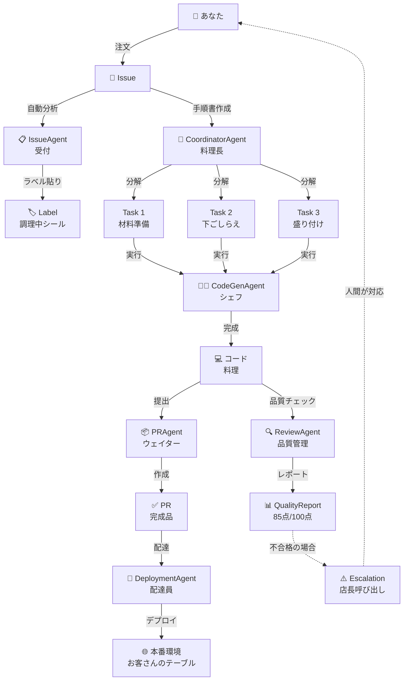

# Miyabi Entity-Relationモデル - 超簡単解説 🌸

**初心者向け：レストランで理解するEntity-Relationモデル**

---

## 📖 この文書について

**難しい技術用語なし！** レストランの注文システムに例えて、Miyabiのしくみを説明します。

---

## 🍽️ レストランで例えると...

### Entity（エンティティ）= レストランの「モノ」

Miyabiは「自動レストラン」です。お客さん（あなた）が注文すると、AIロボット（Agent）が自動で料理を作って提供します。

#### 1. 📝 **Issue（イシュー）= お客さんの注文票**

```
例：
注文票 #270
---
「ユーザー認証機能を作ってください」
```

**何？**: やってほしいことを書いたメモ
**誰が書く？**: プロジェクトの人間
**どうなる？**: Agentが自動で処理してくれる

---

#### 2. ✂️ **Task（タスク）= 料理の手順書**

```
例：Issue #270を3つのTaskに分解
---
Task 1: 材料を準備（データモデル設計）
Task 2: 下ごしらえ（API実装）
Task 3: 盛り付け（UI実装）
```

**何？**: Issueを細かく分けた作業手順
**誰が作る？**: CoordinatorAgent（料理長）が自動で分解
**なぜ分ける？**: 並行作業できるから速い

---

#### 3. 🤖 **Agent（エージェント）= AIシェフ・ウェイター**

Miyabiには7種類のAIロボットがいます：

| Agent | 役割 | レストランで例えると |
|-------|------|-------------------|
| 🎯 **CoordinatorAgent** | 料理長 | 注文を見て、誰が何を作るか決める |
| 👨‍💻 **CodeGenAgent** | シェフ | コードを書く（料理を作る） |
| 🔍 **ReviewAgent** | 品質管理 | 料理の味見・衛生チェック |
| 📋 **IssueAgent** | 受付 | 注文の内容を整理 |
| 📦 **PRAgent** | ウェイター | 完成した料理を提供 |
| 🚀 **DeploymentAgent** | 配達員 | お客さんのテーブルに届ける（デプロイ） |

**何？**: 自動で作業するAIロボット
**どう動く？**: 人間が指示しなくても、勝手に判断して動く
**すごいところ**: 24時間働ける、疲れない、ミスしない

---

#### 4. ✅ **PR（プルリクエスト）= 完成した料理**

```
例：
PR #42
---
「ユーザー認証機能」完成しました！

🍽️ 提供内容：
- ログイン画面
- パスワード暗号化
- セッション管理

👨‍💻 作った人：CodeGenAgent
🔍 品質チェック：85点（合格）
```

**何？**: 完成したコードの塊
**誰がチェック？**: ReviewAgentが自動で品質チェック
**次はどうなる？**: 品質が良ければ本番に反映（マージ）

---

#### 5. 🏷️ **Label（ラベル）= 注文の状態シール**

レストランの注文票に貼るシールのようなもの：

```
注文票 #270
---
🏷️ 「調理中」
🏷️ 「特急（優先度：高）」
🏷️ 「アレルギー対応（セキュリティ）」
```

Miyabiには**53種類**のラベルがあります：

| カテゴリ | 例 | 意味 |
|---------|-----|------|
| 🔄 **STATE** | `state:implementing` | 今、料理を作っている最中 |
| 🔥 **PRIORITY** | `priority:P0-Critical` | 超特急！すぐ作って！ |
| ✨ **TYPE** | `type:feature` | 新メニュー開発 |
| 🤖 **AGENT** | `agent:codegen` | シェフが担当中 |

**何？**: Issue/PRの状態を示すタグ
**誰が貼る？**: IssueAgentが自動で判断して貼る
**なぜ必要？**: パッと見て状態がわかる

---

## 🔗 Relation（リレーション）= 「モノ」同士のつながり

### 最重要フロー：注文から提供まで

```
        ┌─────────┐
        │  Issue  │ お客さんの注文票
        │ #270    │
        └────┬────┘
             │
             │ 📋 IssueAgentが内容を整理
             ▼
        ┌─────────┐
        │CoordinatorAgent│ 料理長が手順を決める
        │  (料理長)  │
        └────┬────┘
             │
             │ ✂️ 3つのTaskに分解
             ▼
     ┌────────┬────────┬────────┐
     │ Task 1 │ Task 2 │ Task 3 │
     │材料準備 │下ごしらえ│盛り付け│
     └───┬────┴───┬────┴───┬────┘
         │          │          │
         │ 🤖      │ 🤖      │ 🤖
         ▼          ▼          ▼
    CodeGenAgent実行中...
         │          │          │
         └──────────┼──────────┘
                    │
                    │ 🔍 ReviewAgentが品質チェック
                    ▼
               ┌─────────┐
               │   PR    │ 完成した料理
               │  #42    │
               └────┬────┘
                    │
                    │ 🚀 DeploymentAgentが配達
                    ▼
               ┌─────────┐
               │ 本番環境 │ お客さんのテーブルへ
               └─────────┘
```

---

## 🎨 ビジュアル：全体像

### 1️⃣ 簡単バージョン（3ステップ）

```
┌──────────────────────────────────────────────────┐
│                                                  │
│  ステップ1: 注文                                  │
│  ┌─────────┐                                     │
│  │ 📝 Issue│  「ユーザー認証機能を作って」         │
│  └─────────┘                                     │
│                                                  │
│  ステップ2: 自動調理                              │
│  ┌─────────┐                                     │
│  │ 🤖 Agent│  AIロボットが自動で作る              │
│  └─────────┘                                     │
│                                                  │
│  ステップ3: 提供                                  │
│  ┌─────────┐                                     │
│  │ ✅ PR   │  完成！品質チェック済み              │
│  └─────────┘                                     │
│                                                  │
└──────────────────────────────────────────────────┘
```

---

### 2️⃣ 詳細バージョン（実際の動き）



---

## 💡 初心者向けQ&A

### Q1: なぜEntity-Relationモデルが必要なの？

**A**: レストランの注文システムと同じです。

- **Entity（モノ）**: 注文票、料理、スタッフ
- **Relation（つながり）**: 「注文票をシェフが見る」「完成した料理をウェイターが運ぶ」

このつながりを整理しないと、混乱して料理が出てきません。

---

### Q2: Agentって何が賢いの？

**A**: 人間が「このIssueを処理して」と言うだけで：

1. 🧠 内容を理解
2. ✂️ 作業を細かく分解
3. 🤖 自動でコード生成
4. 🔍 品質チェック
5. 📦 PR作成
6. 🚀 デプロイ

**全部自動でやってくれます！**

---

### Q3: 53種類のLabelって多すぎない？

**A**: レストランも注文票のシールは色々あります：

- 「特急」「通常」「ゆっくり」（優先度）
- 「アレルギー」「辛さ調整」「特別対応」（特殊条件）
- 「調理中」「完成」「提供済み」（状態）

Miyabiも同じ。パッと見て状態がわかるように、53種類に整理されています。

**詳細**: [LABEL_SYSTEM_GUIDE.md](./LABEL_SYSTEM_GUIDE.md)

---

### Q4: 実際のコード例を見せて！

**A**: はい！例えば「Issue #270 - ユーザー認証機能」の場合：

#### 1. Issue作成（あなたがやること）

```markdown
# Issue #270

## タイトル
ユーザー認証機能を実装

## 説明
ログイン画面を作りたいです。
パスワードは暗号化してください。
```

#### 2. Agentが自動処理（勝手に動く）

```typescript
// IssueAgent: 自動でラベル付け
await issueAgent.analyzeIssue(issue);
// → Label: type:feature, priority:P1-High, agent:codegen

// CoordinatorAgent: 3つのTaskに分解
const tasks = await coordinator.decomposeIssue(issue);
// → Task1: データモデル設計
// → Task2: API実装
// → Task3: UI実装

// CodeGenAgent: コード生成
const code = await codegenAgent.execute(tasks[0]);
// → 完成: src/auth/auth.service.ts

// ReviewAgent: 品質チェック
const report = await reviewAgent.evaluate(code);
// → スコア: 85点 → 合格！

// PRAgent: PR作成
await prAgent.createPR({ title: 'feat: Issue #270 - ユーザー認証実装' });
// → PR #42 作成完了
```

#### 3. 完成！（あなたは何もしてない）

**結果**: PR #42が作成され、レビュー待ち状態になります。

---

## 🎯 まとめ：5つのコアEntity

| Entity | 一言で言うと | レストランで例えると |
|--------|------------|-------------------|
| 📝 **Issue** | やりたいこと | お客さんの注文票 |
| ✂️ **Task** | 作業手順 | 料理の手順書 |
| 🤖 **Agent** | AIロボット | シェフ・ウェイター |
| ✅ **PR** | 完成品 | 完成した料理 |
| 🏷️ **Label** | 状態シール | 「調理中」「完成」のシール |

---

## 📚 もっと詳しく知りたい人へ

### 次に読むべきドキュメント

1. **初心者**: [LABEL_SYSTEM_GUIDE.md](./LABEL_SYSTEM_GUIDE.md) - 53ラベル完全ガイド
2. **中級者**: [AGENT_OPERATIONS_MANUAL.md](./AGENT_OPERATIONS_MANUAL.md) - Agent運用マニュアル
3. **上級者**: [ENTITY_RELATION_MODEL.md](./ENTITY_RELATION_MODEL.md) - 完全版（1722行）

### コマンド一覧

```bash
# プロジェクト状態確認
npx miyabi status

# Agent手動実行
npm run agents:parallel:exec -- --issue=270

# システム動作確認
npm run agents:verify
```

---

## 🌟 Entity-Relationの本質

```
┌─────────────────────────────────────────┐
│                                         │
│  "Everything is connected."             │
│  （すべてはつながっている）                │
│                                         │
│  IssueからPRまで、全てが自動で流れる。    │
│  それがMiyabiの自律型開発システム。       │
│                                         │
└─────────────────────────────────────────┘
```

---

## 📊 補足：全体の数字

| 項目 | 数 |
|-----|-----|
| **Entity種類** | 13種類 |
| **重要Entity** | 5種類（Issue, Task, Agent, PR, Label） |
| **Agent種類** | 7種類（Coding Agents） + 14種類（Business Agents） |
| **Label種類** | 53種類（10カテゴリ） |
| **関係性** | 35種類 |
| **重要フロー** | 3ステップ（Issue → Agent → PR） |

---

## 🎨 アスキーアート：Miyabi自動レストラン

```
     🌸 Miyabi自動レストラン 🌸

┌─────────────────────────────────────────┐
│                                         │
│  👤 お客さん（あなた）                    │
│   │                                     │
│   │ 📝 注文票（Issue）を出す              │
│   ▼                                     │
│  ┌──────────────────────┐               │
│  │  📋 受付（IssueAgent）│               │
│  │  🏷️ シール貼り        │               │
│  └──────┬───────────────┘               │
│         │                               │
│         │ 注文票を渡す                   │
│         ▼                               │
│  ┌──────────────────────┐               │
│  │ 🎯 料理長               │               │
│  │  (CoordinatorAgent)   │               │
│  │  ✂️ 手順書を作る       │               │
│  └──────┬───────────────┘               │
│         │                               │
│    ┌────┼────┐                         │
│    │    │    │                         │
│    ▼    ▼    ▼                         │
│  👨‍💻  👨‍💻  👨‍💻                         │
│  シェフ シェフ シェフ                     │
│  (CodeGenAgent)                         │
│  🍳 料理を作る                           │
│    │    │    │                         │
│    └────┼────┘                         │
│         │                               │
│         │ 完成！                         │
│         ▼                               │
│  ┌──────────────────────┐               │
│  │ 🔍 品質管理             │               │
│  │  (ReviewAgent)        │               │
│  │  ✅ 味見・チェック      │               │
│  └──────┬───────────────┘               │
│         │                               │
│         │ 合格！                         │
│         ▼                               │
│  ┌──────────────────────┐               │
│  │ 📦 ウェイター           │               │
│  │  (PRAgent)            │               │
│  │  🍽️ 料理を提供準備     │               │
│  └──────┬───────────────┘               │
│         │                               │
│         │ 配達準備完了                   │
│         ▼                               │
│  ┌──────────────────────┐               │
│  │ 🚀 配達員              │               │
│  │  (DeploymentAgent)    │               │
│  │  🌐 本番環境へ配達     │               │
│  └──────┬───────────────┘               │
│         │                               │
│         ▼                               │
│  ┌──────────────────────┐               │
│  │ ✅ お客さんのテーブル    │               │
│  │  🎉 完成品をお届け！    │               │
│  └──────────────────────┘               │
│                                         │
│  👤 お客さん「美味しい！」                │
│                                         │
└─────────────────────────────────────────┘
```

---

## 🚀 次のステップ

1. **実際に試す**: Issue #270を作って、Agentが自動で処理するのを見てみよう
2. **Labelを理解する**: [LABEL_SYSTEM_GUIDE.md](./LABEL_SYSTEM_GUIDE.md)を読もう
3. **Agentを使いこなす**: [AGENT_OPERATIONS_MANUAL.md](./AGENT_OPERATIONS_MANUAL.md)で詳細を学ぼう

---

**🌸 Miyabi - Beauty in Autonomous Development**

すべてが自動でつながり、美しく流れる開発システム。

---

**作成日**: 2025-10-13
**対象読者**: プログラミング初心者・Miyabi初心者
**完全版**: [ENTITY_RELATION_MODEL.md](./ENTITY_RELATION_MODEL.md)（1722行の詳細版）
