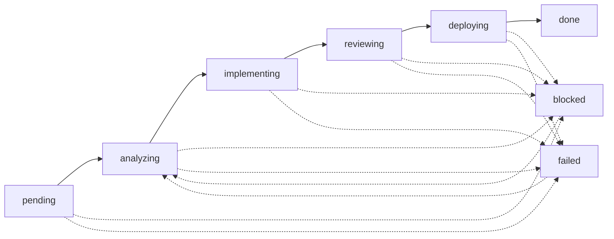

# Issue Trace Log - Complete Lifecycle Tracking Guide

**Status**: ✅ Production-ready (Issue #121)

## 📋 Overview

Issue Trace Log provides complete lifecycle tracking for GitHub Issues in the Miyabi Agentic OS. Every Issue is tracked from creation to completion with full visibility into state transitions, agent executions, quality metrics, deployments, and escalations.

### Key Features

- **8-State Lifecycle Tracking**: pending → analyzing → implementing → reviewing → deploying → done/blocked/failed
- **Agent Execution Tracking**: Start/end timestamps, duration, results, errors
- **State Transition History**: Complete audit trail of state changes
- **Task Statistics**: Real-time tracking of total/completed/failed tasks
- **Label Change Tracking**: Added/removed labels with timestamps
- **Quality Metrics**: Aggregation of quality reports with final scores
- **PR/Deployment Tracking**: Links to PRs and deployment results
- **Escalation Logging**: Security incidents, blockers, critical issues
- **Manual Annotations**: Notes and tags for debugging and documentation

---

## 🏗️ Architecture

### Type Definitions

All types are defined in `agents/types/index.ts`:

```typescript
// 8-state Issue lifecycle
export type IssueState =
  | 'pending'      // Issue created, awaiting triage
  | 'analyzing'    // CoordinatorAgent analyzing
  | 'implementing' // Specialist Agents working
  | 'reviewing'    // ReviewAgent checking quality
  | 'deploying'    // DeploymentAgent deploying
  | 'done'         // Completed successfully
  | 'blocked'      // Blocked - requires intervention
  | 'failed';      // Execution failed

// Complete Issue trace log
export interface IssueTraceLog {
  // Identification
  issueNumber: number;
  issueTitle: string;
  issueUrl: string;

  // Lifecycle tracking
  createdAt: string;
  closedAt?: string;
  currentState: IssueState;
  stateTransitions: StateTransition[];

  // Agent execution tracking
  agentExecutions: AgentExecution[];

  // Task decomposition
  totalTasks: number;
  completedTasks: number;
  failedTasks: number;

  // Label tracking
  labelChanges: LabelChange[];
  currentLabels: string[];

  // Quality & metrics
  qualityReports: QualityReport[];
  finalQualityScore?: number;

  // Pull Request tracking
  pullRequests: PRResult[];

  // Deployment tracking
  deployments: DeploymentResult[];

  // Escalations
  escalations: EscalationInfo[];

  // Notes & annotations
  notes: TraceNote[];

  // Metadata
  metadata: {
    deviceIdentifier: string;
    sessionIds: string[];
    totalDurationMs?: number;
    lastUpdated: string;
  };
}
```

### File Structure

```
.ai/
└── trace-logs/
    ├── issue-108.json   # Security audit trace
    ├── issue-121.json   # Issue Trace Log implementation
    └── issue-270.json   # Example Issue trace
```

---

## 🚀 Usage

### 1. Basic Usage (CoordinatorAgent)

CoordinatorAgent automatically creates and manages Issue Trace Logger for each Issue:

```typescript
import { IssueTraceLogger } from './agents/logging/issue-trace-logger.js';
import { CoordinatorAgent } from './agents/coordinator/coordinator-agent.js';

// Initialize Coordinator
const coordinator = new CoordinatorAgent(config);

// Execute task (IssueTraceLogger is created automatically)
const result = await coordinator.execute({
  id: 'task-270-0',
  title: 'Implement feature X',
  description: 'Feature implementation',
  type: 'feature',
  priority: 1,
  dependencies: [],
  metadata: {
    issueNumber: 270,
    issueUrl: 'https://github.com/user/repo/issues/270',
  },
});

// Trace log is automatically saved to:
// .ai/trace-logs/issue-270.json
```

### 2. Manual Usage (Specialist Agents)

For specialist agents (CodeGen, Review, Deployment, etc.), the logger is passed automatically:

```typescript
import { BaseAgent } from './agents/base-agent.js';
import { IssueTraceLogger } from './agents/logging/issue-trace-logger.js';

export class MySpecialistAgent extends BaseAgent {
  async execute(task: Task): Promise<AgentResult> {
    // Logger is already set by CoordinatorAgent via setTraceLogger()

    // Add notes for debugging
    this.addTraceNote('Starting code generation', ['codegen', 'feature']);

    // Record state transition
    this.recordStateTransition('implementing', 'reviewing', 'Code generation complete');

    // Agent execution is tracked automatically via BaseAgent.run()

    return { status: 'success', data: { message: 'Task completed' } };
  }
}
```

### 3. Direct API Usage

For advanced use cases or testing:

```typescript
import { IssueTraceLogger } from './agents/logging/issue-trace-logger.js';

// Create logger
const logger = new IssueTraceLogger(
  270,                                              // Issue number
  'Implement feature X',                           // Issue title
  'https://github.com/user/repo/issues/270',       // Issue URL
  'MacBook Pro 16-inch'                            // Device identifier
);

// Start tracking
logger.startTrace();

// Record state transition
logger.recordStateTransition(
  'pending',
  'analyzing',
  'CoordinatorAgent',
  'Starting Issue decomposition'
);

// Track agent execution
logger.startAgentExecution('CodeGenAgent', 'task-270-1');
// ... do work ...
logger.endAgentExecution('CodeGenAgent', 'completed', {
  status: 'success',
  data: { filesGenerated: 3 },
});

// Update task statistics
logger.updateTaskStats(5, 3, 0); // total, completed, failed

// Record quality report
logger.recordQualityReport({
  score: 85,
  passed: true,
  issues: [],
  recommendations: ['Add more tests'],
  breakdown: {
    eslintScore: 90,
    typeScriptScore: 85,
    securityScore: 80,
    testCoverageScore: 85,
  },
});

// Record PR
logger.recordPullRequest({
  number: 123,
  url: 'https://github.com/user/repo/pull/123',
  state: 'open',
  createdAt: new Date().toISOString(),
});

// Add manual note
logger.addNote('Developer', 'Manual review needed', ['manual', 'review']);

// End tracking
logger.endTrace('done', 'Issue completed successfully');

// Save to disk (also called automatically by methods)
logger.saveTrace();
```

---

## 📊 State Transition Flow

### Complete Lifecycle



### State Descriptions

| State | Description | Triggered By | Next States |
|-------|-------------|--------------|-------------|
| **pending** | Issue created, awaiting triage | System | analyzing |
| **analyzing** | CoordinatorAgent analyzing dependencies | CoordinatorAgent | implementing, blocked, failed |
| **implementing** | Specialist Agents executing tasks | CodeGenAgent, etc. | reviewing, blocked, failed |
| **reviewing** | ReviewAgent checking quality | ReviewAgent | deploying, implementing, blocked, failed |
| **deploying** | DeploymentAgent deploying to staging/production | DeploymentAgent | done, blocked, failed |
| **done** | Completed successfully | System | - |
| **blocked** | Blocked - requires Guardian intervention | Any Agent | analyzing |
| **failed** | Execution failed - requires Guardian intervention | Any Agent | analyzing |

---

## 🔍 Querying Trace Logs

### Load Existing Trace

```typescript
import { IssueTraceLogger } from './agents/logging/issue-trace-logger.js';

// Load specific Issue trace
const logger = IssueTraceLogger.load(270);

if (logger) {
  const trace = logger.getTrace();
  console.log(`Issue #${trace.issueNumber}: ${trace.issueTitle}`);
  console.log(`Current State: ${trace.currentState}`);
  console.log(`Total Tasks: ${trace.totalTasks}`);
  console.log(`Completed: ${trace.completedTasks}`);
  console.log(`Failed: ${trace.failedTasks}`);
  console.log(`Quality Score: ${trace.finalQualityScore}`);
}
```

### Get All Traces

```typescript
import { IssueTraceLogger } from './agents/logging/issue-trace-logger.js';

// Get all Issue traces
const traces = IssueTraceLogger.getAllTraces();

// Filter by state
const inProgress = traces.filter(t => t.currentState === 'implementing');
const completed = traces.filter(t => t.currentState === 'done');
const failed = traces.filter(t => t.currentState === 'failed');

console.log(`In Progress: ${inProgress.length}`);
console.log(`Completed: ${completed.length}`);
console.log(`Failed: ${failed.length}`);

// Sort by quality score
const sortedByQuality = traces
  .filter(t => t.finalQualityScore !== undefined)
  .sort((a, b) => (b.finalQualityScore || 0) - (a.finalQualityScore || 0));

console.log('Top 5 Quality Issues:');
sortedByQuality.slice(0, 5).forEach(t => {
  console.log(`  Issue #${t.issueNumber}: ${t.finalQualityScore}/100`);
});
```

### Analyze Agent Performance

```typescript
import { IssueTraceLogger } from './agents/logging/issue-trace-logger.js';

const traces = IssueTraceLogger.getAllTraces();

// Calculate average agent execution time
const agentMetrics = new Map<string, { count: number; totalMs: number }>();

traces.forEach(trace => {
  trace.agentExecutions.forEach(exec => {
    if (exec.durationMs) {
      const existing = agentMetrics.get(exec.agentType) || { count: 0, totalMs: 0 };
      agentMetrics.set(exec.agentType, {
        count: existing.count + 1,
        totalMs: existing.totalMs + exec.durationMs,
      });
    }
  });
});

console.log('Agent Performance:');
agentMetrics.forEach((metrics, agentType) => {
  const avgMs = metrics.totalMs / metrics.count;
  console.log(`  ${agentType}: ${avgMs.toFixed(0)}ms (${metrics.count} executions)`);
});
```

---

## 📈 Analytics & Reporting

### Success Rate Calculation

```typescript
function calculateSuccessRate(traces: IssueTraceLog[]): number {
  const completed = traces.filter(t => t.currentState === 'done').length;
  return (completed / traces.length) * 100;
}

const traces = IssueTraceLogger.getAllTraces();
const successRate = calculateSuccessRate(traces);
console.log(`Success Rate: ${successRate.toFixed(1)}%`);
```

### Average Quality Score

```typescript
function calculateAverageQuality(traces: IssueTraceLog[]): number {
  const withScores = traces.filter(t => t.finalQualityScore !== undefined);
  const sum = withScores.reduce((acc, t) => acc + (t.finalQualityScore || 0), 0);
  return sum / withScores.length;
}

const avgQuality = calculateAverageQuality(IssueTraceLogger.getAllTraces());
console.log(`Average Quality Score: ${avgQuality.toFixed(1)}/100`);
```

### Escalation Analysis

```typescript
function analyzeEscalations(traces: IssueTraceLog[]): Record<string, number> {
  const escalationCounts: Record<string, number> = {};

  traces.forEach(trace => {
    trace.escalations.forEach(esc => {
      escalationCounts[esc.target] = (escalationCounts[esc.target] || 0) + 1;
    });
  });

  return escalationCounts;
}

const escalations = analyzeEscalations(IssueTraceLogger.getAllTraces());
console.log('Escalations by Target:');
Object.entries(escalations).forEach(([target, count]) => {
  console.log(`  ${target}: ${count}`);
});
```

---

## 🧪 Testing

Comprehensive test suite with 29 unit tests (all passing):

```bash
npm test -- agents/logging/__tests__/issue-trace-logger.test.ts
```

### Test Categories

- **Lifecycle Management** (5 tests): Create, start, end, persist, load
- **State Transition Tracking** (2 tests): Record transitions, track flow
- **Agent Execution Tracking** (4 tests): Start/end, duration, multiple agents
- **Task Management** (3 tests): Update stats, increment counts
- **Label Tracking** (3 tests): Add/remove, prevent duplicates
- **Quality Tracking** (2 tests): Record reports, update scores
- **PR/Deployment/Escalation** (3 tests): Record entities
- **Notes & Annotations** (1 test): Add notes with tags
- **Static Methods** (5 tests): Load, getAllTraces, deleteTrace
- **Integration** (1 test): Complete lifecycle simulation

---

## 🔐 Security & Privacy

### Data Storage

- Trace logs are stored in `.ai/trace-logs/` directory
- File format: JSON with `.json` extension
- File naming: `issue-{issueNumber}.json`
- **Important**: Add `.ai/` to `.gitignore` if logs contain sensitive data

### Sensitive Data Handling

```typescript
// Sanitize sensitive data before recording
logger.addNote('System', 'Deployment key rotated', ['security', 'credentials']);

// Do NOT include credentials in trace
// ❌ Bad:
logger.recordDeployment({
  environment: 'production',
  deploymentUrl: 'https://api.example.com',
  apiKey: 'sk-prod-1234567890',  // ❌ DO NOT DO THIS
});

// ✅ Good:
logger.recordDeployment({
  environment: 'production',
  deploymentUrl: 'https://api.example.com',
  // apiKey omitted - stored securely in env
});
```

---

## 🛠️ Troubleshooting

### Common Issues

#### 1. Trace Log Not Created

**Symptom**: No `.ai/trace-logs/issue-{number}.json` file

**Solution**:
```typescript
// Ensure trace directory exists
import * as fs from 'fs';
const traceDir = '.ai/trace-logs';
if (!fs.existsSync(traceDir)) {
  fs.mkdirSync(traceDir, { recursive: true });
}

// Verify logger is initialized
if (!this.traceLogger) {
  console.error('IssueTraceLogger not initialized!');
}
```

#### 2. Agent Execution Not Tracked

**Symptom**: `agentExecutions` array is empty

**Solution**:
```typescript
// Ensure setTraceLogger() is called before execute()
const agent = new CodeGenAgent(config);
agent.setTraceLogger(issueLogger);  // ← Must call this!
await agent.execute(task);
```

#### 3. State Transition Errors

**Symptom**: Invalid state transition error

**Solution**:
```typescript
// Valid transitions follow the lifecycle flow
// pending → analyzing → implementing → reviewing → deploying → done
// Any state can transition to blocked/failed

// ❌ Invalid:
logger.recordStateTransition('pending', 'deploying', 'System');

// ✅ Valid:
logger.recordStateTransition('pending', 'analyzing', 'CoordinatorAgent');
logger.recordStateTransition('analyzing', 'implementing', 'CoordinatorAgent');
// ... continue through lifecycle
```

---

## 📚 Examples

### Example 1: Complete Issue Lifecycle

```typescript
import { IssueTraceLogger } from './agents/logging/issue-trace-logger.js';

// Initialize
const logger = new IssueTraceLogger(
  270,
  'Add dark mode support',
  'https://github.com/user/repo/issues/270',
  'MacBook Pro 16-inch'
);

// Start
logger.startTrace();

// Analyze
logger.recordStateTransition('pending', 'analyzing', 'CoordinatorAgent');
logger.updateTaskStats(3, 0, 0); // 3 tasks total

// Implement Task 1
logger.recordStateTransition('analyzing', 'implementing', 'CoordinatorAgent');
logger.startAgentExecution('CodeGenAgent', 'task-270-1');
// ... code generation ...
logger.endAgentExecution('CodeGenAgent', 'completed', {
  status: 'success',
  data: { filesGenerated: 2 },
});
logger.incrementCompletedTasks();

// Review
logger.recordStateTransition('implementing', 'reviewing', 'ReviewAgent');
logger.recordQualityReport({
  score: 88,
  passed: true,
  issues: [],
  recommendations: ['Add integration tests'],
  breakdown: {
    eslintScore: 90,
    typeScriptScore: 90,
    securityScore: 85,
    testCoverageScore: 85,
  },
});

// Create PR
logger.recordPullRequest({
  number: 300,
  url: 'https://github.com/user/repo/pull/300',
  state: 'open',
  createdAt: new Date().toISOString(),
});

// Deploy
logger.recordStateTransition('reviewing', 'deploying', 'DeploymentAgent');
logger.recordDeployment({
  environment: 'staging',
  version: '1.5.0',
  projectId: 'my-project-staging',
  deploymentUrl: 'https://staging.example.com',
  deployedAt: new Date().toISOString(),
  durationMs: 45000,
  status: 'success',
});

// Done
logger.recordStateTransition('deploying', 'done', 'System');
logger.endTrace('done', 'Dark mode feature completed');

console.log('✅ Issue #270 completed successfully!');
```

### Example 2: Escalation Handling

```typescript
import { IssueTraceLogger } from './agents/logging/issue-trace-logger.js';

const logger = new IssueTraceLogger(
  271,
  'Fix security vulnerability',
  'https://github.com/user/repo/issues/271',
  'MacBook Pro 16-inch'
);

logger.startTrace();
logger.recordStateTransition('pending', 'analyzing', 'CoordinatorAgent');

// Detect security issue
logger.recordEscalation({
  reason: 'Critical security vulnerability detected: CVE-2024-1234',
  target: 'CISO',
  severity: 'Sev.1-Critical',
  context: {
    cve: 'CVE-2024-1234',
    affectedVersions: '1.0.0-1.4.9',
    patch: 'Upgrade to 1.5.0',
  },
  timestamp: new Date().toISOString(),
});

// Mark as blocked
logger.recordStateTransition('analyzing', 'blocked', 'Guardian intervention required');
logger.addNote('CISO', 'Security patch approved. Proceeding with fix.', ['security', 'approved']);

// Resume after Guardian approval
logger.recordStateTransition('blocked', 'implementing', 'Resuming after CISO approval');

// ... continue with fix ...
```

---

## 🔗 Related Documentation

- **[Entity-Relation Model](ENTITY_RELATION_MODEL.md)** - E14: Issue Trace Log Entity
- **[Label System Guide](LABEL_SYSTEM_GUIDE.md)** - Label change tracking
- **[Agent Operations Manual](AGENT_OPERATIONS_MANUAL.md)** - Agent integration
- **[Type Definitions](../agents/types/index.ts)** - TypeScript types
- **[Test Suite](../agents/logging/__tests__/issue-trace-logger.test.ts)** - 29 unit tests

---

## 📞 Support

For questions, issues, or feature requests:

- **GitHub Issue**: [Issue #121](https://github.com/ShunsukeHayashi/Miyabi/issues/121)
- **Discord**: Join the Miyabi Community
- **Documentation**: [https://shunsukehayashi.github.io/Miyabi/](https://shunsukehayashi.github.io/Miyabi/)

---

**Generated with** 🤖 [Claude Code](https://claude.com/claude-code)

**Status**: ✅ Production-ready (Phase 5/5 complete)
