# Phase B: Event Bus (Webhooks) - Complete Documentation

**Status**: ✅ Implemented
**Issue**: #5 Phase B
**Priority**: Critical
**Completion Date**: 2025-10-08

---

## Overview

Phase B implements a complete Event-Driven Architecture for the Autonomous Operations system using GitHub Webhooks. This enables automatic Agent execution based on GitHub events (Issues, PRs, Pushes, Comments).

### Architecture

```
GitHub Events
    │
    ├── Issue Events ────────► IssueAgent (analyze, label, state transition)
    ├── PR Events ───────────► ReviewAgent (quality checks, auto-review)
    ├── Push Events ─────────► DeploymentAgent (CI/CD trigger)
    ├── Comment Events ──────► CoordinatorAgent (command parsing)
    └── Workflow Events ─────► Guardian (failure escalation)
```

---

## Key Features

### 1. Event Routing

- **Automatic Event Detection**: GitHub events trigger workflows automatically
- **Intelligent Routing**: Events are routed to appropriate agents based on type and context
- **Priority Handling**: Critical events (agent-execute) take precedence
- **Multi-Agent Support**: Single event can trigger multiple agents

### 2. Security

- **HMAC-SHA256 Signature Verification**: All webhooks are cryptographically verified
- **Timestamp Validation**: Prevents replay attacks (5-minute window)
- **Rate Limiting**: Protects against DoS attacks (100 requests/minute default)
- **IP Allowlisting**: Optional verification of GitHub's webhook IPs

### 3. Reliability

- **Exponential Backoff Retry**: Automatic retry with increasing delays (1s → 2s → 4s → 8s)
- **Error Handling**: Comprehensive error catching and logging
- **Failure Escalation**: Critical failures create Guardian issues automatically
- **Idempotency**: Safe to retry operations

### 4. Observability

- **Detailed Logging**: All events and routing decisions logged
- **Routing Comments**: Automated comments document agent assignments
- **Metrics Collection**: Success/failure rates tracked
- **Debug Mode**: Verbose output for troubleshooting

---

## Components

### 1. Webhook Handler Workflow

**File**: `.github/workflows/webhook-handler.yml`

Central GitHub Actions workflow that receives all webhook events and routes them appropriately.

**Triggers**:
- `issues`: opened, labeled, closed, assigned, milestoned
- `pull_request`: opened, synchronize, closed, review_requested
- `issue_comment`: created
- `pull_request_review`: submitted
- `push`: main branch
- `workflow_run`: completed

**Key Features**:
- Event logging with timestamps
- Conditional routing based on event type and action
- Command parsing for `/agent` comments
- Critical workflow failure escalation

### 2. Webhook Event Router

**File**: `scripts/webhook-router.ts`

TypeScript implementation of the event routing logic.

**Routing Rules**:

| Event | Condition | Agent | Priority | Action |
|-------|-----------|-------|----------|--------|
| Issue labeled | `🤖agent-execute` | CoordinatorAgent | Critical | Execute autonomous task |
| Comment | Starts with `/agent` | CoordinatorAgent | Critical | Parse and execute command |
| Issue opened | - | IssueAgent | High | Analyze and auto-label |
| Issue assigned | - | IssueAgent | High | Transition to implementing |
| Issue closed | - | IssueAgent | Medium | Transition to done |
| PR opened | - | ReviewAgent | High | Run quality checks |
| PR ready_for_review | - | ReviewAgent | High | Request review |
| Review requested | - | ReviewAgent | High | Perform automated review |
| PR merged | - | DeploymentAgent | Medium | Trigger deployment |
| Push to main | - | DeploymentAgent | Medium | Deploy to production |

**Usage**:

```bash
# Test issue opened event
npm run webhook:test:issue

# Test PR opened event
npm run webhook:test:pr

# Test push event
npm run webhook:test:push

# Test comment command
npm run webhook:test:comment
```

### 3. Webhook Security Module

**File**: `scripts/webhook-security.ts`

Security layer for webhook verification and protection.

**Functions**:

#### `verifyWebhookSignature(options)`

Verifies GitHub's HMAC-SHA256 signature.

```typescript
const result = verifyWebhookSignature({
  secret: 'your-webhook-secret',
  signature: 'sha256=abc123...',
  payload: '{"event":"data"}',
  timestamp: '2025-10-08T12:00:00Z',
  maxAge: 300, // 5 minutes
});

// result.valid: true/false
// result.reason: error message if invalid
```

#### `validateTimestamp(timestamp, maxAge)`

Prevents replay attacks by checking timestamp freshness.

```typescript
const result = validateTimestamp('2025-10-08T12:00:00Z', 300);
```

#### `performSecurityCheck(options)`

Comprehensive security check combining signature, timestamp, IP, and rate limiting.

```typescript
const result = performSecurityCheck({
  secret: 'webhook-secret',
  signature: 'sha256=...',
  payload: '{}',
  timestamp: new Date().toISOString(),
  ip: '192.30.252.1',
  identifier: 'user-123',
  skipIPCheck: false,
  skipRateLimit: false,
});
```

#### Rate Limiting

```typescript
import { RateLimiter } from './webhook-security.js';

const limiter = new RateLimiter({
  maxRequests: 100,
  windowMs: 60000, // 1 minute
});

const result = limiter.checkLimit('user-123');
if (!result.valid) {
  console.error('Rate limit exceeded');
}
```

### 4. Integration Tests

**File**: `tests/webhook-router.test.ts`

Comprehensive test suite covering:
- Signature verification (valid, invalid, malformed)
- Timestamp validation (recent, old, future)
- Event routing logic
- Retry mechanism (exponential backoff)
- Rate limiting
- Error handling
- End-to-end scenarios

**Running Tests**:

```bash
npm test
```

---

## Setup Instructions

### 1. Configure Webhook Secret (Optional)

For production use, set up a webhook secret for signature verification:

```bash
# Generate a secure random secret
openssl rand -hex 32

# Add to GitHub repository secrets
# Settings → Secrets and variables → Actions → New repository secret
# Name: WEBHOOK_SECRET
# Value: <generated-secret>
```

### 2. Update Webhook Handler (if needed)

The webhook handler is already configured, but you can customize routing rules in `scripts/webhook-router.ts`:

```typescript
const ROUTING_RULES: RoutingRule[] = [
  {
    condition: (p) => p.type === 'issue' && p.action === 'opened',
    agent: 'CustomAgent',
    priority: 'high',
    action: 'Custom action',
  },
  // ... add more rules
];
```

### 3. Test Webhook Routing

Use the provided npm scripts to test routing logic:

```bash
# Test issue opened
npm run webhook:test:issue

# Test PR opened
npm run webhook:test:pr

# Test push to main
npm run webhook:test:push

# Test agent comment command
npm run webhook:test:comment
```

### 4. Monitor Webhook Activity

Check the following locations for webhook activity:

- **GitHub Actions**: Actions tab → "Webhook Event Handler" workflow
- **Issue Comments**: Automated routing comments on issues/PRs
- **Logs**: Workflow run logs show detailed routing information

---

## Event Flow Examples

### Example 1: Issue with agent-execute Label

```mermaid
sequenceDiagram
    User->>GitHub: Add 🤖agent-execute label to Issue #123
    GitHub->>Webhook Handler: Trigger issues.labeled event
    Webhook Handler->>Security: Verify signature
    Security-->>Webhook Handler: ✅ Valid
    Webhook Handler->>Event Router: Route event
    Event Router->>Routing Rules: Match condition
    Routing Rules-->>Event Router: CoordinatorAgent (critical)
    Event Router->>CoordinatorAgent: Execute autonomous task
    CoordinatorAgent->>Issue: Post comment with routing info
    CoordinatorAgent->>Task Execution: Start agent workflow
```



### Example 2: Comment Command


### Example 3: PR Review Request


---

## Agent Commands

Users can trigger agents using comment commands:

### Available Commands

```bash
/agent analyze          # Trigger IssueAgent for analysis
/agent execute          # Start autonomous execution (CoordinatorAgent)
/agent review           # Request ReviewAgent code review
/agent status           # Check current task status
```

### Command Flow

1. User posts comment with `/agent <command>`
2. Webhook Handler detects comment
3. Event Router parses command
4. CoordinatorAgent executes command
5. Result posted as comment

---

## Security Best Practices

### 1. Always Use Webhook Secrets

Set `WEBHOOK_SECRET` in your repository secrets to enable signature verification.

### 2. Limit Token Permissions

Ensure `GITHUB_TOKEN` has minimal required permissions:

```yaml
permissions:
  issues: write
  pull-requests: write
  actions: write
  contents: read
```

### 3. Monitor Rate Limits

Default rate limit is 100 requests/minute. Adjust in `webhook-router.ts`:

```typescript
const RETRY_CONFIG: RetryConfig = {
  maxRetries: 3,
  initialDelayMs: 1000,
  maxDelayMs: 10000,
  backoffMultiplier: 2,
};
```

### 4. Review Webhook Logs Regularly

Check GitHub Actions logs for:
- Signature verification failures
- Rate limit violations
- Unusual event patterns
- Failed routing attempts

---

## Troubleshooting

### Issue: Webhook not triggering

**Symptoms**: Events occur but workflow doesn't run

**Solutions**:
1. Check workflow file syntax: `.github/workflows/webhook-handler.yml`
2. Verify workflow is enabled: Actions tab → Enable workflow
3. Check event triggers match: `on.issues.types`, `on.pull_request.types`
4. Review GitHub Actions logs for errors

### Issue: Signature verification failing

**Symptoms**: Security checks reject valid webhooks

**Solutions**:
1. Verify `WEBHOOK_SECRET` is set correctly
2. Check signature format: `sha256=<hex>`
3. Ensure payload matches exactly (no modifications)
4. Test with signature verification disabled (dev only):
   ```typescript
   skipIPCheck: true,
   skipRateLimit: true,
   ```

### Issue: Agent not executing

**Symptoms**: Routing succeeds but agent doesn't run

**Solutions**:
1. Check if agent workflow exists (e.g., `agent-runner.yml`)
2. Verify agent label is correct: `🤖agent-execute`
3. Check agent implementation exists
4. Review agent execution logs

### Issue: Rate limit exceeded

**Symptoms**: `429` errors or "Rate limit exceeded" messages

**Solutions**:
1. Increase rate limit in `webhook-router.ts`:
   ```typescript
   const DEFAULT_RATE_LIMIT = {
     maxRequests: 200,  // Increase from 100
     windowMs: 60000,
   };
   ```
2. Implement request queuing
3. Add backoff logic
4. Contact GitHub support for higher limits

### Issue: Retries exhausted

**Symptoms**: "Failed after N retries" errors

**Solutions**:
1. Check network connectivity
2. Verify GitHub API status: https://www.githubstatus.com/
3. Increase retry count:
   ```typescript
   const RETRY_CONFIG = {
     maxRetries: 5,  // Increase from 3
     // ...
   };
   ```
4. Review error logs for root cause

---

## Metrics and Monitoring

### Key Metrics

Track these metrics for webhook system health:

1. **Event Volume**: Number of events per day/hour
2. **Routing Success Rate**: Percentage of successfully routed events
3. **Agent Execution Time**: Average time from event to completion
4. **Error Rate**: Percentage of failed routings
5. **Retry Rate**: Percentage of events requiring retries

### Monitoring Tools

- **GitHub Actions Dashboard**: Real-time workflow status
- **Issue Comments**: Historical routing decisions
- **Workflow Logs**: Detailed execution traces
- **Custom Dashboards**: Use `scripts/generate-dashboard-data.ts`

---

## Performance Optimization

### 1. Parallel Event Processing

Events are processed independently in parallel by default.

### 2. Conditional Workflow Execution

Only relevant jobs run based on event type:

```yaml
- name: Route Issue Event
  if: github.event_name == 'issues'
  # ...
```

### 3. Workflow Caching

Cache dependencies to speed up execution:

```yaml
- name: Cache node modules
  uses: actions/cache@v3
  with:
    path: node_modules
    key: ${{ runner.os }}-node-${{ hashFiles('package-lock.json') }}
```

### 4. Minimize API Calls

- Batch operations where possible
- Cache frequently accessed data
- Use GraphQL for complex queries

---

## Future Enhancements

### Phase B+ (Future)

1. **Advanced Routing**
   - Machine learning-based agent selection
   - Dynamic priority adjustment
   - Context-aware routing

2. **Enhanced Security**
   - Multi-signature verification
   - Anomaly detection
   - IP reputation checking

3. **Scalability**
   - Event queue (Redis/SQS)
   - Distributed routing
   - Load balancing

4. **Observability**
   - Distributed tracing (OpenTelemetry)
   - Real-time dashboards
   - Alerting system

---

## API Reference

### WebhookEventRouter Class

```typescript
class WebhookEventRouter {
  /**
   * Route incoming event to appropriate agent with retry support
   * @param payload - Event payload containing type, action, and metadata
   */
  async route(payload: EventPayload): Promise<void>;

  /**
   * Trigger agent execution with exponential backoff retry
   * @param agent - Agent name to trigger
   * @param payload - Event payload
   * @param action - Action description
   * @returns Routing result with success status and retry count
   */
  private async triggerAgentWithRetry(
    agent: string,
    payload: EventPayload,
    action: string
  ): Promise<RoutingResult>;
}
```

### Types

```typescript
type EventType = 'issue' | 'pr' | 'push' | 'comment';

interface EventPayload {
  type: EventType;
  action: string;
  number?: number;
  title?: string;
  body?: string;
  labels?: string[];
  author?: string;
  branch?: string;
  commit?: string;
}

interface RoutingRule {
  condition: (payload: EventPayload) => boolean;
  agent: string;
  priority: 'critical' | 'high' | 'medium' | 'low';
  action: string;
}

interface RetryConfig {
  maxRetries: number;
  initialDelayMs: number;
  maxDelayMs: number;
  backoffMultiplier: number;
}

interface RoutingResult {
  success: boolean;
  agent?: string;
  action?: string;
  error?: string;
  retries?: number;
}
```

---

## Testing Checklist

Use this checklist to verify Phase B implementation:

- [ ] Issue opened triggers IssueAgent
- [ ] Issue labeled with `🤖agent-execute` triggers CoordinatorAgent
- [ ] PR opened triggers ReviewAgent (if not draft)
- [ ] PR merged triggers DeploymentAgent
- [ ] Push to main triggers DeploymentAgent
- [ ] Comment with `/agent` triggers CoordinatorAgent
- [ ] Workflow failure creates Guardian escalation issue
- [ ] Signature verification rejects invalid signatures
- [ ] Timestamp validation rejects old/future timestamps
- [ ] Rate limiting blocks excessive requests
- [ ] Retry mechanism handles transient failures
- [ ] Routing comments are posted to issues/PRs
- [ ] All tests pass: `npm test`
- [ ] No TypeScript errors: `npm run typecheck`
- [ ] No ESLint errors: `npm run lint`

---

## Support and Resources

### Documentation
- [Phase A: Agent System](./PHASE_A_AGENTS.md)
- [Phase C: CI/CD Integration](./PHASE_C_CICD.md)
- [GitHub Webhooks Guide](https://docs.github.com/en/developers/webhooks-and-events/webhooks/about-webhooks)

### Contact
- **Issues**: Report bugs or request features via GitHub Issues
- **Discussions**: Ask questions in GitHub Discussions
- **Pull Requests**: Contribute improvements

---

## License

MIT License - See [LICENSE](../LICENSE) for details.

---

**Status**: ✅ Phase B Complete
**Next**: Phase C - CI/CD Integration
**Maintained By**: Autonomous Operations Team
**Last Updated**: 2025-10-08
