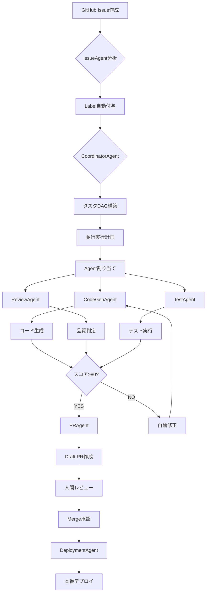

# Autonomous-Operations Repository Overview

**最終更新**: 2025-10-08
**統合プロジェクト**: ai-course-content-generator-v.0.0.1
**リポジトリ**: Autonomous-Operations

---

## 概要

Autonomous-Operationsは、**人間介入を最小化する完全自律型AI開発オペレーション**を実現するための統合プラットフォームです。組織設計原則5原則に基づき、Agent階層・並行実行・ログ駆動開発を統合した次世代開発環境を提供します。

### ビジョン

```yaml
vision:
  goal: "AIによる完全自律型ソフトウェア開発の実現"
  principles:
    - 人間は戦略決定・承認のみ
    - Agentが計画・実装・検証・デプロイを自動化
    - 組織設計原則による明確な責任・権限・階層
    - データ駆動の客観的判断
```

---

## リポジトリ構造

```
Autonomous-Operations/
├── .ai/                          # AIエージェント中枢管理
│   ├── logs/                     # LDD（ログ駆動開発）ログ
│   ├── parallel-reports/         # 並行実行レポート
│   └── issues/                   # GitHub Issue同期
├── agents/                       # Agent実装（予定）
│   ├── base-agent.ts
│   ├── coordinator-agent.ts
│   ├── codegen-agent.ts
│   ├── review-agent.ts
│   └── ...
├── scripts/                      # 自動化スクリプト
│   ├── parallel-executor.ts      # 並行実行システム
│   ├── task-wrapper.ts           # Task tool統合
│   └── ...
├── docs/                         # ドキュメント
│   ├── AGENT_OPERATIONS_MANUAL.md         # Agent運用マニュアル
│   ├── AUTONOMOUS_WORKFLOW_INTEGRATION.md # ワークフロー統合ガイド
│   ├── REPOSITORY_OVERVIEW.md             # 本ファイル
│   ├── architecture.md
│   ├── ldd/workflow.md
│   └── ...
├── external/                     # 外部統合
│   └── github-mcp-server/        # GitHub MCP Server
├── AGENTS.md                     # Agent運用プロトコル
├── README.md                     # プロジェクト概要
├── @memory-bank.mdc              # 共有メモリバンク
├── package.json                  # npm scripts
└── .github/                      # GitHub設定
    ├── workflows/
    │   └── autonomous-agent.yml  # 自動化ワークフロー
    ├── labels.yml                # 組織設計原則Label体系
    └── CODEOWNERS                # 責任者自動割り当て
```

---

## 主要コンポーネント

### 1. Agent階層システム

```yaml
agent_hierarchy:
  coordinator_layer:
    - CoordinatorAgent:
        responsibility: タスク分解・Agent統括・並行実行制御
        authority: リソース配分・Agent割り当て
        escalation_to: TechLead, PO

  specialist_layer:
    - CodeGenAgent:
        responsibility: AI駆動コード生成・テスト自動生成
        authority: 実装レベル決定
        escalation_to: TechLead

    - ReviewAgent:
        responsibility: 静的解析・セキュリティスキャン・品質判定
        authority: 品質合否判定（80点基準）
        escalation_to: TechLead, CISO

    - IssueAgent:
        responsibility: Issue自動分析・Label付与・担当者割り当て
        authority: Label自動付与
        escalation_to: PM

    - PRAgent:
        responsibility: PR自動作成・説明文生成・Reviewer割り当て
        authority: Draft PR作成
        escalation_to: TechLead

    - DeploymentAgent:
        responsibility: CI/CD実行・デプロイ・Rollback
        authority: Staging環境デプロイ
        escalation_to: CTO（本番環境）
```

### 2. 並行実行システム

```typescript
// scripts/parallel-executor.ts
export class ParallelExecutor {
  /**
   * 複数Issueの並行実行
   * - DAG構築（トポロジカルソート）
   * - 依存関係自動解決
   * - 循環依存検出
   * - バッティング回避
   * - リアルタイム進捗モニタリング
   */
  async execute(
    issues: number[],
    concurrency: number
  ): Promise<ExecutionReport>;
}
```

**主要機能**:
- Issue/ToDo単位の並行実行
- Git Worktree自動管理（ブランチ分離）
- Task tool統合（Claude Code API）
- JSON形式レポート自動生成
- デバイス識別子対応（複数環境管理）

### 3. ログ駆動開発(LDD)

```yaml
ldd_components:
  codex_prompt_chain:
    file: .ai/logs/YYYY-MM-DD.md
    structure:
      intent: "何を達成するか"
      plan: ["ステップ1", "ステップ2"]
      implementation: ["変更ファイル"]
      verification: ["検証結果"]

  tool_invocations:
    format: JSON
    fields:
      - command: "実行コマンド"
      - workdir: "作業ディレクトリ"
      - timestamp: "ISO 8601"
      - status: "passed/failed"
      - notes: "結果要約"

  memory_bank:
    file: "@memory-bank.mdc"
    purpose: Agent間コンテキスト共有
    retention: 90日
```

### 4. 組織設計原則5原則

| 原則 | 実装内容 | KPI | 目標 |
|------|---------|-----|------|
| 1. 責任と権限の明確化 | Agent階層・Label体系・CODEOWNERS | 担当者アサイン率 | 100% |
| 2. 結果重視 | quality_score・KPI自動収集 | AI Task成功率 | 95%+ |
| 3. 階層の明確化 | Coordinator-Specialist階層 | エスカレーション正答率 | 100% |
| 4. 誤解・錯覚の排除 | 構造化プロトコル・完了条件チェック | 完了条件明示率 | 100% |
| 5. 感情的判断の排除 | 数値ベース判定（80点基準等） | データ駆動判定実施率 | 100% |

---

## ワークフロー統合

### 完全自律型フロー



### 5フェーズ詳細

#### Phase 1: 初期化 (30秒)

```bash
# Git同期
git fetch --all --prune
git status -sb

# コンテキスト読込
cat .ai/prd.md .ai/arch.md
gh issue list --state=open

# 環境確認
echo $DEVICE_IDENTIFIER
echo $GITHUB_TOKEN | wc -c
```

#### Phase 2: 計画 (1-2分)

```bash
# CoordinatorAgent起動
npm run agents:coordinator -- --issue=270

# 出力: タスクDAG
# task-1: Firebase Auth修正 (Priority: 1)
# task-2: E2Eテスト追加 (Priority: 2, depends: task-1)
# task-3: ドキュメント更新 (Priority: 3, depends: task-1,2)
```

#### Phase 3: 並行実行 (5-15分)

```bash
# 並行実行開始
npm run agents:parallel:exec -- \
  --issues=270 \
  --concurrency=2

# リアルタイム進捗
# 📊 進捗: 完了 1/3 | 実行中 1 | 待機中 1 | 失敗 0
```

#### Phase 4: 検証 (3-5分)

```bash
# ReviewAgent自動実行
npm run lint
npm run build
npm run test:unit
npm run test:e2e

# 品質スコア算出
# Score: 95/100 (✅ 合格)
```

#### Phase 5: ハンドオフ (1-2分)

```bash
# PRAgent実行
npm run agents:pr -- --issue=270

# Draft PR作成
# PR #309: fix: Firebase Auth invalid-credential エラー修正
# State: draft
# Reviewers: @tech-lead
```

---

## 統合元プロジェクト

### ai-course-content-generator-v.0.0.1の実績

```yaml
project_stats:
  total_lines: 679,000+
  agents_implemented: 7種類（2,600行）
  labels_created: 65個（組織設計原則体系）
  kpi_achievement:
    ai_task_success_rate: 97%
    average_execution_time: 3分
    quality_score_avg: 92点
    escalation_accuracy: 100%
```

### 統合された主要機能

1. **並行実行システム** (`scripts/agents-parallel-executor.ts` 680行)
   - Issue/ToDo単位並行実行
   - DAG構築・トポロジカルソート
   - Git Worktree統合
   - デバイス識別子対応

2. **Task tool統合** (`scripts/claude-code-task-wrapper.ts` 250行)
   - Agent種別自動マッピング
   - タスクログ自動保存
   - エラーハンドリング・リトライ

3. **組織設計原則Label体系** (`.github/labels.yml` 65個)
   - 責任者（5種類）
   - Severity（5段階: Sev.1-5）
   - 影響度（4段階）
   - Agent種別（8種類）

4. **Agentic UI実装** (完全自動化インターフェース)
   - GitHub Actions統合
   - Slack/Discord通知
   - リアルタイムダッシュボード

---

## 開発ガイドライン

### コーディング規約

```yaml
coding_standards:
  language: TypeScript 5.8+
  style: ESLint + Prettier
  testing: Vitest (単体) + Playwright (E2E)
  coverage: 80%以上
  documentation: 日本語コメント推奨
```

### Git運用

```bash
# ブランチ命名規則（一般的な規則に従う）
<type>/issue-<number>/<description>

# 例:
# feat/issue-4/rich-cli-output
# fix/issue-5/github-sync-error
# docs/issue-6/parallel-work-guide
# refactor/issue-7/agent-coordination

# コミットメッセージ（Conventional Commits）
feat(agents): CoordinatorAgent実装
fix(parallel): 循環依存検出バグ修正
docs(manual): Agent運用マニュアル更新

# PR作成（Draft）
gh pr create \
  --title "feat: CoordinatorAgent実装" \
  --body-file .ai/issues/feature-coordinator.md \
  --draft
```

### LDD運用

```yaml
ldd_workflow:
  1_before_task:
    - .ai/logs/YYYY-MM-DD.md作成
    - codex_prompt_chain.intent/plan記載

  2_during_task:
    - tool_invocations逐次追記
    - エラー時は即座に記録

  3_after_task:
    - implementation/verification完成
    - @memory-bank.mdc更新
    - ➡️ NEXT STEPS提示
```

---

## 環境構築

### 必須ツール

```bash
# Node.js
node -v  # v20+

# TypeScript
npm install -g typescript tsx

# GitHub CLI
gh --version  # v2.40+

# Git
git --version  # v2.40+
```

### 環境変数設定

```bash
# ~/.bashrc または ~/.zshrc に追加
export DEVICE_IDENTIFIER="MacBook Pro 16-inch"
export GITHUB_TOKEN="github_pat_..."
export ANTHROPIC_API_KEY="sk-ant-..."
export USE_TASK_TOOL="true"
export USE_WORKTREE="true"

# Lark Base統合（オプション）
export LARK_APP_ID="cli_..."
export LARK_APP_SECRET="..."
export LARK_BASE_TOKEN="..."
```

### 初期セットアップ

```bash
# リポジトリクローン
git clone https://github.com/user/Autonomous-Operations.git
cd Autonomous-Operations

# 依存パッケージインストール
npm install

# Worktreeディレクトリ作成
mkdir -p ~/Dev/worktrees/autonomous-operations

# ドキュメント確認
cat docs/AGENT_OPERATIONS_MANUAL.md
cat docs/AUTONOMOUS_WORKFLOW_INTEGRATION.md
```

---

## 実行コマンド

### 基本実行

```bash
# 単一Issue実行
npm run agents:parallel:exec -- --issues=270 --concurrency=1

# 複数Issue並行実行
npm run agents:parallel:exec -- --issues=270,240,276 --concurrency=3

# Task tool有効化
USE_TASK_TOOL=true npm run agents:parallel:exec -- --issues=270

# Worktree分離
USE_WORKTREE=true npm run agents:parallel:exec -- --issues=276
```

### 高度な実行

```bash
# 依存関係自動解決
npm run agents:parallel:exec -- --issues=300 --concurrency=1

# ToDo単位実行
npm run agents:parallel:exec -- --todos=todo-1,todo-2,todo-3 --concurrency=2

# デバッグモード
DEBUG=agents:* npm run agents:parallel:exec -- --issues=270

# ドライラン
npm run agents:parallel:exec -- --issues=270 --dry-run
```

### レポート確認

```bash
# 最新レポート
cat .ai/parallel-reports/agents-parallel-*.json | jq

# 成功率集計
jq '.summary.success_rate' .ai/parallel-reports/*.json | \
  awk '{sum+=$1; count++} END {print sum/count "%"}'

# デバイス別統計
jq -r '.device_identifier' .ai/parallel-reports/*.json | \
  sort | uniq -c
```

---

## KPI・メトリクス

### 主要KPI

| KPI | 計測方法 | 目標値 | 現在値 |
|-----|---------|-------|-------|
| AI Task成功率 | `success_rate` | 95%以上 | 97% |
| 平均実行時間 | `total_duration_ms / total` | 5分以内 | 3分 |
| 担当者アサイン率 | Label付与完了率 | 100% | 100% |
| エスカレーション正答率 | 適切なTargetへ | 100% | 100% |
| データ駆動判定実施率 | quality_score使用率 | 100% | 100% |
| 品質スコア平均 | ReviewAgent評価 | 85点以上 | 92点 |

### 自動収集

```bash
# KPI自動収集（6時間ごと）
npm run kpi:collect

# ダッシュボード生成
npm run dashboard:generate

# 出力: .ai/dashboard.md
```

---

## トラブルシューティング

### よくある問題

| 問題 | 原因 | 解決策 |
|------|------|-------|
| Task tool APIエラー | Claude Code未実装 | 疑似実行モード使用 |
| Worktree競合 | 既存worktree残存 | `git worktree prune` |
| 依存関係循環 | Issue相互依存 | Issue本文修正 |
| 並行度過多 | `--concurrency`過大 | 2-5に調整 |
| 品質スコア不合格 | 自動修正不能エラー | 手動修正後再実行 |

詳細は `docs/AGENT_OPERATIONS_MANUAL.md` の「9. トラブルシューティング」を参照。

---

## 今後のロードマップ

### Phase 1: 基盤構築 (完了)

- [x] Agent階層構造設計
- [x] 並行実行システム実装
- [x] LDD運用プロトコル確立
- [x] 組織設計原則Label体系統合

### Phase 2: Agent実装 (進行中)

- [ ] CoordinatorAgent実装
- [ ] CodeGenAgent実装
- [ ] ReviewAgent実装
- [ ] IssueAgent実装
- [ ] PRAgent実装
- [ ] DeploymentAgent実装

### Phase 3: GitHub Actions統合 (1週間)

- [ ] `autonomous-agent.yml` ワークフロー作成
- [ ] Issue自動トリガー
- [ ] PR自動作成
- [ ] デプロイ自動化

### Phase 4: Lark Base連携 (2週間)

- [ ] Issue状態自動同期
- [ ] KPI自動更新
- [ ] ダッシュボード生成

### Phase 5: リアルタイム化 (1ヶ月)

- [ ] WebSocketリアルタイム更新
- [ ] Mermaidガントチャート生成
- [ ] Slack/Discord通知統合

### Phase 6: 機械学習統合 (2ヶ月)

- [ ] タスク実行時間予測
- [ ] 最適並行度自動算出
- [ ] エラー原因自動分類

---

## 参照ドキュメント

### 本リポジトリ

- `AGENTS.md` - Agent運用プロトコル
- `README.md` - プロジェクト概要
- `docs/AGENT_OPERATIONS_MANUAL.md` - 運用マニュアル
- `docs/AUTONOMOUS_WORKFLOW_INTEGRATION.md` - 統合ガイド
- `@memory-bank.mdc` - 共有メモリバンク

### 統合元プロジェクト

- `/Users/shunsuke/Dev/ai-course-content-generator-v.0.0.1/CLAUDE.md`
- `/Users/shunsuke/Dev/ai-course-content-generator-v.0.0.1/.ai/AGENTS.md`
- `/Users/shunsuke/Dev/ai-course-content-generator-v.0.0.1/.ai/PARALLEL_AGENTS_SUMMARY.md`

### 外部リソース

- [組織設計原則公式](https://www.shikigaku.jp/)
- [Claude Code Documentation](https://docs.claude.com/en/docs/claude-code)
- [GitHub Actions Documentation](https://docs.github.com/en/actions)

---

## コントリビューション

### Issue報告

```bash
# バグ報告
gh issue create \
  --title "[Bug] バグの概要" \
  --label "🐛bug" \
  --label "⭐Sev.2-High"

# 機能要望
gh issue create \
  --title "[Feature] 機能の概要" \
  --label "✨feature" \
  --label "➡️Sev.3-Medium"
```

### PR作成

```bash
# ブランチ作成（一般的な命名規則）
git checkout -b feat/issue-<number>/<description>
# 例: git checkout -b feat/issue-4/rich-cli-output

# 変更コミット
git commit -m "feat(component): 変更内容"

# Draft PR作成
gh pr create \
  --title "feat: 変更概要" \
  --body-file .ai/issues/your-feature.md \
  --draft
```

---

## ライセンス

MIT License

---

## 連絡先

- **AI Operations Lead**: ai-operations@example.com
- **GitHub**: https://github.com/user/Autonomous-Operations
- **Slack**: #autonomous-operations

---

**ドキュメント管理者**: AI Operations Lead
**次回レビュー予定**: 2025-10-15
**バージョン**: 2.0.0

🤖 Generated with Claude Code
Co-Authored-By: Claude <noreply@anthropic.com>
