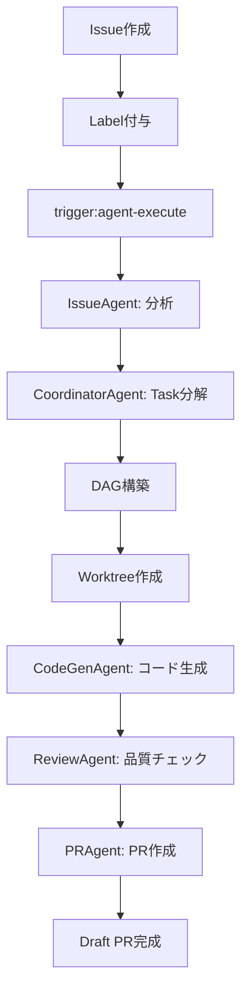
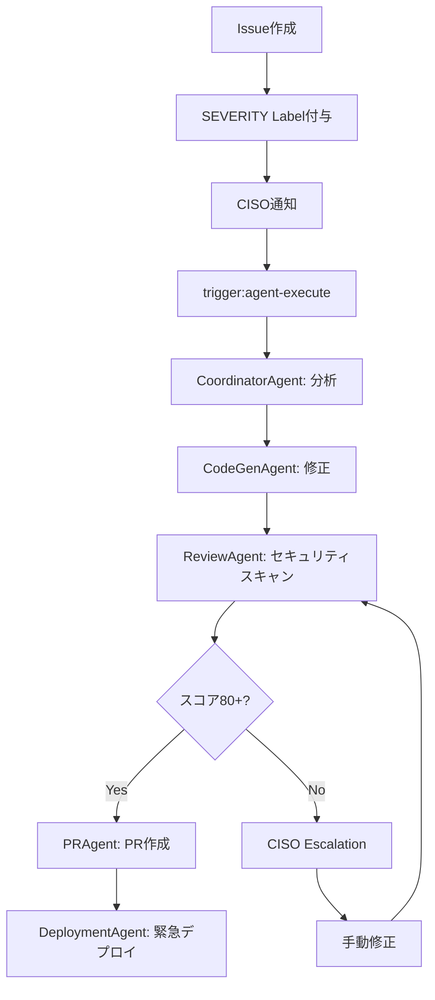

# Miyabi Template Master Index - 一周テンプレート統合マップ

**すべてのテンプレートをEntity-Relationで繋ぐ統合インデックス**

---

## 📖 目次

1. [概要](#概要)
2. [テンプレート一覧](#テンプレート一覧)
3. [Entity別テンプレートマップ](#entity別テンプレートマップ)
4. [ユースケース別フロー](#ユースケース別フロー)
5. [クイックリファレンス](#クイックリファレンス)
6. [テンプレート作成ガイド](#テンプレート作成ガイド)

---

## 概要

### 🎯 このドキュメントの目的

**Miyabiプロジェクトのすべてのテンプレートを統合的に管理し、Entity-Relationモデルに基づいて整合性を保証する。**

### 📊 テンプレート統合原則

```
"Every template is connected to entities. Every entity has templates."
```

- **Entity-Driven**: すべてのテンプレートは1つ以上のEntityに関連
- **関係性明示**: テンプレート間の依存関係を明確化
- **フロー最適化**: ユースケース別の最適なテンプレート使用順を定義
- **自動整合性**: Entity-Relationモデルとの自動検証

### 🔗 関連ドキュメント

- [ENTITY_RELATION_MODEL.md](./ENTITY_RELATION_MODEL.md) - Entity-Relationモデル定義
- [LABEL_SYSTEM_GUIDE.md](./LABEL_SYSTEM_GUIDE.md) - 53ラベル体系
- [AGENT_OPERATIONS_MANUAL.md](./AGENT_OPERATIONS_MANUAL.md) - Agent運用マニュアル

---

## テンプレート一覧

### 📁 全テンプレートカタログ（88ファイル）

#### 1. プロジェクトルート（7ファイル）

| # | ファイル | 関連Entity | 説明 |
|---|---------|-----------|------|
| 1 | `CLAUDE.md` | 全Entity | プロジェクト設定・Claude Code統合 |
| 2 | `TEMPLATE_COMPLETE.md` | 全Entity | Phase 4-5完了レポート |
| 3 | `TEMPLATE_INSTRUCTIONS.md` | Issue, Agent, Command | テンプレート使用ガイド |
| 4 | `README.md` | - | プロジェクト概要 |
| 5 | `CONTRIBUTING.md` | Issue, PR | 貢献ガイドライン |
| 6 | `CHANGELOG.md` | - | 変更履歴 |
| 7 | `VERIFICATION_REPORT_*.md` | Agent, Task, QualityReport | 検証レポート |

#### 2. docs/（14ファイル）

| # | ファイル | 関連Entity | 説明 |
|---|---------|-----------|------|
| 8 | `docs/ENTITY_RELATION_MODEL.md` | 全Entity | **Entity-Relationモデル定義** ⭐ |
| 9 | `docs/TEMPLATE_MASTER_INDEX.md` | 全Entity | **テンプレート統合インデックス** ⭐ |
| 10 | `docs/TEMPLATE_COMPLETE.md` | 全Entity | テンプレート化完了レポート |
| 11 | `docs/TEMPLATE_INSTRUCTIONS.md` | Issue, Agent | テンプレート使用方法 |
| 12 | `docs/PRODUCT_TEMPLATE_PLAN.md` | 全Entity | プロダクトテンプレート化プラン |
| 13 | `docs/LABEL_SYSTEM_GUIDE.md` | Label, Issue, Task, Agent | **53ラベル体系完全ガイド** ⭐ |
| 14 | `docs/AGENT_OPERATIONS_MANUAL.md` | Agent, Task, DAG | **Agent運用マニュアル** ⭐ |
| 15 | `docs/AGENT_SDK_LABEL_INTEGRATION.md` | Agent, Label | Agent SDK × Label統合 |
| 16 | `docs/GITHUB_OS_INTEGRATION.md` | Issue, PR, Label | GitHub OS統合ガイド |
| 17 | `docs/AUTONOMOUS_WORKFLOW_INTEGRATION.md` | Agent, Workflow | 自動ワークフロー統合 |
| 18 | `docs/CODEX_MIYABI_INTEGRATION.md` | Agent, LDDLog | Codex × Miyabi統合 |
| 19 | `docs/REPOSITORY_OVERVIEW.md` | - | リポジトリ概要 |
| 20 | `docs/PROJECT_SUMMARY.md` | - | プロジェクトサマリー |
| 21 | `docs/operations/GETTING_STARTED.md` | 全Entity | **完全ガイド（初心者向け）** ⭐ |
| 22 | `docs/operations/QUICKSTART.md` | 全Entity | 5分クイックスタート |

#### 3. .claude/agents/specs/（7ファイル）

| # | ファイル | 関連Entity | 説明 |
|---|---------|-----------|------|
| 23 | `.claude/agents/specs/coordinator-agent.md` | Agent, Task, DAG | **CoordinatorAgent仕様** ⭐ |
| 24 | `.claude/agents/specs/codegen-agent.md` | Agent, Task, PR | **CodeGenAgent仕様** ⭐ |
| 25 | `.claude/agents/specs/review-agent.md` | Agent, PR, QualityReport | **ReviewAgent仕様** ⭐ |
| 26 | `.claude/agents/specs/issue-agent.md` | Agent, Issue, Label | **IssueAgent仕様** ⭐ |
| 27 | `.claude/agents/specs/pr-agent.md` | Agent, PR | **PRAgent仕様** ⭐ |
| 28 | `.claude/agents/specs/deployment-agent.md` | Agent, Deployment | **DeploymentAgent仕様** ⭐ |
| 29 | `.claude/agents/specs/hooks-integration.md` | Agent, Hook | Hooks統合ガイド |

#### 4. .claude/agents/prompts/（6ファイル）

| # | ファイル | 関連Entity | 説明 |
|---|---------|-----------|------|
| 30 | `.claude/agents/prompts/coordinator-agent-prompt.md` | Agent, Task, Worktree | **Coordinator実行プロンプト** ⭐ |
| 31 | `.claude/agents/prompts/codegen-agent-prompt.md` | Agent, Task, Worktree | **CodeGen実行プロンプト** ⭐ |
| 32 | `.claude/agents/prompts/review-agent-prompt.md` | Agent, QualityReport, Worktree | **Review実行プロンプト** ⭐ |
| 33 | `.claude/agents/prompts/issue-agent-prompt.md` | Agent, Issue, Label, Worktree | **Issue実行プロンプト** ⭐ |
| 34 | `.claude/agents/prompts/pr-agent-prompt.md` | Agent, PR, Worktree | **PR実行プロンプト** ⭐ |
| 35 | `.claude/agents/prompts/deployment-agent-prompt.md` | Agent, Deployment, Worktree | **Deployment実行プロンプト** ⭐ |

#### 5. .claude/commands/（9ファイル）

| # | ファイル | 関連Entity | 説明 |
|---|---------|-----------|------|
| 36 | `.claude/commands/test.md` | Command, Agent | テスト実行コマンド |
| 37 | `.claude/commands/agent-run.md` | Command, Agent, Issue | **Agent手動実行** ⭐ |
| 38 | `.claude/commands/verify.md` | Command, Agent | システム動作確認 |
| 39 | `.claude/commands/deploy.md` | Command, Agent, Deployment | **デプロイ実行** ⭐ |
| 40 | `.claude/commands/create-issue.md` | Command, Issue | **Issue対話的作成** ⭐ |
| 41 | `.claude/commands/security-scan.md` | Command, Agent, QualityReport | **セキュリティスキャン** ⭐ |
| 42 | `.claude/commands/generate-docs.md` | Command, Agent | ドキュメント自動生成 |
| 43 | `.claude/commands/miyabi-todos.md` | Command, Issue | TODO検出・Issue化 |
| 44 | `.claude/commands/miyabi-auto.md` | Command, Agent | 全自動モード |

#### 6. agents/types/（5ファイル）

| # | ファイル | 関連Entity | 説明 |
|---|---------|-----------|------|
| 45 | `agents/types/index.ts` | **全Entity** | **コア型定義** ⭐⭐⭐ |
| 46 | `agents/types/errors.ts` | Escalation | エラー型定義 |
| 47 | `agents/types/hooks.ts` | Hook | Hook型定義 |
| 48 | `agents/types/agent-template.ts` | Agent | Agentテンプレート型 |
| 49 | `agents/types/agent-analysis.ts` | Agent, Task | Agent分析型 |

#### 7. agents/実装（6ファイル）

| # | ファイル | 関連Entity | 説明 |
|---|---------|-----------|------|
| 50 | `agents/base-agent.ts` | Agent | **BaseAgentクラス** ⭐ |
| 51 | `agents/coordinator/coordinator-agent.ts` | Agent, Task, DAG | CoordinatorAgent実装 |
| 52 | `agents/codegen/codegen-agent.ts` | Agent, Task, PR | CodeGenAgent実装 |
| 53 | `agents/review/review-agent.ts` | Agent, QualityReport | ReviewAgent実装 |
| 54 | `agents/issue/issue-agent.ts` | Agent, Issue, Label | IssueAgent実装 |
| 55 | `agents/pr/pr-agent.ts` | Agent, PR | PRAgent実装 |
| 56 | `agents/deployment/deployment-agent.ts` | Agent, Deployment | DeploymentAgent実装 |

#### 8. scripts/（3ファイル）

| # | ファイル | 関連Entity | 説明 |
|---|---------|-----------|------|
| 57 | `scripts/init-project.sh` | - | プロジェクト初期化スクリプト |
| 58 | `scripts/parallel-executor.ts` | Agent, Task, Worktree, DAG | **並列実行エンジン** ⭐ |
| 59 | `scripts/verify-system.ts` | Agent, QualityReport | システム検証スクリプト |

#### 9. .github/（6ファイル）

| # | ファイル | 関連Entity | 説明 |
|---|---------|-----------|------|
| 60 | `.github/labels.yml` | Label | **Label定義（53個）** ⭐ |
| 61 | `.github/workflows/autonomous-agent.yml` | Agent, Issue, Label | **Agent自動実行ワークフロー** ⭐ |
| 62 | `.github/workflows/deploy-pages.yml` | Deployment | デプロイワークフロー |
| 63 | `.github/workflows/label-sync.yml` | Label | Label同期 |
| 64 | `.github/ISSUE_TEMPLATE/agent-task.md` | Issue, Task | Issueテンプレート |
| 65 | `.github/AGENTS.md` | Agent | Agent一覧ドキュメント |

#### 10. examples/（4ファイル）

| # | ファイル | 関連Entity | 説明 |
|---|---------|-----------|------|
| 66 | `examples/README.md` | - | サンプル一覧 |
| 67 | `examples/demo-issue.md` | Issue, Task | **実行可能デモIssue** ⭐ |
| 68 | `examples/sample-output/execution-report.json` | Agent, Task, QualityReport | 実行レポート例 |
| 69 | `examples/sample-output/generated-code/` | Agent, Task | 生成コード例 |

#### 11. packages/（3ファイル）

| # | ファイル | 関連Entity | 説明 |
|---|---------|-----------|------|
| 70 | `packages/cli/README.md` | Command | CLIドキュメント |
| 71 | `packages/cli/CLAUDE.md` | Command, Agent | CLI Claude設定 |
| 72 | `packages/cli/templates/` | - | CLIテンプレート |

#### 12. その他ドキュメント（16ファイル）

| # | ファイル | 関連Entity | 説明 |
|---|---------|-----------|------|
| 73 | `docs/SAAS_BUSINESS_MODEL.md` | - | SaaS事業化戦略 |
| 74 | `docs/MARKET_ANALYSIS_2025.md` | - | 市場調査レポート |
| 75 | `docs/MIYABI_BUSINESS_PLAN_DETAILED.md` | - | ビジネスプラン詳細 |
| 76 | `docs/MIYABI_LICENSE_STRATEGY.md` | - | ライセンス戦略 |
| 77 | `docs/MARKETPLACE_IMPLEMENTATION_GUIDE.md` | - | マーケットプレイス実装 |
| 78 | `docs/MARKETPLACE_DEPLOYMENT_GUIDE.md` | - | マーケットプレイスデプロイ |
| 79 | `docs/MARKETPLACE_BUSINESS_SUMMARY.md` | - | マーケットプレイス事業概要 |
| 80 | `docs/DISCORD_SETUP_GUIDE.md` | - | Discord設定ガイド |
| 81 | `docs/CLI_PACKAGE_PROGRESS.md` | Command | CLIパッケージ進捗 |
| 82 | `docs/CLAUDE_CODE_PLUGIN_INTEGRATION.md` | Command | Claude Codeプラグイン統合 |
| 83 | `docs/CONTEXT_ENGINEERING_INTEGRATION.md` | Agent | コンテキストエンジニアリング |
| 84 | `docs/SYSTEM_VERIFICATION_REPORT.md` | Agent, QualityReport | システム検証レポート |
| 85 | `docs/DEPENDENCY_VISUALIZATION.md` | Task, DAG | 依存関係可視化 |
| 86 | `docs/architecture/AGENTIC_OS.md` | Agent | Agentic OSアーキテクチャ |
| 87 | `docs/architecture/OSS_DEVELOPMENT_SYSTEM.md` | Agent, Issue, PR | OSS開発システム |
| 88 | `docs/operations/DEPLOYMENT.md` | Deployment | デプロイガイド |

---

## Entity別テンプレートマップ

### E1: Issue

**関連テンプレート（13ファイル）**:

| テンプレート | 役割 | 関係性 |
|------------|------|--------|
| `docs/LABEL_SYSTEM_GUIDE.md` | Label体系定義 | R3: Issue --tagged-with-→ Label |
| `docs/AGENT_OPERATIONS_MANUAL.md` | Agent運用 | R1: Issue --analyzed-by-→ Agent |
| `.claude/agents/specs/issue-agent.md` | IssueAgent仕様 | R1: Issue --analyzed-by-→ Agent |
| `.claude/agents/prompts/issue-agent-prompt.md` | Issue実行プロンプト | R1: Issue --analyzed-by-→ Agent |
| `.claude/agents/specs/coordinator-agent.md` | CoordinatorAgent仕様 | R2: Issue --decomposed-into-→ Task |
| `.claude/agents/prompts/coordinator-agent-prompt.md` | Coordinator実行プロンプト | R2: Issue --decomposed-into-→ Task |
| `.claude/commands/create-issue.md` | Issue対話的作成 | Issue作成支援 |
| `.claude/commands/agent-run.md` | Agent手動実行 | Issue処理トリガー |
| `.github/ISSUE_TEMPLATE/agent-task.md` | Issueテンプレート | Issue作成フォーマット |
| `.github/workflows/autonomous-agent.yml` | 自動実行ワークフロー | R16: Label --triggers-→ Agent |
| `examples/demo-issue.md` | デモIssue | 実行可能サンプル |
| `agents/types/index.ts` | Issue型定義 | 型システム |
| `TEMPLATE_INSTRUCTIONS.md` | テンプレート使用方法 | Issue作成ガイド |

**使用フロー**:
1. `.claude/commands/create-issue.md` でIssue作成
2. `docs/LABEL_SYSTEM_GUIDE.md` 参照してLabel付与
3. `trigger:agent-execute` Label付与
4. `.github/workflows/autonomous-agent.yml` が自動起動
5. IssueAgentがIssue分析 (`.claude/agents/specs/issue-agent.md`)
6. CoordinatorAgentがTask分解 (`.claude/agents/specs/coordinator-agent.md`)

---

### E2: Task

**関連テンプレート（11ファイル）**:

| テンプレート | 役割 | 関係性 |
|------------|------|--------|
| `docs/AGENT_OPERATIONS_MANUAL.md` | Agent運用 | R5: Task --assigned-to-→ Agent |
| `.claude/agents/specs/coordinator-agent.md` | CoordinatorAgent仕様 | R2: Issue --decomposed-into-→ Task |
| `.claude/agents/prompts/coordinator-agent-prompt.md` | Coordinator実行プロンプト | Task分解手順 |
| `.claude/agents/specs/codegen-agent.md` | CodeGenAgent仕様 | R9: Agent --executes-→ Task |
| `.claude/agents/prompts/codegen-agent-prompt.md` | CodeGen実行プロンプト | Task実行手順 |
| `scripts/parallel-executor.ts` | 並列実行エンジン | Task並列実行 |
| `docs/DEPENDENCY_VISUALIZATION.md` | 依存関係可視化 | R6: Task --depends-on-→ Task |
| `docs/ENTITY_RELATION_MODEL.md` | ERモデル定義 | Task Entity定義 |
| `agents/types/index.ts` | Task型定義 | 型システム |
| `agents/coordinator/coordinator-agent.ts` | Coordinator実装 | Task分解実装 |
| `CLAUDE.md` | プロジェクト設定 | R8: Task --runs-in-→ Worktree |

**使用フロー**:
1. CoordinatorAgent がIssueをTask配列に分解
2. 依存関係を解析してDAG構築 (R6: Task --depends-on-→ Task)
3. Agent割り当て (R5: Task --assigned-to-→ Agent)
4. Worktree作成 (R8: Task --runs-in-→ Worktree)
5. 並列実行 (`scripts/parallel-executor.ts`)

---

### E3: Agent

**関連テンプレート（28ファイル）**:

#### Agent仕様（6ファイル）
| テンプレート | Agent | 役割 |
|------------|-------|------|
| `.claude/agents/specs/coordinator-agent.md` | CoordinatorAgent | タスク統括 |
| `.claude/agents/specs/codegen-agent.md` | CodeGenAgent | コード生成 |
| `.claude/agents/specs/review-agent.md` | ReviewAgent | 品質レビュー |
| `.claude/agents/specs/issue-agent.md` | IssueAgent | Issue分析 |
| `.claude/agents/specs/pr-agent.md` | PRAgent | PR自動作成 |
| `.claude/agents/specs/deployment-agent.md` | DeploymentAgent | デプロイ自動化 |

#### Agent実行プロンプト（6ファイル）
| テンプレート | Agent | 役割 |
|------------|-------|------|
| `.claude/agents/prompts/coordinator-agent-prompt.md` | CoordinatorAgent | Worktree実行手順 |
| `.claude/agents/prompts/codegen-agent-prompt.md` | CodeGenAgent | Worktree実行手順 |
| `.claude/agents/prompts/review-agent-prompt.md` | ReviewAgent | Worktree実行手順 |
| `.claude/agents/prompts/issue-agent-prompt.md` | IssueAgent | Worktree実行手順 |
| `.claude/agents/prompts/pr-agent-prompt.md` | PRAgent | Worktree実行手順 |
| `.claude/agents/prompts/deployment-agent-prompt.md` | DeploymentAgent | Worktree実行手順 |

#### Agent実装（7ファイル）
| テンプレート | 役割 |
|------------|------|
| `agents/base-agent.ts` | BaseAgentクラス |
| `agents/coordinator/coordinator-agent.ts` | Coordinator実装 |
| `agents/codegen/codegen-agent.ts` | CodeGen実装 |
| `agents/review/review-agent.ts` | Review実装 |
| `agents/issue/issue-agent.ts` | Issue実装 |
| `agents/pr/pr-agent.ts` | PR実装 |
| `agents/deployment/deployment-agent.ts` | Deployment実装 |

#### Agent関連ドキュメント（9ファイル）
| テンプレート | 役割 |
|------------|------|
| `docs/AGENT_OPERATIONS_MANUAL.md` | Agent運用マニュアル |
| `docs/AGENT_SDK_LABEL_INTEGRATION.md` | Agent × Label統合 |
| `docs/ENTITY_RELATION_MODEL.md` | ERモデル（Agent定義） |
| `.github/AGENTS.md` | Agent一覧 |
| `agents/types/index.ts` | Agent型定義 |
| `.claude/agents/README.md` | Agent構造説明 |
| `.claude/commands/agent-run.md` | Agent手動実行 |
| `CLAUDE.md` | Agent統合設定 |
| `TEMPLATE_INSTRUCTIONS.md` | Agent使用方法 |

**使用フロー**:
1. `.claude/agents/specs/\*-agent.md` でAgent仕様確認
2. `agents/base-agent.ts` を継承してAgent実装
3. `.claude/agents/prompts/\*-agent-prompt.md` でWorktree実行手順定義
4. `docs/AGENT_OPERATIONS_MANUAL.md` 参照して運用
5. `.claude/commands/agent-run.md` で手動実行

---

### E4: PR (Pull Request)

**関連テンプレート（10ファイル）**:

| テンプレート | 役割 | 関係性 |
|------------|------|--------|
| `.claude/agents/specs/pr-agent.md` | PRAgent仕様 | R10: Agent --generates-→ PR |
| `.claude/agents/prompts/pr-agent-prompt.md` | PR実行プロンプト | PR作成手順 |
| `.claude/agents/specs/review-agent.md` | ReviewAgent仕様 | R19: PR --reviewed-by-→ Agent |
| `.claude/agents/prompts/review-agent-prompt.md` | Review実行プロンプト | PR レビュー手順 |
| `agents/pr/pr-agent.ts` | PRAgent実装 | PR生成実装 |
| `agents/review/review-agent.ts` | ReviewAgent実装 | PR レビュー実装 |
| `agents/types/index.ts` | PR型定義 | 型システム |
| `docs/ENTITY_RELATION_MODEL.md` | ERモデル | PR Entity定義 |
| `CONTRIBUTING.md` | 貢献ガイドライン | PR作成ルール |
| `CLAUDE.md` | プロジェクト設定 | PR フロー説明 |

**使用フロー**:
1. CodeGenAgent がコード生成・commit作成
2. PRAgent が Draft PR作成 (`.claude/agents/specs/pr-agent.md`)
3. ReviewAgent がPRレビュー (`.claude/agents/specs/review-agent.md`)
4. QualityReport添付 (R20: PR --has-→ QualityReport)
5. Issue自動リンク (R21: PR --attached-to-→ Issue)

---

### E5: Label

**関連テンプレート（7ファイル）**:

| テンプレート | 役割 | 関係性 |
|------------|------|--------|
| `docs/LABEL_SYSTEM_GUIDE.md` | **Label体系完全ガイド** ⭐ | 53ラベル全定義 |
| `docs/AGENT_SDK_LABEL_INTEGRATION.md` | Agent × Label統合 | R16: Label --triggers-→ Agent |
| `.github/labels.yml` | Label定義ファイル | GitHub Label定義 |
| `.github/workflows/label-sync.yml` | Label同期ワークフロー | Label自動同期 |
| `.github/workflows/autonomous-agent.yml` | Agent実行ワークフロー | R16: Label --triggers-→ Agent |
| `agents/issue/issue-agent.ts` | IssueAgent実装 | Label自動付与 |
| `docs/ENTITY_RELATION_MODEL.md` | ERモデル | Label Entity定義 |

**Labelカテゴリ（10種類、53ラベル）**:
1. **STATE** (8個): ライフサイクル管理
2. **AGENT** (6個): Agent割り当て
3. **PRIORITY** (4個): 優先度管理
4. **TYPE** (7個): Issue分類
5. **SEVERITY** (4個): 深刻度・エスカレーション
6. **PHASE** (5個): プロジェクトフェーズ
7. **SPECIAL** (7個): 特殊操作
8. **TRIGGER** (4個): 自動化トリガー
9. **QUALITY** (4個): 品質スコア
10. **COMMUNITY** (4個): コミュニティ

**使用フロー**:
1. `docs/LABEL_SYSTEM_GUIDE.md` でLabel体系理解
2. `.github/labels.yml` でLabel定義確認
3. Issue作成時にLabel付与 (R17: Label --defines-state-→ Issue)
4. `trigger:agent-execute` でAgent起動 (R16: Label --triggers-→ Agent)
5. IssueAgent が自動Label付与 (type, priority, severity)

---

### E6: QualityReport

**関連テンプレート（8ファイル）**:

| テンプレート | 役割 | 関係性 |
|------------|------|--------|
| `.claude/agents/specs/review-agent.md` | ReviewAgent仕様 | R22: QualityReport --evaluated-by-→ Agent |
| `.claude/agents/prompts/review-agent-prompt.md` | Review実行プロンプト | 品質評価手順 |
| `agents/review/review-agent.ts` | ReviewAgent実装 | 品質評価実装 |
| `agents/types/index.ts` | QualityReport型定義 | 型システム |
| `docs/ENTITY_RELATION_MODEL.md` | ERモデル | QualityReport定義 |
| `docs/AGENT_OPERATIONS_MANUAL.md` | Agent運用 | 品質基準説明 |
| `.claude/commands/security-scan.md` | セキュリティスキャン | セキュリティチェック |
| `examples/sample-output/execution-report.json` | 実行レポート例 | QualityReport サンプル |

**品質スコアリング基準**:
- **100点満点**
- **80点以上で合格**
- **ESLintエラー**: -20点/件
- **TypeScriptエラー**: -30点/件
- **重大な脆弱性**: -40点/件
- **カバレッジ不足**: -10点（80%未満）

**使用フロー**:
1. ReviewAgent が品質評価実行 (`.claude/agents/specs/review-agent.md`)
2. QualityReport生成 (R22: QualityReport --evaluated-by-→ Agent)
3. PRにQualityReport添付 (R20: PR --has-→ QualityReport)
4. QUALITY Label自動付与 (`quality:excellent`/`good`/`needs-improvement`/`poor`)
5. 80点未満の場合、再実装要求

---

### E7: Command

**関連テンプレート（14ファイル）**:

#### コマンド定義（9ファイル）
| テンプレート | コマンド | 役割 |
|------------|---------|------|
| `.claude/commands/test.md` | `/test` | テスト実行 |
| `.claude/commands/agent-run.md` | `/agent-run` | Agent手動実行 |
| `.claude/commands/verify.md` | `/verify` | システム動作確認 |
| `.claude/commands/deploy.md` | `/deploy` | デプロイ実行 |
| `.claude/commands/create-issue.md` | `/create-issue` | Issue対話的作成 |
| `.claude/commands/security-scan.md` | `/security-scan` | セキュリティスキャン |
| `.claude/commands/generate-docs.md` | `/generate-docs` | ドキュメント自動生成 |
| `.claude/commands/miyabi-todos.md` | `/miyabi-todos` | TODO検出・Issue化 |
| `.claude/commands/miyabi-auto.md` | `/miyabi-auto` | 全自動モード |

#### Command関連ドキュメント（5ファイル）
| テンプレート | 役割 |
|------------|------|
| `docs/ENTITY_RELATION_MODEL.md` | Command Entity定義 |
| `CLAUDE.md` | Claude Code統合設定 |
| `packages/cli/README.md` | CLI使用方法 |
| `packages/cli/CLAUDE.md` | CLI Claude設定 |
| `TEMPLATE_INSTRUCTIONS.md` | コマンド使用ガイド |

**使用フロー**:
1. `.claude/commands/\*.md` でコマンド定義確認
2. Claude Code内で `/command-name` 実行
3. コマンドがAgentを起動 (R15: Command --invokes-→ Agent)
4. Agent実行結果を返却

---

### E8: Escalation

**関連テンプレート（9ファイル）**:

| テンプレート | 役割 | 関係性 |
|------------|------|--------|
| `agents/base-agent.ts` | BaseAgent escalate メソッド | R12: Agent --triggers-→ Escalation |
| `.claude/agents/specs/coordinator-agent.md` | Coordinator仕様 | エスカレーション条件 |
| `.claude/agents/specs/codegen-agent.md` | CodeGen仕様 | エスカレーション条件 |
| `.claude/agents/specs/review-agent.md` | Review仕様 | エスカレーション条件 |
| `.claude/agents/specs/deployment-agent.md` | Deployment仕様 | エスカレーション条件 |
| `agents/types/index.ts` | Escalation型定義 | 型システム |
| `docs/ENTITY_RELATION_MODEL.md` | ERモデル | Escalation定義 |
| `docs/AGENT_OPERATIONS_MANUAL.md` | Agent運用 | エスカレーション手順 |
| `docs/LABEL_SYSTEM_GUIDE.md` | Label体系 | SEVERITY Label説明 |

**エスカレーション先**:
- **TechLead**: アーキテクチャ問題、複雑度超過
- **CISO**: セキュリティ脆弱性（Sev.1-2）
- **PO**: 要件不明確、ビジネス判断必要
- **CTO**: システムレベル障害
- **DevOps**: インフラ・デプロイ問題

**使用フロー**:
1. Agent実行中にエスカレーション条件検出
2. BaseAgent.escalate() メソッド呼び出し
3. GitHub Issueにコメント追加
4. Slack/Discord通知送信
5. エスカレーション先担当者が対応

---

### E9: Deployment

**関連テンプレート（8ファイル）**:

| テンプレート | 役割 | 関係性 |
|------------|------|--------|
| `.claude/agents/specs/deployment-agent.md` | DeploymentAgent仕様 | R13: Agent --performs-→ Deployment |
| `.claude/agents/prompts/deployment-agent-prompt.md` | Deployment実行プロンプト | デプロイ手順 |
| `agents/deployment/deployment-agent.ts` | DeploymentAgent実装 | デプロイ実装 |
| `.claude/commands/deploy.md` | `/deploy` コマンド | デプロイ実行 |
| `.github/workflows/deploy-pages.yml` | デプロイワークフロー | 自動デプロイ |
| `agents/types/index.ts` | Deployment型定義 | 型システム |
| `docs/ENTITY_RELATION_MODEL.md` | ERモデル | Deployment定義 |
| `docs/operations/DEPLOYMENT.md` | デプロイガイド | デプロイ手順書 |

**デプロイ先**:
- **staging**: Firebase/Vercel staging環境
- **production**: Firebase/Vercel production環境

**使用フロー**:
1. `/deploy staging` または `/deploy production` 実行
2. DeploymentAgent がデプロイ実行 (`.claude/agents/specs/deployment-agent.md`)
3. ビルド → テスト → デプロイ
4. ヘルスチェック実行
5. 失敗時は自動ロールバック

---

### E10: LDDLog (Log-Driven Development)

**関連テンプレート（6ファイル）**:

| テンプレート | 役割 | 関係性 |
|------------|------|--------|
| `agents/base-agent.ts` | BaseAgent logToLDD メソッド | R14: Agent --logs-to-→ LDDLog |
| `agents/types/index.ts` | LDDLog型定義 | 型システム |
| `docs/CODEX_MIYABI_INTEGRATION.md` | Codex × Miyabi統合 | LDD説明 |
| `docs/ENTITY_RELATION_MODEL.md` | ERモデル | LDDLog定義 |
| `.ai/logs/YYYY-MM-DD.md` | ログ出力先 | 日次ログ |
| `CLAUDE.md` | プロジェクト設定 | LDD設定 |

**ログ構造**:
```markdown
# Agent Execution Log - YYYY-MM-DD

## Session: {sessionId}

### Codex Prompt Chain
- Intent: ...
- Plan: ...
- Implementation: ...
- Verification: ...

### Tool Invocations
- `command` - status - output

### Memory Bank Updates
- 新規ファイル: ...
```

**使用フロー**:
1. すべてのAgentが自動的にLDDログ出力
2. `.ai/logs/YYYY-MM-DD.md` に日次集約
3. Codex Prompt Chain記録
4. Tool実行履歴記録
5. Memory Bank更新記録

---

### E11: DAG (Directed Acyclic Graph)

**関連テンプレート（7ファイル）**:

| テンプレート | 役割 | 関係性 |
|------------|------|--------|
| `.claude/agents/specs/coordinator-agent.md` | CoordinatorAgent仕様 | R24: DAG --decomposed-from-→ Issue |
| `.claude/agents/prompts/coordinator-agent-prompt.md` | Coordinator実行プロンプト | DAG構築手順 |
| `agents/coordinator/coordinator-agent.ts` | Coordinator実装 | DAG構築実装 |
| `agents/types/index.ts` | DAG型定義 | 型システム |
| `docs/DEPENDENCY_VISUALIZATION.md` | 依存関係可視化 | DAG可視化 |
| `docs/ENTITY_RELATION_MODEL.md` | ERモデル | DAG定義 |
| `scripts/parallel-executor.ts` | 並列実行エンジン | DAG実行 |

**DAG構造**:
```typescript
interface DAG {
  nodes: Task[];           // 全Task
  edges: Array<{ from: string; to: string }>;  // 依存関係
  levels: string[][];      // トポロジカルソート済みレベル
}
```

**使用フロー**:
1. CoordinatorAgent がIssueをTask配列に分解
2. 依存関係を抽出（キーワード: "after", "requires", "depends on"）
3. DAG構築
4. トポロジカルソート実行
5. 循環依存チェック
6. 並列実行レベル決定

---

### E12: Worktree

**関連テンプレート（9ファイル）**:

| テンプレート | 役割 | 関係性 |
|------------|------|--------|
| `CLAUDE.md` | プロジェクト設定 | **Worktree並列実行アーキテクチャ** ⭐ |
| `.claude/agents/prompts/coordinator-agent-prompt.md` | Coordinator実行プロンプト | Worktree実行手順 |
| `.claude/agents/prompts/codegen-agent-prompt.md` | CodeGen実行プロンプト | Worktree実行手順 |
| `.claude/agents/prompts/review-agent-prompt.md` | Review実行プロンプト | Worktree実行手順 |
| `.claude/agents/prompts/issue-agent-prompt.md` | Issue実行プロンプト | Worktree実行手順 |
| `.claude/agents/prompts/pr-agent-prompt.md` | PR実行プロンプト | Worktree実行手順 |
| `.claude/agents/prompts/deployment-agent-prompt.md` | Deployment実行プロンプト | Worktree実行手順 |
| `scripts/parallel-executor.ts` | 並列実行エンジン | Worktree管理 |
| `docs/ENTITY_RELATION_MODEL.md` | ERモデル | Worktree定義 |

**Worktreeパス規則**:
```
.worktrees/
├── issue-270/              # Issue単位
├── issue-271/
└── issue-272/
```

**使用フロー**:
1. CoordinatorAgent がDAG構築
2. 各Taskに対してWorktree作成 (`git worktree add`)
3. Worktree内でClaude Code起動
4. Agent promptファイル読み込み (`.claude/agents/prompts/\*-agent-prompt.md`)
5. Task実行
6. PR作成
7. mainブランチにマージ
8. Worktree削除 (`git worktree remove`)

---

### E13: DiscordCommunity

**関連テンプレート（5ファイル）**:

| テンプレート | 役割 | 関係性 |
|------------|------|--------|
| `agents/types/index.ts` | DiscordCommunity型定義 | 型システム |
| `docs/ENTITY_RELATION_MODEL.md` | ERモデル | DiscordCommunity定義 |
| `docs/DISCORD_COMMUNITY_PLAN.md` | Discord設定ガイド | コミュニティ構築計画 |
| `docs/diagrams/entity-relation-model.puml` | PlantUMLダイアグラム | Entity-Relation可視化 |
| `.github/workflows/` | Webhook統合（将来） | GitHub → Discord通知 |

**Discord Community統合**:
- **15+チャンネル**: Information, Development, Community, Help & Support
- **Progressive Role System**: 🌱 Newcomer → 🌳 Expert (5レベル)
- **Webhook統合**: GitHub/Agent通知を各チャンネルへ配信
- **Bot統合**: MEE6, GitHub Bot, Custom Miyabi Bot

**8つの新規Relation (R28-R35)**:

| Relation | 説明 | トリガー条件 |
|----------|------|------------|
| R28 | Issue → DiscordCommunity (notifies-to #announcements) | Issue作成時 |
| R29 | Agent → DiscordCommunity (posts-to #dev-general) | Agent実行完了時 |
| R30 | QualityReport → DiscordCommunity (announces-in #dev-pull-requests) | PR品質スコア算出時 |
| R31 | PR → DiscordCommunity (announces-in #release-notes) | PRマージ時 |
| R32 | Deployment → DiscordCommunity (notifies-to #announcements) | デプロイ成功/失敗時 |
| R33 | Label → DiscordCommunity (triggers-notification-to) | 特定Label付与時 |
| R34 | Escalation → DiscordCommunity (notifies-to #help-general) | エスカレーション発生時 |
| R35 | Command → DiscordCommunity (integrated-with /miyabi bot) | Botコマンド実行時 |

**チャンネル構造**:
```
📢 Information & Announcements
├── #announcements         - R28: Issue通知, R32: Deployment通知
├── #release-notes         - R31: PR通知

💻 Development
├── #dev-general          - R29: Agent実行ログ
├── #dev-pull-requests    - R30: QualityReport

👥 Community
├── #general              - 一般雑談
├── #introductions        - 自己紹介

❓ Help & Support
├── #help-general         - R34: Escalation通知
└── #help-troubleshooting
```

**Bot Commands (R35)**:
```bash
/miyabi status              # システムステータス確認
/miyabi agent-run <issue>   # Agent手動実行
/miyabi deploy <env>        # デプロイ実行
/miyabi quality <pr>        # 品質レポート表示
```

**使用フロー**:
1. Discord Server作成 (`docs/DISCORD_COMMUNITY_PLAN.md` Phase 1)
2. Webhook設定 (`.github/workflows/` → Discord Webhook URL)
3. Bot統合 (MEE6 + GitHub Bot + Custom Miyabi Bot)
4. チャンネル権限設定 (Progressive Role System)
5. コミュニティ運用開始 (Phase 2-4)

**型定義** (`agents/types/index.ts:404-463`):
```typescript
interface DiscordCommunity {
  serverId: string;
  serverName: string;
  channels: DiscordChannel[];      // 15+チャンネル
  roles: DiscordRole[];            // Progressive Role System
  members: number;
  webhooks: WebhookConfig[];       // GitHub/Agent通知用
  botIntegrations: BotConfig[];    // MEE6, GitHub Bot, Custom Miyabi Bot
  createdAt: string;
}
```

**実装例 (R28: Issue → Discord)**:
```typescript
// Issue作成時、#announcementsチャンネルに通知
const webhook = discord.webhooks.find(w => w.channelId === 'announcements');
await sendWebhook(webhook.webhookUrl, {
  content: `📢 **New Issue Created**\n\nIssue #${issue.number}: ${issue.title}\n${issue.url}`
});
```

**参照ドキュメント**:
- [ENTITY_RELATION_MODEL.md](./ENTITY_RELATION_MODEL.md) - E13定義とR28-R35
- [DISCORD_COMMUNITY_PLAN.md](./DISCORD_COMMUNITY_PLAN.md) - 4フェーズ構築計画
- [entity-relation-model.puml](./diagrams/entity-relation-model.puml) - PlantUMLダイアグラム

---

## ユースケース別フロー

### 🎯 ユースケース1: 新機能追加 (Full Autonomous)

**目的**: GitHub Issueから完全自動でPR作成まで実行

#### 使用テンプレート（16ファイル）
1. `.claude/commands/create-issue.md` - Issue作成
2. `docs/LABEL_SYSTEM_GUIDE.md` - Label付与ガイド
3. `.github/workflows/autonomous-agent.yml` - 自動実行トリガー
4. `.claude/agents/specs/issue-agent.md` - Issue分析
5. `.claude/agents/prompts/issue-agent-prompt.md` - Issue分析手順
6. `.claude/agents/specs/coordinator-agent.md` - Task分解
7. `.claude/agents/prompts/coordinator-agent-prompt.md` - Task分解手順
8. `.claude/agents/specs/codegen-agent.md` - コード生成
9. `.claude/agents/prompts/codegen-agent-prompt.md` - コード生成手順
10. `.claude/agents/specs/review-agent.md` - 品質レビュー
11. `.claude/agents/prompts/review-agent-prompt.md` - レビュー手順
12. `.claude/agents/specs/pr-agent.md` - PR作成
13. `.claude/agents/prompts/pr-agent-prompt.md` - PR作成手順
14. `scripts/parallel-executor.ts` - 並列実行
15. `CLAUDE.md` - Worktree設定
16. `docs/ENTITY_RELATION_MODEL.md` - ERモデル参照

#### 実行フロー


#### ステップ詳細

**1. Issue作成 (2分)**
```bash
# Claude Code内で
/create-issue

# または手動
gh issue create --title "新機能: ダークモード追加" \
  --body "..." \
  --label "✨ type:feature,⚠️ priority:P1-High"
```

**参照**: `.claude/commands/create-issue.md`

**2. Label付与 (30秒)**
```markdown
必須Label:
- `✨ type:feature`
- `⚠️ priority:P1-High`

トリガー:
- `🤖 trigger:agent-execute`
```

**参照**: `docs/LABEL_SYSTEM_GUIDE.md`

**3. IssueAgent分析 (1分)**
```typescript
// .claude/agents/specs/issue-agent.md
// Issue本文解析
// type, priority, severity自動推定
// Label自動付与
```

**参照**: `.claude/agents/specs/issue-agent.md`, `.claude/agents/prompts/issue-agent-prompt.md`

**4. CoordinatorAgent Task分解 (2分)**
```typescript
// .claude/agents/specs/coordinator-agent.md
// Issueを複数Taskに分解
// 依存関係抽出
// DAG構築
// トポロジカルソート
```

**参照**: `.claude/agents/specs/coordinator-agent.md`, `.claude/agents/prompts/coordinator-agent-prompt.md`

**5. Worktree作成・並列実行 (5-10分)**
```bash
# scripts/parallel-executor.ts
# 各Taskに対してWorktree作成
git worktree add .worktrees/issue-270 -b feature/agent-issue-270

# Worktree内でCodeGenAgent実行
cd .worktrees/issue-270
# Claude Code起動 → prompts/codegen-agent-prompt.md 読み込み
```

**参照**: `CLAUDE.md`, `scripts/parallel-executor.ts`, `.claude/agents/prompts/codegen-agent-prompt.md`

**6. CodeGenAgent実行 (3-5分)**
```typescript
// .claude/agents/specs/codegen-agent.md
// コード生成（TypeScript strict mode）
// テストコード生成（Vitest）
// ドキュメント生成
// Git commit
```

**参照**: `.claude/agents/specs/codegen-agent.md`, `.claude/agents/prompts/codegen-agent-prompt.md`

**7. ReviewAgent実行 (1分)**
```typescript
// .claude/agents/specs/review-agent.md
// ESLintチェック
// TypeScript型チェック
// セキュリティスキャン
// 品質スコアリング（100点満点）
// 80点以上で合格
```

**参照**: `.claude/agents/specs/review-agent.md`, `.claude/agents/prompts/review-agent-prompt.md`

**8. PRAgent実行 (30秒)**
```typescript
// .claude/agents/specs/pr-agent.md
// Conventional Commits形式でPRタイトル生成
// PR本文生成（変更サマリ）
// Draft PR作成
// Issueリンク（Closes #270）
```

**参照**: `.claude/agents/specs/pr-agent.md`, `.claude/agents/prompts/pr-agent-prompt.md`

**9. 完了 ✅**
```markdown
✅ Draft PR作成完了
✅ QualityReport添付
✅ Issueリンク
✅ レビュー待ち
```

#### 合計時間: **10-15分**

---

### 🎯 ユースケース2: バグ修正 (Semi-Autonomous)

**目的**: セキュリティバグの緊急修正

#### 使用テンプレート（14ファイル）
1. `.claude/commands/create-issue.md` - Issue作成
2. `docs/LABEL_SYSTEM_GUIDE.md` - SEVERITY Label
3. `.github/workflows/autonomous-agent.yml` - 自動実行
4. `.claude/agents/specs/coordinator-agent.md` - Task分解
5. `.claude/agents/prompts/coordinator-agent-prompt.md` - Task分解手順
6. `.claude/agents/specs/codegen-agent.md` - バグ修正
7. `.claude/agents/prompts/codegen-agent-prompt.md` - バグ修正手順
8. `.claude/agents/specs/review-agent.md` - セキュリティチェック
9. `.claude/agents/prompts/review-agent-prompt.md` - セキュリティチェック手順
10. `.claude/commands/security-scan.md` - セキュリティスキャン
11. `agents/base-agent.ts` - エスカレーション機能
12. `.claude/agents/specs/pr-agent.md` - PR作成
13. `.claude/agents/prompts/pr-agent-prompt.md` - PR作成手順
14. `docs/ENTITY_RELATION_MODEL.md` - ERモデル参照

#### 実行フロー


#### ステップ詳細

**1. Issue作成（緊急）**
```bash
gh issue create --title "🚨 [SECURITY] XSS脆弱性修正" \
  --body "..." \
  --label "🐛 type:bug,🔥 priority:P0-Critical,🚨 severity:Sev.1-Critical,🔐 security,🤖 trigger:agent-execute"
```

**参照**: `.claude/commands/create-issue.md`, `docs/LABEL_SYSTEM_GUIDE.md`

**2. CISO自動通知**
```markdown
🚨 Critical Security Issue detected
Issue #270: XSS脆弱性修正
Severity: Sev.1-Critical
Assignee: CISO
```

**参照**: `agents/base-agent.ts` (escalate), `.claude/agents/specs/\*-agent.md` (エスカレーション条件)

**3. 自動実行開始**
```bash
# GitHub Actions自動トリガー
# .github/workflows/autonomous-agent.yml
npm run agents:parallel:exec -- --issue=270 --concurrency=1
```

**参照**: `.github/workflows/autonomous-agent.yml`

**4. CoordinatorAgent分析**
```typescript
// タスク分解
// T1: 脆弱性箇所特定
// T2: 修正コード作成
// T3: テスト作成
// T4: セキュリティスキャン
```

**参照**: `.claude/agents/specs/coordinator-agent.md`, `.claude/agents/prompts/coordinator-agent-prompt.md`

**5. CodeGenAgent修正**
```typescript
// XSS対策コード生成
// 入力バリデーション追加
// エスケープ処理追加
// テストコード生成
```

**参照**: `.claude/agents/specs/codegen-agent.md`, `.claude/agents/prompts/codegen-agent-prompt.md`

**6. ReviewAgent セキュリティスキャン**
```bash
# /security-scan all
npm audit
npm run lint
snyk test
```

**参照**: `.claude/commands/security-scan.md`, `.claude/agents/specs/review-agent.md`, `.claude/agents/prompts/review-agent-prompt.md`

**7. 品質スコア判定**
```typescript
// スコア: 90点
// ESLint: 100点
// TypeScript: 100点
// Security: 90点（警告1件）
// 合格ライン: 80点以上 ✅
```

**参照**: `.claude/agents/specs/review-agent.md`

**8. PR作成**
```bash
gh pr create --title "fix: XSS脆弱性修正 #270" --draft
```

**参照**: `.claude/agents/specs/pr-agent.md`, `.claude/agents/prompts/pr-agent-prompt.md`

**9. 緊急デプロイ（オプション）**
```bash
/deploy staging
# ヘルスチェック成功 ✅
/deploy production
```

**参照**: `.claude/commands/deploy.md`, `.claude/agents/specs/deployment-agent.md`

#### 合計時間: **5-10分**

---

### 🎯 ユースケース3: ドキュメント生成

**目的**: APIドキュメント自動生成

#### 使用テンプレート（8ファイル）
1. `.claude/commands/generate-docs.md` - ドキュメント生成コマンド
2. `.claude/agents/specs/codegen-agent.md` - ドキュメント生成機能
3. `.claude/agents/prompts/codegen-agent-prompt.md` - ドキュメント生成手順
4. `.claude/agents/specs/review-agent.md` - ドキュメント品質チェック
5. `.claude/agents/prompts/review-agent-prompt.md` - ドキュメントレビュー手順
6. `.claude/agents/specs/pr-agent.md` - PR作成
7. `.claude/agents/prompts/pr-agent-prompt.md` - PR作成手順
8. `docs/ENTITY_RELATION_MODEL.md` - ERモデル参照

#### 実行フロー
```bash
# Claude Code内で
/generate-docs api

# または
npm run agents:parallel:exec -- --todos="API documentation"
```

#### ステップ詳細

**1. コマンド実行**
```bash
/generate-docs api
```

**参照**: `.claude/commands/generate-docs.md`

**2. CodeGenAgent起動**
```typescript
// TypeScript AST解析
// JSDoc/TSDocコメント抽出
// Markdown生成
// APIリファレンス生成
```

**参照**: `.claude/agents/specs/codegen-agent.md`, `.claude/agents/prompts/codegen-agent-prompt.md`

**3. ドキュメント生成**
```markdown
# API Documentation

## Endpoints

### POST /api/auth/login
...
```

**参照**: `.claude/agents/specs/codegen-agent.md`

**4. ReviewAgent品質チェック**
```typescript
// リンク切れチェック
// コード例の動作確認
// 整合性チェック
```

**参照**: `.claude/agents/specs/review-agent.md`, `.claude/agents/prompts/review-agent-prompt.md`

**5. PR作成**
```bash
gh pr create --title "docs: API documentation update" --draft
```

**参照**: `.claude/agents/specs/pr-agent.md`, `.claude/agents/prompts/pr-agent-prompt.md`

#### 合計時間: **2-3分**

---

### 🎯 ユースケース4: 新規プロジェクトセットアップ

**目的**: テンプレートから新規プロジェクト作成

#### 使用テンプレート（10ファイル）
1. `TEMPLATE_INSTRUCTIONS.md` - テンプレート使用ガイド
2. `TEMPLATE_COMPLETE.md` - テンプレート機能一覧
3. `scripts/init-project.sh` - 初期化スクリプト
4. `docs/operations/QUICKSTART.md` - 5分クイックスタート
5. `docs/operations/GETTING_STARTED.md` - 完全ガイド
6. `CLAUDE.md` - プロジェクト設定
7. `.claude/commands/verify.md` - 動作確認
8. `examples/demo-issue.md` - デモIssue
9. `docs/LABEL_SYSTEM_GUIDE.md` - Label体系
10. `docs/ENTITY_RELATION_MODEL.md` - ERモデル参照

#### 実行フロー
```bash
# 1. テンプレートから作成
gh repo create my-new-project --template ShunsukeHayashi/Autonomous-Operations --clone

# 2. 初期化
cd my-new-project
./scripts/init-project.sh

# 3. 動作確認
/verify

# 4. デモ実行
gh issue create --body-file examples/demo-issue.md --label "🤖trigger:agent-execute"
```

#### ステップ詳細

**1. リポジトリ作成（30秒）**
```bash
gh repo create my-new-project \
  --template ShunsukeHayashi/Autonomous-Operations \
  --public --clone
```

**参照**: `TEMPLATE_INSTRUCTIONS.md`

**2. 初期化（2分）**
```bash
cd my-new-project
./scripts/init-project.sh

# 対話的設定:
# - プロジェクト名: my-new-project
# - GitHubオーナー: your-username
# - 説明: ...
# - GitHub Token: ghp_xxx
# - Anthropic API Key: sk-ant-xxx
```

**参照**: `scripts/init-project.sh`, `TEMPLATE_INSTRUCTIONS.md`

**3. 動作確認（30秒）**
```bash
# Claude Code内で
/verify

# または
npm run verify
```

**参照**: `.claude/commands/verify.md`

**4. デモIssue実行（5-10分）**
```bash
# デモIssue作成
gh issue create \
  --title "[DEMO] ユーザー認証機能の実装" \
  --body-file examples/demo-issue.md \
  --label "🤖trigger:agent-execute,📚demo"

# 実行監視
gh run watch

# PR確認
gh pr list
gh pr view 1
```

**参照**: `examples/demo-issue.md`

**5. 完了 ✅**
```markdown
✅ 新規プロジェクト作成完了
✅ 初期化完了
✅ 動作確認成功
✅ デモIssue実行成功
✅ 開発環境準備完了
```

#### 合計時間: **15-20分**

---

## クイックリファレンス

### 📌 頻繁に参照するテンプレート Top 10

| # | テンプレート | 用途 | 頻度 |
|---|------------|------|------|
| 1 | `docs/ENTITY_RELATION_MODEL.md` | ERモデル確認 | 🔥🔥🔥🔥🔥 |
| 2 | `docs/LABEL_SYSTEM_GUIDE.md` | Label体系確認 | 🔥🔥🔥🔥🔥 |
| 3 | `docs/AGENT_OPERATIONS_MANUAL.md` | Agent運用 | 🔥🔥🔥🔥 |
| 4 | `CLAUDE.md` | プロジェクト設定 | 🔥🔥🔥🔥 |
| 5 | `.claude/agents/specs/\*-agent.md` | Agent仕様 | 🔥🔥🔥 |
| 6 | `.claude/commands/agent-run.md` | Agent実行 | 🔥🔥🔥 |
| 7 | `agents/types/index.ts` | 型定義 | 🔥🔥🔥 |
| 8 | `TEMPLATE_INSTRUCTIONS.md` | テンプレート使用方法 | 🔥🔥 |
| 9 | `docs/operations/GETTING_STARTED.md` | 初心者ガイド | 🔥🔥 |
| 10 | `examples/demo-issue.md` | デモ実行 | 🔥🔥 |

### 🔍 Entity別クイックリファレンス

#### Issue関連
- **型定義**: `agents/types/index.ts:54-64`
- **Agent仕様**: `.claude/agents/specs/issue-agent.md`
- **Label体系**: `docs/LABEL_SYSTEM_GUIDE.md`
- **作成コマンド**: `.claude/commands/create-issue.md`

#### Task関連
- **型定義**: `agents/types/index.ts:37-52`
- **Agent仕様**: `.claude/agents/specs/coordinator-agent.md`
- **実装**: `agents/coordinator/coordinator-agent.ts`

#### Agent関連
- **型定義**: `agents/types/index.ts:15-22`
- **BaseAgent**: `agents/base-agent.ts`
- **仕様**: `.claude/agents/specs/\*-agent.md`
- **プロンプト**: `.claude/agents/prompts/\*-agent-prompt.md`

#### PR関連
- **型定義**: `agents/types/index.ts:240-257`
- **Agent仕様**: `.claude/agents/specs/pr-agent.md`
- **実装**: `agents/pr/pr-agent.ts`

#### Label関連
- **完全ガイド**: `docs/LABEL_SYSTEM_GUIDE.md`
- **定義**: `.github/labels.yml`
- **SDK統合**: `docs/AGENT_SDK_LABEL_INTEGRATION.md`

#### QualityReport関連
- **型定義**: `agents/types/index.ts:108-130`
- **Agent仕様**: `.claude/agents/specs/review-agent.md`
- **実装**: `agents/review/review-agent.ts`

#### Command関連
- **定義**: `.claude/commands/\*.md`
- **実装**: `agents/\*/\*-agent.ts`

#### Escalation関連
- **型定義**: `agents/types/index.ts:96-102`
- **実装**: `agents/base-agent.ts` (escalate)
- **条件**: `.claude/agents/specs/\*-agent.md` (エスカレーション条件)

#### Deployment関連
- **型定義**: `agents/types/index.ts:262-281`
- **Agent仕様**: `.claude/agents/specs/deployment-agent.md`
- **コマンド**: `.claude/commands/deploy.md`

#### LDDLog関連
- **型定義**: `agents/types/index.ts:284-312`
- **実装**: `agents/base-agent.ts` (logToLDD)
- **出力先**: `.ai/logs/YYYY-MM-DD.md`

#### DAG関連
- **型定義**: `agents/types/index.ts:66-70`
- **実装**: `agents/coordinator/coordinator-agent.ts`
- **可視化**: `docs/DEPENDENCY_VISUALIZATION.md`

#### Worktree関連
- **アーキテクチャ**: `CLAUDE.md` (Git Worktree並列実行)
- **実装**: `scripts/parallel-executor.ts`
- **プロンプト**: `.claude/agents/prompts/\*-agent-prompt.md`

#### DiscordCommunity関連
- **型定義**: `agents/types/index.ts:404-463`
- **ERモデル**: `docs/ENTITY_RELATION_MODEL.md`
- **構築計画**: `docs/DISCORD_COMMUNITY_PLAN.md`
- **PlantUML**: `docs/diagrams/entity-relation-model.puml`
- **8つの新規Relation**: R28-R35

---

## テンプレート作成ガイド

### 📝 新規テンプレート作成手順

#### 1. Entityとの関連を明確化

**質問**:
- このテンプレートは **どのEntity** に関連するか？
- このテンプレートは **どの関係性** を実装するか？

**例**:
```markdown
# 新規Agent: AutoFixAgent

## 関連Entity
- Agent (E3)
- Task (E2)
- QualityReport (E6)

## 関連関係性
- R9: Agent --executes-→ Task
- R11: Agent --creates-→ QualityReport
```

#### 2. 型定義を追加

**ファイル**: `agents/types/index.ts`

```typescript
export type AgentType =
  | 'CoordinatorAgent'
  | 'CodeGenAgent'
  | 'ReviewAgent'
  | 'IssueAgent'
  | 'PRAgent'
  | 'DeploymentAgent'
  | 'AutoFixAgent';  // ← 追加
```

#### 3. Agent仕様を作成

**ファイル**: `.claude/agents/specs/autofix-agent.md`

```markdown
---
name: AutoFixAgent
description: 自動修正Agent - 品質問題の自動修正
authority: 🔵実行権限
escalation: TechLead
---

## 役割
品質問題（ESLint, TypeScript, Security）を自動修正

## 関連Entity
- Agent (E3)
- Task (E2)
- QualityReport (E6)

## 関係性
- R9: Agent --executes-→ Task
- R11: Agent --creates-→ QualityReport

## 参照ドキュメント
- [ENTITY_RELATION_MODEL.md](../../../docs/ENTITY_RELATION_MODEL.md)
```

#### 4. 実行プロンプトを作成

**ファイル**: `.claude/agents/prompts/autofix-agent-prompt.md`

```markdown
# AutoFixAgent Worktree Execution Prompt

## 関連Entity
- Agent (E3)
- Task (E2)
- QualityReport (E6)

## Task情報
- **Task ID**: {{TASK_ID}}
- **Issue Number**: {{ISSUE_NUMBER}}

## 実行手順
...
```

#### 5. Agent実装を作成

**ファイル**: `agents/autofix/autofix-agent.ts`

```typescript
import { BaseAgent } from '../base-agent';
import type { Task, AgentResult } from '../types';

export class AutoFixAgent extends BaseAgent {
  async execute(task: Task): Promise<AgentResult> {
    // 実装
  }
}
```

#### 6. ERモデルを更新

**ファイル**: `docs/ENTITY_RELATION_MODEL.md`

```markdown
#### E3: Agent

...

type AgentType =
  | 'CoordinatorAgent'
  | 'CodeGenAgent'
  | 'ReviewAgent'
  | 'IssueAgent'
  | 'PRAgent'
  | 'DeploymentAgent'
  | 'AutoFixAgent';  // ← 追加
```

#### 7. Master Indexを更新

**ファイル**: `docs/TEMPLATE_MASTER_INDEX.md`

```markdown
#### 3. .claude/agents/specs/（8ファイル）

| # | ファイル | 関連Entity | 説明 |
|---|---------|-----------|------|
| ...
| 30 | `.claude/agents/specs/autofix-agent.md` | Agent, Task, QualityReport | **AutoFixAgent仕様** ⭐ |
```

#### 8. 整合性検証

**チェックリスト**:
- [ ] 型定義追加 (`agents/types/index.ts`)
- [ ] Agent仕様作成 (`.claude/agents/specs/\*.md`)
- [ ] 実行プロンプト作成 (`.claude/agents/prompts/\*.md`)
- [ ] Agent実装作成 (`agents/\*/\*-agent.ts`)
- [ ] ERモデル更新 (`docs/ENTITY_RELATION_MODEL.md`)
- [ ] Master Index更新 (`docs/TEMPLATE_MASTER_INDEX.md`)
- [ ] TypeScript型チェック通過 (`npm run typecheck`)
- [ ] ドキュメントリンク確認

---

## まとめ

### 🎯 このドキュメントの使い方

1. **新規テンプレート作成時**: [テンプレート作成ガイド](#テンプレート作成ガイド) 参照
2. **Entity探索**: [Entity別テンプレートマップ](#entity別テンプレートマップ) 参照
3. **ユースケース実行**: [ユースケース別フロー](#ユースケース別フロー) 参照
4. **クイック検索**: [クイックリファレンス](#クイックリファレンス) 参照

### 📚 関連ドキュメント

- [ENTITY_RELATION_MODEL.md](./ENTITY_RELATION_MODEL.md) - Entity-Relationモデル定義
- [LABEL_SYSTEM_GUIDE.md](./LABEL_SYSTEM_GUIDE.md) - 53ラベル体系
- [AGENT_OPERATIONS_MANUAL.md](./AGENT_OPERATIONS_MANUAL.md) - Agent運用マニュアル
- [CLAUDE.md](../CLAUDE.md) - プロジェクト設定

### ✅ テンプレート統合チェックリスト

新規テンプレート追加時に確認:
- [ ] Entity との関連が明確
- [ ] 型定義が追加されている
- [ ] ERモデルが更新されている
- [ ] Master Indexが更新されている
- [ ] ドキュメントリンクが正しい
- [ ] TypeScript型チェックが通る
- [ ] 他のテンプレートとの整合性が保たれている

---

**Miyabi Template Master Index** - Everything is Connected 🌸
