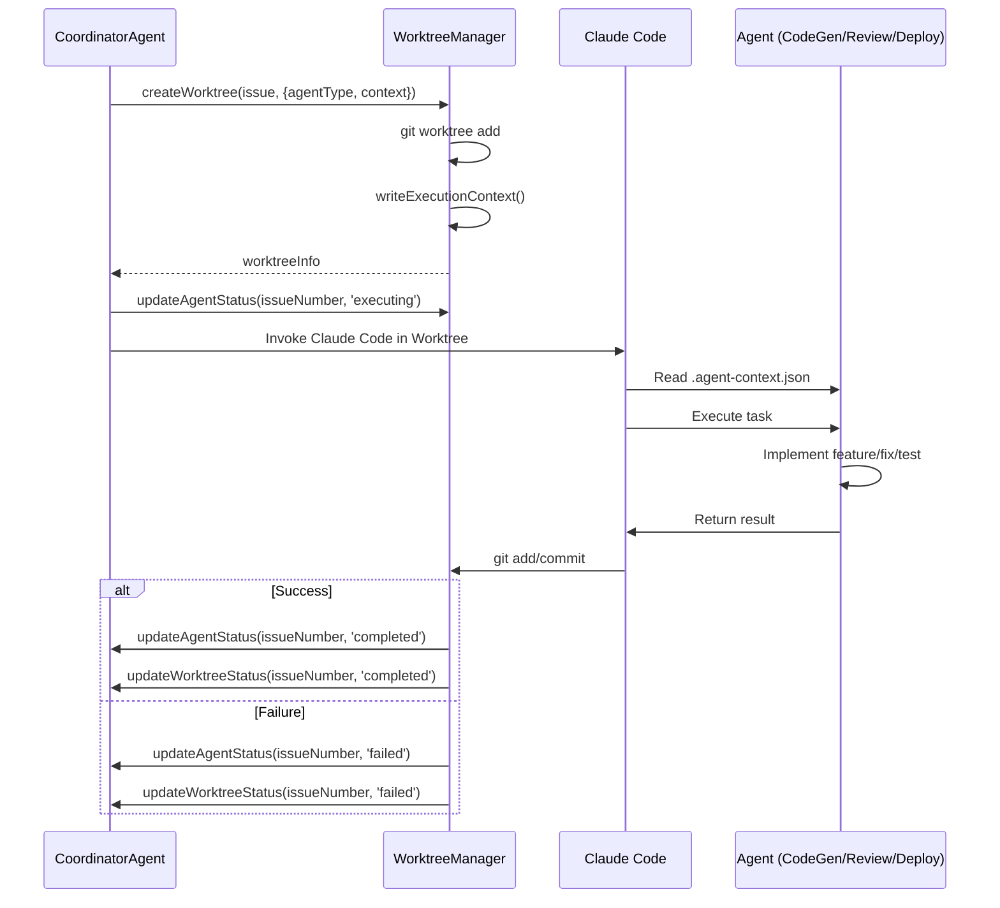

# Git Worktree Lifecycle Protocol

**Complete sequence protocol for Git Worktree creation, agent assignment, execution, and cleanup**

## 📋 Overview

This document defines the complete protocol for Git Worktree lifecycle management in Miyabi.
All components (CoordinatorAgent, WorktreeManager, Claude Code) must follow this standardized sequence.

## 🔄 Protocol Phases

The Worktree lifecycle consists of 4 phases:

1. **Phase 1: Worktree Creation** - Create isolated working directory
2. **Phase 2: Agent Assignment** - Assign appropriate Agent to task
3. **Phase 3: Execution** - Execute task within Worktree
4. **Phase 4: Cleanup** - Merge, push, and remove Worktree

## Phase 1: Worktree Creation

### 1.1 Prerequisites

**Required**:
- Repository root path
- Main branch exists (default: `main`)
- Issue object with valid issue number
- Execution context (Task + Issue + Config)

**Optional**:
- Agent type (for pre-assignment)
- Execution context metadata

### 1.2 Sequence

```typescript
// Step 1: Create Worktree
const worktreeInfo = await worktreeManager.createWorktree(issue, {
  agentType: 'CodeGenAgent',  // Optional pre-assignment
  executionContext: {
    task,
    issue,
    config,
    promptPath: '.claude/agents/prompts/coding/codegen-agent-prompt.md',
  },
});

// Result:
// - New branch: `issue-270`
// - Worktree path: `.worktrees/issue-270/`
// - Status: 'active'
// - Agent status: 'idle'
```

### 1.3 Git Operations

```bash
# If branch exists remotely
git worktree add .worktrees/issue-270 issue-270

# If branch does not exist
git worktree add -b issue-270 .worktrees/issue-270 main
```

### 1.4 State After Creation

| Property | Value |
|----------|-------|
| `worktree.status` | `'active'` |
| `worktree.agentStatus` | `'idle'` (if agent assigned) |
| `worktree.createdAt` | ISO timestamp |
| `worktree.lastActivityAt` | ISO timestamp |
| `worktree.sessionId` | `worktree-270-1234567890` |

### 1.5 Write Execution Context

```typescript
// Step 2: Write execution context files to Worktree
await worktreeManager.writeExecutionContext(issueNumber);

// Creates:
// - .worktrees/issue-270/.agent-context.json
// - .worktrees/issue-270/EXECUTION_CONTEXT.md
```

**`.agent-context.json`** (Machine-readable):
```json
{
  "agentType": "CodeGenAgent",
  "agentStatus": "idle",
  "task": { /* Task object */ },
  "issue": { /* Issue object */ },
  "config": { /* Agent config */ },
  "promptPath": ".claude/agents/prompts/coding/codegen-agent-prompt.md",
  "worktreeInfo": {
    "path": ".worktrees/issue-270",
    "branch": "issue-270",
    "sessionId": "worktree-270-1234567890",
    "createdAt": "2025-10-14T..."
  }
}
```

**`EXECUTION_CONTEXT.md`** (Human-readable):
```markdown
# Agent Execution Context

## Issue Information
- **Number**: #270
- **Title**: Firebase Auth修正
- **Labels**: ✨ type:feature, 🔥 priority:P0-Critical

## Task Information
- **ID**: task-1
- **Title**: Auth実装修正
- **Assigned Agent**: CodeGenAgent
- **Status**: pending

## Agent Information
- **Agent Type**: CodeGenAgent
- **Agent Status**: idle
- **Prompt Path**: .claude/agents/prompts/coding/codegen-agent-prompt.md
```

### 1.6 Error Handling

| Error | Handling |
|-------|----------|
| Worktree already exists | Return existing WorktreeInfo, log warning |
| Branch creation fails | Throw error, do not create Worktree |
| Context write fails | Throw error, cleanup Worktree |

---

## Phase 2: Agent Assignment

### 2.1 Agent Assignment Logic

**Rule-based assignment** (based on Task type):

| Task Type | Assigned Agent | Character Name |
|-----------|---------------|----------------|
| `feature` | `CodeGenAgent` | つくるん |
| `bug` | `CodeGenAgent` | つくるん |
| `refactor` | `CodeGenAgent` | つくるん |
| `test` | `CodeGenAgent` | つくるん |
| `review` | `ReviewAgent` | めだまん |
| `deployment` | `DeploymentAgent` | はこぶん |
| `docs` | `CodeGenAgent` | つくるん |
| `issue-analysis` | `IssueAgent` | みつけるん |
| `pr-creation` | `PRAgent` | まとめるん |

### 2.2 Sequence

```typescript
// Automatic agent assignment (CoordinatorAgent)
function assignAgentToTask(task: Task): AgentType {
  switch (task.type) {
    case 'feature':
    case 'bug':
    case 'refactor':
    case 'test':
    case 'docs':
      return 'CodeGenAgent';

    case 'review':
      return 'ReviewAgent';

    case 'deployment':
      return 'DeploymentAgent';

    case 'issue-analysis':
      return 'IssueAgent';

    case 'pr-creation':
      return 'PRAgent';

    default:
      return 'CodeGenAgent'; // Default fallback
  }
}

// Update agent status
worktreeManager.updateAgentStatus(issueNumber, 'executing');
```

### 2.3 State After Assignment

| Property | Value |
|----------|-------|
| `worktree.agentType` | `'CodeGenAgent'` |
| `worktree.agentStatus` | `'executing'` |
| `worktree.lastActivityAt` | Updated timestamp |

---

## Phase 3: Execution

### 3.1 Claude Code Invocation

**Within Worktree** (`.worktrees/issue-270/`):

```bash
# Method 1: Direct Claude Code execution
cd .worktrees/issue-270
claude code "Issue #270 を実装して"

# Method 2: Use agent-specific prompt
cd .worktrees/issue-270
claude code --prompt=".claude/agents/prompts/coding/codegen-agent-prompt.md"
```

### 3.2 Agent Execution Flow



### 3.3 Agent Responsibilities

During execution, the Agent must:

1. **Read Context**: Parse `.agent-context.json` and `EXECUTION_CONTEXT.md`
2. **Follow Prompt**: Execute according to agent-specific prompt (e.g., `codegen-agent-prompt.md`)
3. **Implement Task**: Generate code, run tests, write documentation
4. **Commit Changes**: Use `git add` + `git commit` with proper message
5. **Update Status**: Signal completion or failure

### 3.4 Commit Message Format

**Conventional Commits準拠**:

```bash
# Feature
git commit -m "feat(auth): implement Firebase authentication flow

- Add Firebase Auth SDK integration
- Create login/logout functions
- Add user state management

Implements #270

🤖 Generated with [Claude Code](https://claude.com/claude-code)

Co-Authored-By: Claude <noreply@anthropic.com>"

# Bug fix
git commit -m "fix(auth): resolve token refresh race condition

- Add mutex lock for token refresh
- Prevent simultaneous refresh requests

Fixes #271

🤖 Generated with [Claude Code](https://claude.com/claude-code)

Co-Authored-By: Claude <noreply@anthropic.com>"
```

### 3.5 State After Execution

| Property | Value |
|----------|-------|
| `worktree.status` | `'completed'` or `'failed'` |
| `worktree.agentStatus` | `'completed'` or `'failed'` |
| `worktree.lastActivityAt` | Updated timestamp |

---

## Phase 4: Cleanup

### 4.1 Prerequisites

**Before cleanup**:
- [ ] All changes committed
- [ ] Tests passing (if applicable)
- [ ] Quality checks passed (if ReviewAgent executed)
- [ ] Status is `'completed'`

### 4.2 Sequence

```typescript
// Step 1: Check for uncommitted changes
if (worktreeManager.hasUncommittedChanges(worktreePath)) {
  worktreeManager.commitChanges(
    worktreePath,
    `chore: auto-commit before cleanup for issue #${issueNumber}`
  );
}

// Step 2: Push to remote
await worktreeManager.pushWorktree(issueNumber);

// Step 3: Merge to main (optional)
if (autoMerge) {
  await worktreeManager.mergeWorktree(issueNumber);
}

// Step 4: Remove worktree
await worktreeManager.removeWorktree(issueNumber);

// Step 5: Prune stale worktrees
await worktreeManager.cleanupAll();
```

### 4.3 Git Operations

```bash
# Step 1: Push worktree branch to remote
cd .worktrees/issue-270
git push -u origin issue-270

# Step 2: Merge to main (in main repo)
cd /path/to/main-repo
git checkout main
git merge issue-270

# Step 3: Remove worktree
git worktree remove .worktrees/issue-270 --force

# Step 4: Prune stale worktrees
git worktree prune
```

### 4.4 Auto-cleanup Conditions

| Condition | Action |
|-----------|--------|
| Status is `'completed'` | Auto-cleanup if `autoCleanup=true` |
| Status is `'failed'` | Manual cleanup required |
| Idle time > `maxIdleTime` | Auto-cleanup |
| Uncommitted changes | Auto-commit → cleanup |

### 4.5 Merge Conflict Handling

**If merge conflicts occur**:

1. Pause cleanup process
2. Log conflict details
3. Update status to `'blocked'`
4. Notify CoordinatorAgent or Guardian
5. Wait for manual resolution

**Conflict resolution**:

```bash
# Manual resolution required
cd /path/to/main-repo
git merge issue-270
# Resolve conflicts manually
git add .
git commit -m "Merge branch 'issue-270' (resolved conflicts)"
```

### 4.6 State After Cleanup

| Property | Value |
|----------|-------|
| Worktree removed | ✅ Yes |
| Branch pushed | ✅ Yes (remote: `origin/issue-270`) |
| Merged to main | ✅ Yes (if `autoMerge=true`) |
| Entry in `activeWorktrees` | ❌ Deleted |

---

## 🔐 Error Handling & Rollback

### Error Scenarios

| Error | Phase | Handling |
|-------|-------|----------|
| Worktree creation fails | Phase 1 | Throw error, do not proceed |
| Context write fails | Phase 1 | Cleanup worktree, throw error |
| Agent assignment fails | Phase 2 | Use default agent, log warning |
| Execution fails | Phase 3 | Set status to 'failed', preserve worktree |
| Push fails | Phase 4 | Log error, allow manual push |
| Merge conflicts | Phase 4 | Pause cleanup, require manual resolution |
| Cleanup fails | Phase 4 | Log error, mark as stale |

### Rollback Protocol

**If execution fails**:

```typescript
// Phase 3 failure
worktreeManager.updateAgentStatus(issueNumber, 'failed');
worktreeManager.updateWorktreeStatus(issueNumber, 'failed');

// Preserve worktree for debugging
// Do NOT auto-cleanup

// Manual cleanup later
await worktreeManager.removeWorktree(issueNumber);
```

---

## 📊 Monitoring & Observability

### Worktree Statistics

```typescript
// Get current statistics
const stats = worktreeManager.getStatistics();
console.log(stats);
/*
{
  total: 5,
  active: 2,
  idle: 1,
  completed: 1,
  failed: 1,
  cleanup: 0
}
*/

// Get agent statistics
const agentStats = worktreeManager.getAgentStatistics();
console.log(agentStats);
/*
{
  byAgent: {
    CodeGenAgent: 3,
    ReviewAgent: 1,
    DeploymentAgent: 1
  },
  byAgentStatus: {
    executing: 2,
    completed: 2,
    failed: 1
  },
  totalWithAgent: 5,
  totalWithoutAgent: 0
}
*/
```

### Logging

All operations are logged with timestamps:

```
[WorktreeManager] 🌿 Creating new branch: issue-270
[WorktreeManager] ✅ Created worktree for issue #270: .worktrees/issue-270
[WorktreeManager] 🤖 Assigned CodeGenAgent to worktree for issue #270
[WorktreeManager] 📄 Wrote .agent-context.json to .worktrees/issue-270/.agent-context.json
[WorktreeManager] 📄 Wrote EXECUTION_CONTEXT.md to .worktrees/issue-270/EXECUTION_CONTEXT.md
[WorktreeManager] 🤖 Updated agent status for issue #270: executing
[WorktreeManager] 🤖 Updated agent status for issue #270: completed
[WorktreeManager] ✅ Pushed worktree branch to remote: issue-270
[WorktreeManager] ✅ Merged worktree branch to main: issue-270
[WorktreeManager] ✅ Removed worktree for issue #270
```

---

## 🧪 Testing Protocol

### Unit Tests

```typescript
describe('Worktree Protocol', () => {
  it('Phase 1: should create worktree with context', async () => {
    const worktree = await worktreeManager.createWorktree(issue, {
      agentType: 'CodeGenAgent',
      executionContext: context,
    });

    expect(worktree.status).toBe('active');
    expect(worktree.agentType).toBe('CodeGenAgent');
    expect(worktree.agentStatus).toBe('idle');
  });

  it('Phase 2: should assign agent and update status', () => {
    worktreeManager.updateAgentStatus(issueNumber, 'executing');
    const worktree = worktreeManager.getWorktree(issueNumber);

    expect(worktree.agentStatus).toBe('executing');
  });

  it('Phase 3: should execute task successfully', async () => {
    // Simulate execution
    await executeTask(worktree);

    worktreeManager.updateAgentStatus(issueNumber, 'completed');
    expect(worktree.agentStatus).toBe('completed');
  });

  it('Phase 4: should cleanup worktree', async () => {
    await worktreeManager.removeWorktree(issueNumber);

    expect(worktreeManager.getWorktree(issueNumber)).toBeUndefined();
  });
});
```

---

## 📚 References

- **WorktreeManager Implementation**: `packages/coding-agents/worktree/worktree-manager.ts`
- **CoordinatorAgent**: `packages/coding-agents/coordinator/coordinator-agent.ts`
- **Agent Prompts**: `.claude/agents/prompts/coding/`
- **Label System**: `docs/LABEL_SYSTEM_GUIDE.md`
- **Entity-Relation Model**: `docs/ENTITY_RELATION_MODEL.md`

---

## 🔄 Version History

| Version | Date | Changes |
|---------|------|---------|
| 1.0 | 2025-10-14 | Initial protocol definition |

---

**This protocol is mandatory for all Worktree operations in Miyabi.**
**Any deviation must be documented and approved by the CoordinatorAgent.**
