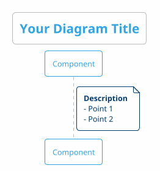

# PlantUML Diagrams

このディレクトリには、Autonomous Operations システムのアーキテクチャとワークフローを視覚化した PlantUML 図が含まれています。

## 📊 利用可能な図

### Entity-Relation Model 図（新規追加）

#### 1. Entity-Relation Model - 完全版 (`entity-relation-model.puml`) ⭐ NEW
**概要:** 12種類のEntity定義と27の関係性を完全に可視化

**内容:**
- 12種類のEntity完全定義（属性・メソッド）
- 27の関係性マップ
- 6種類のAgent詳細
- 53ラベル体系サマリー
- 9コマンド一覧
- 統計情報

**対象読者:** アーキテクト、システム設計者、Entity探索が必要な開発者

**ファイル参照:**
- Entity定義: `agents/types/index.ts`
- 詳細ドキュメント: `docs/ENTITY_RELATION_MODEL.md`

---

#### 2. Entity-Relation Model - 簡易版 (`entity-relation-simplified.puml`) ⭐ NEW
**概要:** コアワークフローに焦点を当てた簡易図

**内容:**
- コアEntity（8種類）
- 主要な関係性
- ワークフロー概要
- 注釈付き

**対象読者:** 初心者、クイックリファレンスが必要な人

**使用シーン:** プレゼンテーション、クイック確認

---

#### 3. Agent Workflow (`agent-workflow.puml`) ⭐ NEW
**概要:** Issue → PR の完全な実行フロー

**内容:**
- IssueAgent → CoordinatorAgent → CodeGenAgent → ReviewAgent → PRAgent
- 並列実行（Worktree）
- 品質チェック（QualityReport）
- エスカレーションフロー
- LDDログ記録

**対象読者:** Agent運用担当者、デバッグが必要な開発者

**ハイライト:**
- Git Worktree並列実行
- 品質スコア80点基準
- 自動エスカレーション

---

#### 4. Label System (`label-system.puml`) ⭐ NEW
**概要:** 53ラベル体系の完全マップ

**内容:**
- 10カテゴリ × 53ラベル
- 状態遷移（STATE Labels）
- Agent割り当て（AGENT Labels）
- 品質スコアリング（QUALITY Labels）
- エスカレーションルート（SEVERITY Labels）

**対象読者:** Label管理者、Issue/PRトリアージ担当者

**カテゴリ:**
1. STATE (8) - ライフサイクル
2. AGENT (6) - Agent割り当て
3. PRIORITY (4) - 優先度
4. TYPE (7) - 分類
5. SEVERITY (4) - 深刻度
6. PHASE (5) - フェーズ
7. SPECIAL (7) - 特殊操作
8. TRIGGER (4) - 自動化トリガー
9. QUALITY (4) - 品質スコア
10. COMMUNITY (4) - コミュニティ

---

### システム図（既存）

#### 5. システムアーキテクチャ (`system-architecture.puml`)
**概要:** Agentic OS 全体のコンポーネント構成と相互関係

**内容:**
- GitHub を OS として機能させる仕組み
- AI エージェントレイヤーの構成
- ツールと自動化コンポーネント
- 外部サービスとの統合
- データフロー

**対象読者:** システム設計者、アーキテクト、新規参加者

---

#### 6. ワークフローシーケンス (`workflow-sequence.puml`)
**概要:** Issue 作成から本番デプロイまでの完全な自律フロー

**内容:**
- Issue 作成からデプロイまでの全ステップ
- AI エージェント間の相互作用
- 並列処理のタイミング
- 人間の関与ポイント
- 時間の流れとパフォーマンス指標

**対象読者:** 開発者、プロジェクトマネージャー、ステークホルダー

**ハイライト:**
- 従来の開発プロセス（数日〜数週間）→ Agentic OS（5〜10分）
- 95%以上の自動化率
- 並列コード生成によるスループット向上

---

#### 7. 並列実行フロー (`parallel-execution.puml`)
**概要:** マルチワーカーによる並列タスク実行の詳細

**内容:**
- タスクキューの管理
- ワーカーの動的割り当て
- 並列処理の同期
- 結果の集約
- パフォーマンス最適化

**対象読者:** パフォーマンスエンジニア、スケーラビリティ担当者

**パフォーマンス:**
- シーケンシャル実行: 75分（15タスク × 5分）
- 並列実行（3ワーカー）: 25分
- **時短効果: 67%**

---

#### 8. コンポーネント構造 (`component-structure.puml`)
**概要:** プロジェクトのファイル構成と依存関係

**内容:**
- ディレクトリ構造
- モジュール間の依存関係
- スクリプトとエージェントの関係
- ドキュメントの構成
- 設定ファイルの役割

**対象読者:** 新規開発者、コントリビューター

**主要コンポーネント:**
- `agents/` - AI エージェントとUI システム
- `scripts/` - CLIツールと自動化スクリプト
- `tests/` - ユニットテスト
- `docs/` - ドキュメント
- `.github/` - GitHub 固有の設定

---

#### 9. データフロー図 (`data-flow.puml`)
**概要:** システム全体のデータの流れ

**内容:**
- 外部エンティティ（開発者、API）
- データストア（GitHub、Projects V2、.env）
- プロセス（解析、生成、QA）
- データ変換の流れ
- 入出力の形式

**対象読者:** データエンジニア、システムインテグレーター

**データストア:**
- GitHub Repository（Issues、PRs、Actions）
- Projects V2（Items、Fields、Status）
- Environment Variables（.env）
- KPI Data & Dashboard

---

#### 10. 状態遷移図 (`state-machine.puml`)
**概要:** Issue のライフサイクルと状態遷移

**内容:**
- Issue の各状態
- 状態遷移のトリガー
- 自動遷移と手動遷移
- エラーハンドリング
- 完了条件

**対象読者:** プロダクトオーナー、QAエンジニア

**主要状態:**
1. **Created** - Issue 作成
2. **In Progress** - 開発中（5-10分）
3. **Quality Check** - 自動QA
4. **Ready for Review** - 人間によるレビュー待ち
5. **Deployed** - 本番環境へデプロイ

---

### .claude/ ディレクトリ図（新規追加）

#### 11. Claude ディレクトリ構造図 (`claude-directory-structure.puml`) ⭐ NEW
**概要:** `.claude` ディレクトリの階層構造を可視化

**内容:**
- ディレクトリ階層（agents/specs, agents/prompts, commands, mcp-servers等）
- ファイル数と行数統計
- ファイル種別（.md, .json, .sh, .js）
- 総ファイル数: 55ファイル
- 総行数: 20,437行

**対象読者:** Claude Code利用者、.claude/ディレクトリをカスタマイズする開発者

**主要セクション:**
- `agents/specs/` - Agent仕様定義（21ファイル）
- `agents/prompts/` - Worktree実行プロンプト（20ファイル）
- `commands/` - スラッシュコマンド（9ファイル）
- `mcp-servers/` - MCPサーバー実装（5ファイル）
- `hooks/` - Git hooks（4ファイル）

---

#### 12. MCP統合アーキテクチャ図 (`mcp-integration.puml`) ⭐ NEW
**概要:** MCPサーバーとClaude Code統合を可視化

**内容:**
- 5つのMCPサーバー詳細
- 提供ツール一覧
- 環境変数設定
- Claude Codeとの統合フロー

**対象読者:** MCP開発者、統合担当者、システム管理者

**MCPサーバー一覧:**
1. **miyabi-integration** - プロジェクト統合・Agent制御
2. **discord-community** - コミュニティ管理・通知
3. **github-enhanced** - GitHub拡張操作
4. **filesystem** - ファイルシステムアクセス
5. **ide-integration** - IDE統合

**提供ツール例（miyabi-integration）:**
- `miyabi_status` - プロジェクトステータス取得
- `miyabi_agent_run` - Agent実行制御
- `miyabi_issue_analyze` - Issue分析
- `miyabi_pr_create` - PR作成
- `miyabi_deploy` - デプロイ実行

---

## 🔧 図の閲覧方法

### オンラインで閲覧

1. **GitHub 上で直接閲覧:**
   GitHub は PlantUML をネイティブサポートしています。
   ```
   https://github.com/ShunsukeHayashi/Autonomous-Operations/blob/main/docs/diagrams/system-architecture.puml
   ```

2. **PlantUML Web Server:**
   ```
   http://www.plantuml.com/plantuml/uml/
   ```
   `.puml` ファイルの内容をコピー＆ペースト

3. **PlantUML Online Editor:**
   ```
   https://www.planttext.com/
   ```

### ローカルで閲覧

#### VSCode 拡張機能（推奨）
```bash
# PlantUML 拡張機能をインストール
code --install-extension jebbs.plantuml
```

**使い方:**
1. `.puml` ファイルを開く
2. `Alt + D` でプレビュー
3. リアルタイムレンダリング

#### コマンドライン

```bash
# PlantUML インストール (Java 必要)
brew install plantuml  # macOS
apt install plantuml   # Ubuntu

# PNG 画像生成
plantuml docs/diagrams/*.puml

# SVG 画像生成
plantuml -tsvg docs/diagrams/*.puml
```

---

## 📝 図の編集

### 編集ガイドライン

1. **一貫性を保つ:**
   - テーマ: `!theme cerulean-outline`
   - 背景色: `#FEFEFE`
   - フォント: `Arial`

2. **可読性を優先:**
   - ノートを活用して補足説明
   - 適切な間隔とグループ化
   - 明確なラベル

3. **メンテナンス:**
   - コード変更時は図も更新
   - 図の追加時はこの README も更新
   - レビュー時に図の正確性を確認

### テンプレート



---

## 🎯 使用シーン

### 新規参加者のオンボーディング
1. `system-architecture.puml` で全体像を把握
2. `workflow-sequence.puml` で動作フローを理解
3. `component-structure.puml` でコード構成を学習

### 設計レビュー
1. `system-architecture.puml` でアーキテクチャを確認
2. `data-flow.puml` でデータの流れを検証
3. `state-machine.puml` で状態管理を議論

### パフォーマンス最適化
1. `parallel-execution.puml` で並列処理を分析
2. `workflow-sequence.puml` でボトルネックを特定
3. `data-flow.puml` でデータ処理を最適化

### ドキュメント作成
1. 各図を画像出力
2. README や Wiki に埋め込み
3. プレゼンテーション資料に利用

---

## 📚 ダイアグラム選択ガイド

### 用途別推奨

| 用途 | 推奨ダイアグラム |
|------|----------------|
| **Entity理解** | entity-relation-model.puml |
| **クイック確認** | entity-relation-simplified.puml |
| **Agent運用** | agent-workflow.puml |
| **Label管理** | label-system.puml |
| **システム全体** | system-architecture.puml |
| **ワークフロー** | workflow-sequence.puml |

### 対象読者別推奨

| 読者 | 推奨ダイアグラム |
|------|----------------|
| **初心者** | entity-relation-simplified.puml → system-architecture.puml |
| **開発者** | entity-relation-model.puml → agent-workflow.puml |
| **PM/PO** | agent-workflow.puml → label-system.puml |
| **アーキテクト** | entity-relation-model.puml → system-architecture.puml |

---

## 🔗 関連リンク

**Miyabiドキュメント:**
- [ENTITY_RELATION_MODEL.md](../ENTITY_RELATION_MODEL.md) - Entity-Relationモデル定義
- [TEMPLATE_MASTER_INDEX.md](../TEMPLATE_MASTER_INDEX.md) - テンプレート統合インデックス
- [LABEL_SYSTEM_GUIDE.md](../LABEL_SYSTEM_GUIDE.md) - 53ラベル体系完全ガイド

**PlantUML:**
- [PlantUML 公式サイト](https://plantuml.com/)
- [PlantUML Language Reference Guide](https://plantuml.com/guide)
- [GitHub PlantUML Support](https://docs.github.com/en/get-started/writing-on-github/working-with-advanced-formatting/creating-diagrams)
- [VSCode PlantUML Extension](https://marketplace.visualstudio.com/items?itemName=jebbs.plantuml)

---

## 📊 図の更新履歴

| 日付 | 図 | 変更内容 |
|------|-----|----------|
| 2025-10-12 | .claude/ディレクトリ図（2図） | claude-directory-structure, mcp-integration追加 ⭐ |
| 2025-10-12 | Entity-Relation関連（6図） | Entity-Relationモデル図大幅改善・統合 ⭐ |
| 2025-10-08 | システム図（4図） | 初版作成 |

**総PlantUML図数**: 12図（統合後）
**統合完了**: 2025-10-12 - `.claude/diagrams/`から2図を`docs/diagrams/`へ統合

---

## 💡 フィードバック

図の改善提案や追加要望がある場合は、Issue を作成してください:
https://github.com/ShunsukeHayashi/Autonomous-Operations/issues/new
